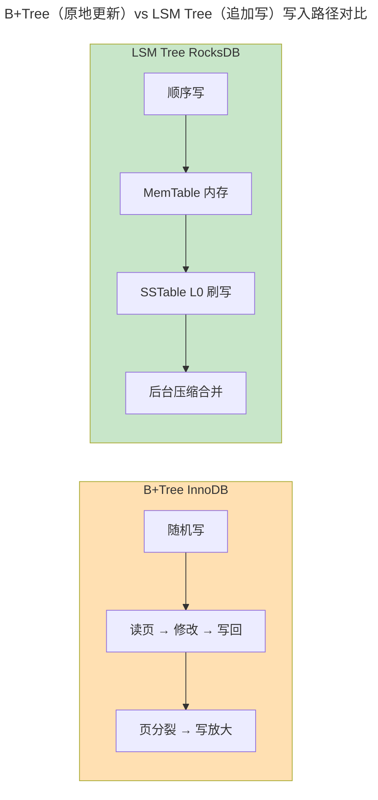

> 数据如何持久、如何查找。

存储引擎决定了数据在磁盘上的物理组织方式。InnoDB (B+Tree) 与 RocksDB (LSM Tree) 性能相差可达十倍——前者读优、后者写优。

---

## B+Tree vs LSM Tree

| 特性 | B+Tree (InnoDB) | LSM Tree (RocksDB) |
|------|----------------|-------------------|
| **写入** | 随机 I/O + 页分裂 | 顺序追加 + 后台压缩 |
| **读取** | O(log n) 直接查找 | 逐层查找 MemTable + SSTable |
| **写放大** | 高（每次写可能触发多次页 I/O） | 低（顺序写），但压缩有放大 |
| **读放大** | 低 | 高（Bloom Filter 缓解） |

### 写放大与读放大的定量分析

写放大因子（Write Amplification Factor）定义为：

$$
\text{WAF} = \frac{\text{实际写入磁盘的字节数}}{\text{应用层写入的字节数}}
$$

B+Tree 的 WAF 典型值在 2~5 之间——一次页分裂会将一页数据重新写入两个新页。LSM Tree 的 WAF 取决于压缩策略：Size-Tiered 可低至 1.1~2，Leveled 通常在 10~30（因为每层数据在压缩时被反复重写）。

读放大因子（Read Amplification Factor）正相反：

$$
\text{RAF} = \frac{\text{读取的磁盘页数}}{\text{返回给应用的行数所需的最少页数}}
$$

B+Tree 的 RAF 约 1~2（精确查找走索引），LSM Tree 的 RAF 在最坏情况下等于层数 × 每层需探测的 SSTable 数——这就是为什么 RocksDB 对每个 SSTable 使用 **Bloom Filter**：一个位数组 + 多个哈希，以 $O(1)$ 代价过滤掉 99% 的不包含目标 key 的 SSTable。

Bloom Filter 的假阳性率：

$$
P_{fp} \approx \left(1 - e^{-kn/m}\right)^k
$$

其中 $m$ 是位数组大小，$n$ 是插入的 key 数量，$k$ 是哈希函数个数。当 $k = \frac{m}{n} \ln 2$ 时假阳性率最小——这是 RocksDB 默认配置的数学依据。

---

## 压缩策略：写放大与读放大的权衡

| 策略 | 写放大 | 读放大 | 空间放大 | 代表 |
|------|:--:|:--:|:--:|------|
| **Size-Tiered** | 低（1.1~2） | 高（多层重叠） | 高（可达 2x） | Cassandra |
| **Leveled** | 较高（10~30） | 低（每层至多一个 SSTable 包含某 key） | 低（~1.1x） | RocksDB 默认 |
| **Tiered+Leveled** | 中等 | 中等 | 中等 | RocksDB 混合策略 |

Leveled 压缩的写放大为什么这么高？因为每写入 1 字节到 L0，在向 L1 压缩时该字节被读出并重写一次（第一次重写），L1 向 L2 又重写一次……层数 $L$ 意味着**每字节被重写 $L$ 次**。Size-Tiered 只在同层做合并，不跨层重写，因而写放大低。

---

## WAL：崩溃恢复的最后防线

WAL 规则：**日志必须先于数据持久化**。`innodb_flush_log_at_trx_commit = 1` 确保每次提交都 fsync WAL——代价是每次提交等待磁盘。设为 2 时每秒刷盘一次，系统崩溃可能丢失 1 秒内的事务——与 [TCP 的断电丢数据窗口](../../03-qiankun/06-transport-tcp-udp-quic/) 是同构的权衡。

崩溃恢复从最后检查点重放 WAL，将已提交但未写入数据页的事务重新应用。检查点的间隔决定了恢复时间——PostgreSQL 的 `checkpoint_timeout` 默认为 5 分钟。

---

## 列式存储与 OLAP

行式（InnoDB）适合 `SELECT *` 的 OLTP 查询。列式（Parquet/ClickHouse）将同一列的所有行连续存储——聚合查询只需读取目标列。配合 SIMD 向量化和 [CPU 流水线](../../01-weichen/03-microarchitecture/) 的指令级并行，聚合分析可达行式的 100 倍以上。

列存的另一个杀手特性是**高压缩比**——同一列的数据类型相同、值域相似，配合字典编码 + 游程编码（Run-Length Encoding），压缩比可达 10:1。这与 [LZ77 压缩的核心思想](../../00-lingxi/04-algorithm-theory/)——用"距离-长度"对替换重复模式——一脉相承。

---

## 跨卷连接

| 概念 | 关联 |
|------|------|
| LSM Tree 分层压缩 | [ext4 extent 树——分层查找的磁盘友好设计](../../03-qiankun/03-filesystem/#ext4-磁盘布局inode-与-extent-树) |
| WAL 与 REDO Log | [事务与 MVCC——Undo Log 的原子回滚](../01-relational-database/#事务与-mvcc) |
| Bloom Filter 假阳性率 | [哈希函数——将无限域映射到固定范围的数学魔法](../../07-tianshu/03-hash-and-signature/) |
| 列存压缩字典编码 | [LZ77 压缩——重复模式的"距离-长度"对](../../00-lingxi/04-algorithm-theory/) |
| fsync 延迟与丢失窗口 | [TCP 的 Timeout 与丢包重传窗口](../../03-qiankun/06-transport-tcp-udp-quic/#tcp可靠传输的基石) |

:::tip[卷四内部路径]
- [**关系型数据库**](../01-relational-database/)：SQL 层——存储引擎的上层接口
- [**数据流水线**](../05-data-pipelines/)：CDC 变更捕获——存储引擎日志的流式消费
:::
