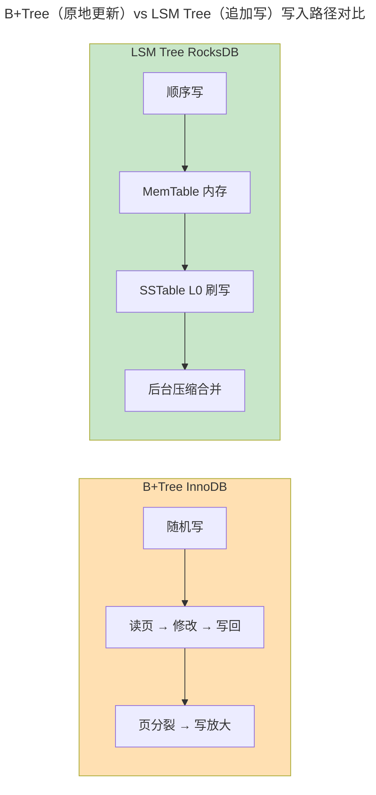

> 数据如何持久、如何查找。

存储引擎决定了数据在磁盘上的物理组织方式。InnoDB (B+Tree) 与 RocksDB (LSM Tree) 性能相差可达十倍——前者读优、后者写优。

---

## B+Tree vs LSM Tree

| 特性 | B+Tree (InnoDB) | LSM Tree (RocksDB) |
|------|----------------|-------------------|
| **写入** | 随机 I/O + 页分裂 | 顺序追加 + 后台压缩 |
| **读取** | O(log n) 直接查找 | 逐层查找 MemTable + SSTable |
| **写放大** | 高（每次写可能触发多次页 I/O） | 低（顺序写），但压缩有放大 |
| **读放大** | 低 | 高（Bloom Filter 缓解） |

---

## 压缩策略

| 策略 | 写放大 | 读放大 |
|------|--------|--------|
| **Size-Tiered** | 低 | 高（多层重叠） |
| **Leveled** | 较高 | 低（每层至多一个 SSTable 包含某 key） |

---

## WAL：崩溃恢复的最后防线

WAL 规则：**日志必须先于数据持久化**。`innodb_flush_log_at_trx_commit = 1` 确保每次提交都 fsync WAL。崩溃恢复从最后检查点重放 WAL，将已提交但未写入数据页的事务重新应用。

---

## 列式存储与 OLAP

行式（InnoDB）适合 `SELECT *` 的 OLTP 查询。列式（Parquet/ClickHouse）将同一列的所有行连续存储——聚合查询只需读取目标列。配合 SIMD 向量化，聚合分析可达行式的 100 倍以上。

---

## 跨卷连接

| 概念 | 关联 |
|------|------|
| LSM Tree 分层压缩 | [DRAM 行缓冲刷新周期](../../01-weichen/04-memory-hierarchy/) |
| WAL 与 REDO Log | [ext4 日志有序模式](../03-qiankun/03-filesystem/) |
| 列式 SIMD 向量化 | [GPU SIMD 数据并行](../../01-weichen/05-instruction-set-architecture/) |

:::tip[卷四内部路径]
- [**关系型数据库**](../01-relational-database/)：SQL 层——存储引擎的上层接口
- [**数据流水线**](../05-data-pipelines/)：CDC 变更捕获——存储引擎日志的流式消费
:::
