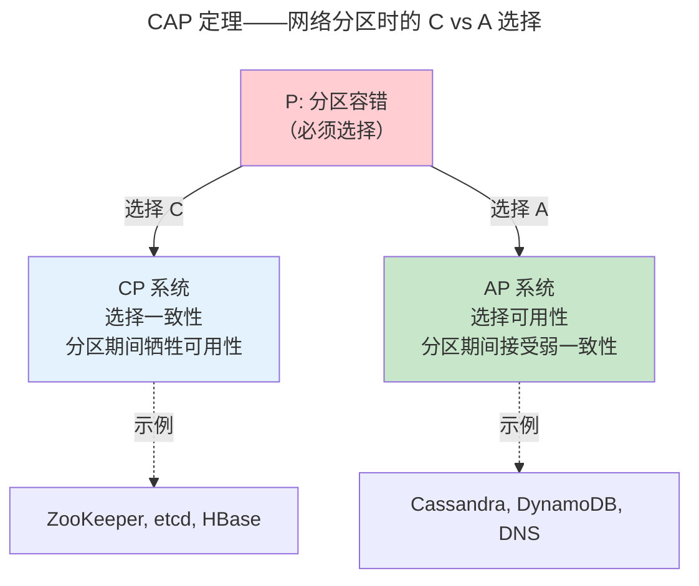

> 光速有限，故障总在。

单机 ACID 假设所有数据在一台机器上。分布式系统推翻了这个假设。CAP 定理浓缩了这一困境：一致性、可用性和分区容错——三者只能选其二。

---

## CAP 定理

---

## 一致性模型光谱

| 模型 | 保证 | 典型系统 |
|------|------|---------|
| **线性一致性** | 全局原子时间点 | etcd, ZooKeeper |
| **顺序一致性** | 同节点顺序，跨节点任意 | 分布式共享内存 |
| **因果一致性** | 有因果关系的操作有序 | MongoDB（因果会话） |
| **最终一致性** | 无新更新则最终一致 | DNS, Cassandra |

---

## 向量时钟：冲突检测

$$
X \prec Y \iff \forall_i (X_i \leq Y_i) \land \exists_j (X_j < Y_j)
$$

如果既不 $X \prec Y$ 也不 $Y \prec X$，则 X 和 Y 并发——应用层需解决冲突（CRDT、LWW、或合并函数）。

---

## 分布式事务：2PC/3PC/TCC

2PC 的致命缺陷是协调者单点故障——若协调者在 Commit 阶段崩溃，已回复 Yes 的参与者被"阻塞"。3PC 增加了预提交阶段但无法完全消除。TCC（Try-Confirm-Cancel）通过业务层补偿替代数据库层回滚——微服务架构的分布式事务主流方案。

---

## 跨卷连接

| 概念 | 关联 |
|------|------|
| CAP 定理 | [Cache MESI 一致性协议——多核的 CAP](../../01-weichen/04-memory-hierarchy/) |
| 向量时钟 | [Git commit 的 DAG 拓扑排序](../../08-qianli/03-devops-practices/) |
| 2PC | [数据库 WAL 两阶段写](../02-storage-engine/) |

:::tip[卷四内部路径]
- [**共识协议**](../04-consensus-protocols/)：Raft——从 CAP 到一致性的工程实现
- [**数据流水线**](../05-data-pipelines/)：Kafka 分区——CAP 在流处理中的权衡
:::
