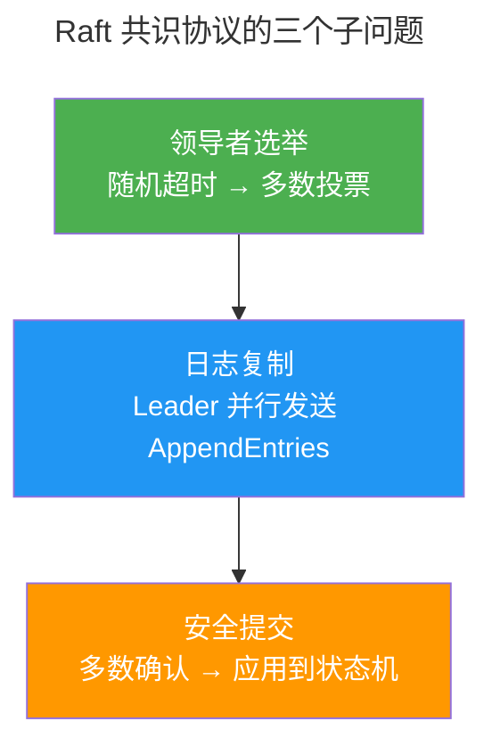

> 异口同声的艺术。

共识协议在三重不确定性之上建立确定性：网络延迟、节点故障、时钟偏移。本章从 Paxos 的数学根基出发，对比 Raft 的可理解性设计，走过 ZAB 的工程实践，最后抵达拜占庭容错的边界。

---

## Raft：为可理解性而设计



### 领导者选举的随机化

Raft 使用随机选举超时（150-300ms）避免分裂投票。如果所有节点使用相同超时，它们会同时发起选举——没有人能获得多数票。随机化使每个节点有独立的选举窗口，几乎一定有一个节点率先超时并赢得选举。

选举的数学保证：设节点数为 $N$，在任意时刻最多有一个节点能获得 $\lfloor N/2 \rfloor + 1$ 张票——因为每个节点在一个任期内只投一票。**多数集之间必然相交**：任何两个多数集（各含至少 $\lfloor N/2 \rfloor + 1$ 个节点）一定共享至少一个节点。

### 日志复制的安全条件

Raft 安全性的核心不变量：**Leader 仅提交当前任期的条目**。为什么？看这个危险场景——

```
任期 1：S1 是 Leader，将条目 a 复制到 S1 和 S2（多数），但在提交前崩溃
任期 2：S3 成为 Leader（S3 的日志中没有 a），写入条目 b 并提交
      如果 S1 可以提交任期 1 的 a，a 会在 S3 提交 b 之后出现——已提交的 b 被覆盖
```

Raft 的解决：新 Leader 当选后强制将自己的日志覆盖 Follower 的不一致后缀；Leader 只能在当前任期有已提交条目时，顺便提交之前任期的未提交条目——这种"连带提交"保证不会出现上述反转。

---

## 共识的数学核心：Quorum 交叠

三种主流协议对 Quorum（法定人数）的定义：

| 协议 | Quorum 大小 | 故障容忍 | 交叠保证 |
|------|:--:|:--:|------|
| **Paxos** | $\lfloor N/2 \rfloor + 1$ | $f < N/2$（崩溃） | 任意两个多数集必然相交 |
| **Raft** | $\lfloor N/2 \rfloor + 1$ | $f < N/2$（崩溃） | 同上 + Leader 任期约束 |
| **PBFT** | $2f+1$（prepare）+ $2f+1$（commit） | $f < N/3$（拜占庭） | 任意两个 $2f+1$ 集必然共享至少 $f+1$ 个诚实节点 |

崩溃容错只需 $N = 2f+1$ 个节点容忍 $f$ 个崩溃节点，因为多数集交叠保证至少一个节点同时知晓前后两个决策。拜占庭容错需要 $N = 3f+1$——$f$ 个恶意节点 + 必须保证剩余的 $2f+1$ 个节点中诚实者占多数（$\geq f+1$）。

---

## Paxos vs Raft vs ZAB

| 协议 | 特点 | 代表系统 |
|------|------|---------|
| **Paxos** | 数学基础严谨，实现极难——Lamport 的原文被戏称"读不懂" | Google Chubby |
| **Raft** | 可理解性优先，三个子问题分解——Ongaro 的博士论文 | etcd, Consul, TiKV |
| **ZAB** | Leader 选举含事务日志同步，支持 Follower 直读 | ZooKeeper |

ZAB（ZooKeeper Atomic Broadcast）在 Leader 选举阶段同步事务日志——新 Leader 必须拥有所有已提交的事务。这比 Raft 的"强制覆盖 Follower 日志"更保守，避免了日志回滚的工程复杂性，代价是选举稍慢。

---

## PBFT：拜占庭容错

PBFT 将共识从崩溃容错提升到拜占庭容错——节点可以任意撒谎。三阶段投票：

1. **Pre-Prepare**：Primary 广播提议
2. **Prepare**：每个节点广播"我确认这个提议"
3. **Commit**：收到 $2f+1$ 个 Prepare 后广播"我确认已达成共识"

PBFT 在许可链（Hyperledger Fabric）和部分公链共识中有应用。它的局限：通信复杂度 $O(N^2)$（每个阶段所有节点互相广播），当 $N > 100$ 时带宽开销不可接受——这就是为什么公链转向 PoS + BFT 混合方案（如 Tendermint）。

---

## 跨卷连接

| 概念 | 关联 |
|------|------|
| Raft 日志复制 | [数据库 WAL REDO Log](../02-storage-engine/) |
| Raft 随机选举超时 | [CSMA/CD 以太网随机回退——碰撞后的指数退避](../../03-qiankun/05-network-protocol-stack/) |
| PBFT 三阶段投票 | [2PC——分布式事务的两阶段提交](../03-distributed-fundamentals/) |
| Quorum 交叠 | [MESI cache 一致性——多个 S 态副本的失效广播](../../01-weichen/04-memory-hierarchy/#cache-一致性协议多核世界的交通规则) |
| Leader 任期单调递增 | [Lamport 逻辑时钟——"发生在之前"的全序关系](../03-distributed-fundamentals/) |

:::tip[卷四内部路径]
- [**分布式基础**](../03-distributed-fundamentals/)：CAP + 一致性模型——共识的理论背景
- [**数据流水线**](../05-data-pipelines/)：Kafka ISR——Raft 风格的多数确认
:::
