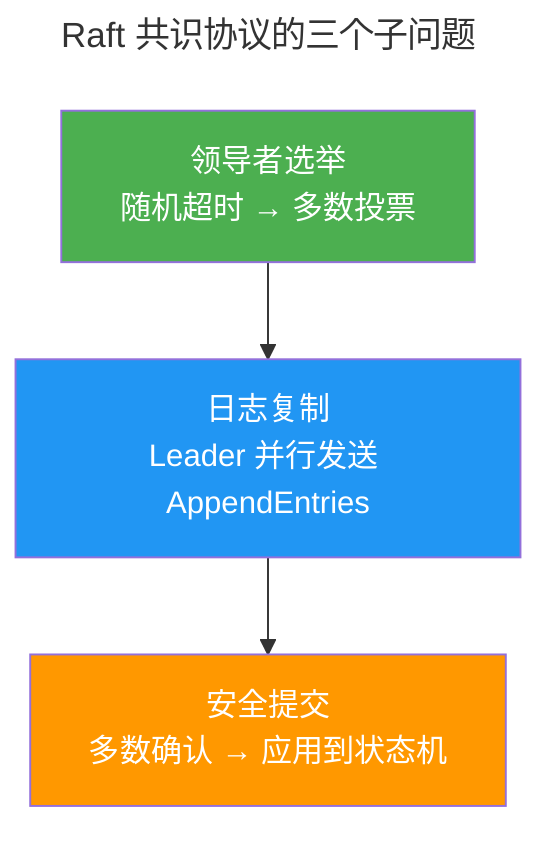

> 异口同声的艺术。

共识协议在三重不确定性之上建立确定性：网络延迟、节点故障、时钟偏移。本章从 Paxos 的数学根基出发，对比 Raft 的可理解性设计，走过 ZAB 的工程实践。

---

## Raft：为可理解性而设计

### Raft 关键规则

1. **领导者选举**：随机超时（150-300ms）避免分裂投票
2. **日志复制**：Leader 将条目复制到多数节点后才提交——任何包含已提交条目的节点都有资格成为新 Leader
3. **安全提交**：Leader 只能提交当前任期内的条目——防止已提交条目回滚

---

## Paxos vs Raft vs ZAB

| 协议 | 特点 | 代表系统 |
|------|------|---------|
| **Paxos** | 数学基础严谨，实现极难 | Google Chubby |
| **Raft** | 可理解性优先，三个子问题分解 | etcd, Consul, TiKV |
| **ZAB** | Leader 选举含事务日志同步，支持 Follower 直读 | ZooKeeper |

---

## PBFT：拜占庭容错

PBFT 将共识从崩溃容错提升到拜占庭容错——需 $3f+1$ 个节点容忍 $f$ 个恶意节点。Pre-Prepare → Prepare → Commit 三阶段投票。在许可链（Hyperledger Fabric）和部分公链共识中有应用。

---

## 跨卷连接

| 概念 | 关联 |
|------|------|
| Raft 日志复制 | [数据库 WAL REDO Log](../02-storage-engine/) |
| Raft 随机选举超时 | [CSMA/CD 以太网随机回退](../../03-qiankun/05-network-protocol-stack/) |
| ZooKeeper 分布式锁 | [互斥锁与优先级继承](../03-qiankun/04-synchronization/) |

:::tip[卷四内部路径]
- [**分布式基础**](../03-distributed-fundamentals/)：CAP + 一致性模型——共识的理论背景
- [**数据流水线**](../05-data-pipelines/)：Kafka ISR——Raft 风格的多数确认
:::
