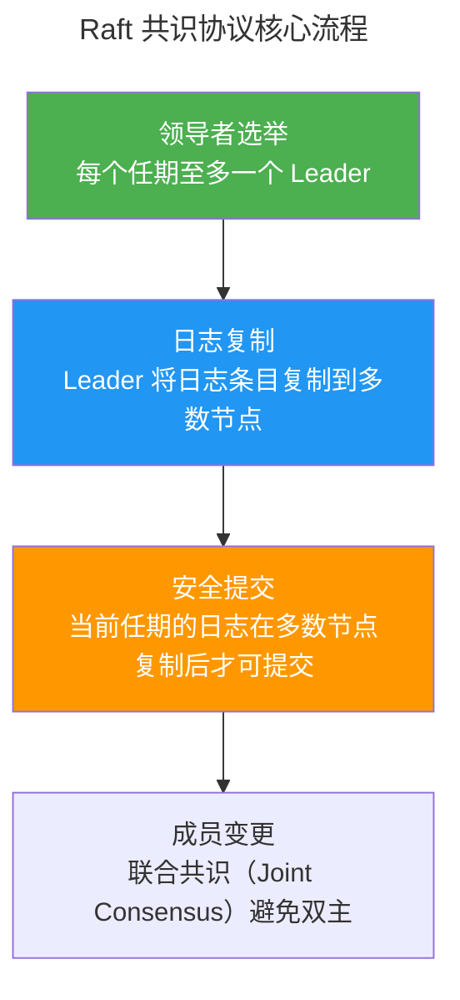

> 异口同声的艺术。

分布式系统的不确定性源自三个物理约束：网络延迟、节点故障、时钟偏移。**共识协议**（Consensus Protocol）在这三重不确定性之上建立确定性——使一组节点就某个值达成一致，即使部分节点故障或网络不可靠。

本章从 Paxos 的经典推导出发，对比 Raft 的领导者驱动简化设计，走过 ZAB 在 ZooKeeper 中的工程实践，最后触及 PBFT 的拜占庭容错边界。

---

## Paxos：共识协议的数学根基

Paxos 由 Leslie Lamport 在 1998 年发表，是共识协议的奠基之作。其核心角色：

- **Proposer**（提议者）：提出一个值让集群达成共识
- **Acceptor**（接受者）：接受或拒绝提议
- **Learner**（学习者）：了解已达成共识的值

Multi-Paxos 将多个 Paxos 实例串联为一个日志——第一个实例达成共识的值是一个"日志槽"（log slot）的内容，第二个实例是下一个日志槽，依此类推。通过**领导者选举**，一个节点成为固定的 Proposer，避免了每次提议都竞争领导者的高延迟。

---

## Raft：为可理解性而设计

Diego Ongaro 在 2014 年提出 Raft 协议，其核心设计目标是**可理解性**——Paxos 被证明正确但极其难以理解和实现。Raft 通过三个子问题分解共识：

### Raft 的关键规则

1. **领导者选举**：每个 Server 在选举超时（150-300ms 随机值）后成为 Candidate，向其他节点请求投票。获得多数票的 Candidate 成为新 Leader。
2. **日志复制**：Leader 将客户端请求追加到自己的日志后，并行发送给所有 Follower。当日志条目在**多数**节点上持久化后，Leader 将其标记为已提交（committed），然后应用到状态机。
3. **安全提交**：Leader 只能提交当前任期内的日志条目——这防止了已提交条目的回滚。

:::note[为什么 Raft 的选举超时是随机的？]
如果所有节点的超时相同，它们会在同一时刻触发选举——所有 Candidate 同时广播投票请求，**分裂投票**导致没有一个节点获得多数票。随机的超时确保了极大概率下只有一个 Candidate 率先触发选举，顺利当选 Leader。
:::

---

## ZAB 与 ZooKeeper

ZAB（ZooKeeper Atomic Broadcast）是 ZooKeeper 的共识引擎。与 Raft 的核心差异：

- ZAB 的 Leader 选举包含了**事务日志的同步**——新 Leader 必须"追赶"旧 Leader 的已提交事务
- ZAB 支持**Follower 直读**（客户端可以从 Follower 读取数据），但写操作必须经过 Leader——这是 ZooKeeper 高读吞吐的来源

ZooKeeper 作为分布式协调服务，使用 ZAB 提供的共识保证实现了**分布式锁**、**配置中心**和**服务发现**。

---

## PBFT 与拜占庭容错

**实用拜占庭容错**（PBFT，Practical Byzantine Fault Tolerance）将共识从"节点可能崩溃"（崩溃容错）提升到"节点可能恶意行为"（拜占庭容错）。在 PBFT 中，$3f + 1$ 个节点可以容忍 $f$ 个拜占庭节点。共识需要经历 Pre-Prepare、Prepare 和 Commit 三个阶段的投票——比 Raft 的单个 AppendEntries 调用复杂得多，但可以在存在恶意节点的情况下保证正确性。

---

## 跨卷连接

共识协议是分布式计算的理论基石——它的投票机制、日志复制和领导者选举，在下至硬件总线仲裁、上至区块链共识中都有映射：

| 本章概念 | 依赖的底层原理 | 支撑的上层抽象 |
|----------|---------------|---------------|
| Raft 日志复制 | [数据库 WAL 的 REDO Log 语义](../02-storage-engine/#wal崩溃恢复的最后防线) | [Kafka 的 ISR 复制机制](../05-data-pipelines/) |
| Raft 领导者选举 | [中断控制器的优先级仲裁](../02-jiezi/02-interrupts/#中断嵌套与优先级谁先来谁后到) | [Kubernetes Controller 的 Leader Election](../../08-qianli/03-devops-practices/) |
| PBFT 三阶段投票 | [流水线寄存器的多级锁存](../../01-weichen/02-digital-logic/#时序逻辑) | [区块链的 Tendermint 共识](../../06-xumi/05-ai-agents/) |
| ZooKeeper 分布式锁 | [互斥锁与优先级继承](../03-qiankun/04-synchronization/#自旋锁与互斥锁忙等与睡眠的分野) | [分布式调度器的任务独占锁](../05-data-pipelines/) |

:::tip[卷四内部路径]
- [**分布式基础**](../03-distributed-fundamentals/)：CAP 定理与一致性模型——共识协议的理论背景
- [**数据流水线**](../05-data-pipelines/)：Kafka 的 ISR 复制直接使用 Raft 风格的多数确认
:::
