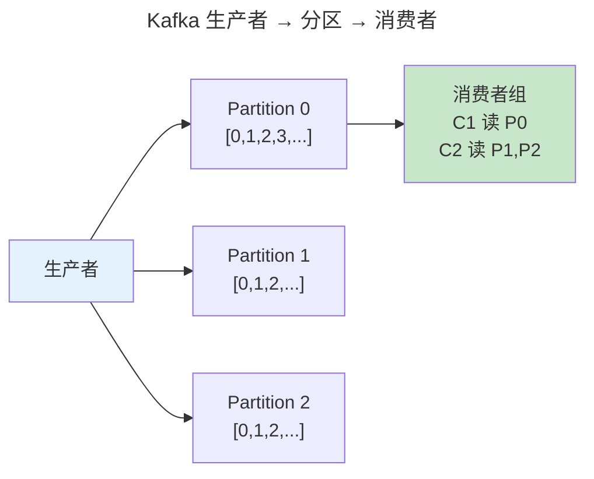

> 让数据流动起来。

数据库擅长存储当前状态但不擅长描述状态如何变化。数据流水线将数据视为持续的**事件流**。本章覆盖 Kafka 分布式日志、流处理的时间语义与 Exactly-Once 保证。

---

## Kafka：分区化不可变日志

Kafka 的核心抽象是分区日志——每个 Topic 被切分为多个有序分区，每条消息有单调递增的偏移量。分区内严格有序，跨分区无序。

ISR（同步副本集）确保消息在多数副本确认后才视为已提交——类似 [Raft 的多数确认](../04-consensus-protocols/)。当 Follower 落后超过阈值被踢出 ISR。

---

## 流处理：事件时间 vs 处理时间

**水位线**（Watermark）是事件时间处理的基石——告诉引擎"所有时间戳早于 T 的事件都已到达"。Flink 通过**检查点**实现状态的故障恢复：协调者注入 Barrier 沿数据流图传播，每个算子收到 Barrier 后异步保存状态——实现 Exactly-Once 语义。

---

## Lambda vs Kappa 架构

| 架构 | 批处理层 | 流处理层 | 复杂度 |
|------|---------|---------|--------|
| **Lambda** | Spark/MapReduce | Storm/Flink | 高（两套代码） |
| **Kappa** | 不需要——流引擎回放 | Flink/Kafka Streams | 低（单引擎） |

Kappa 的核心思想：**批处理只是从 offset 0 回放到最后 offset 的流处理特例**。

---

## 跨卷连接

| 概念 | 关联 |
|------|------|
| Kafka 分区日志 | [LSM Tree SSTable 分段追加](../02-storage-engine/) |
| Exactly-Once | [WAL + 2PC 的两阶段提交](../03-distributed-fundamentals/) |
| Flink 检查点 | [操作系统进程快照 CRIU](../03-qiankun/01-process-and-thread/) |

:::tip[卷四内部路径]
- [**存储引擎**](../02-storage-engine/)：LSM Tree 压缩——Kafka Log Compaction
- [**共识协议**](../04-consensus-protocols/)：Raft——Kafka KRaft 共识基础
:::
