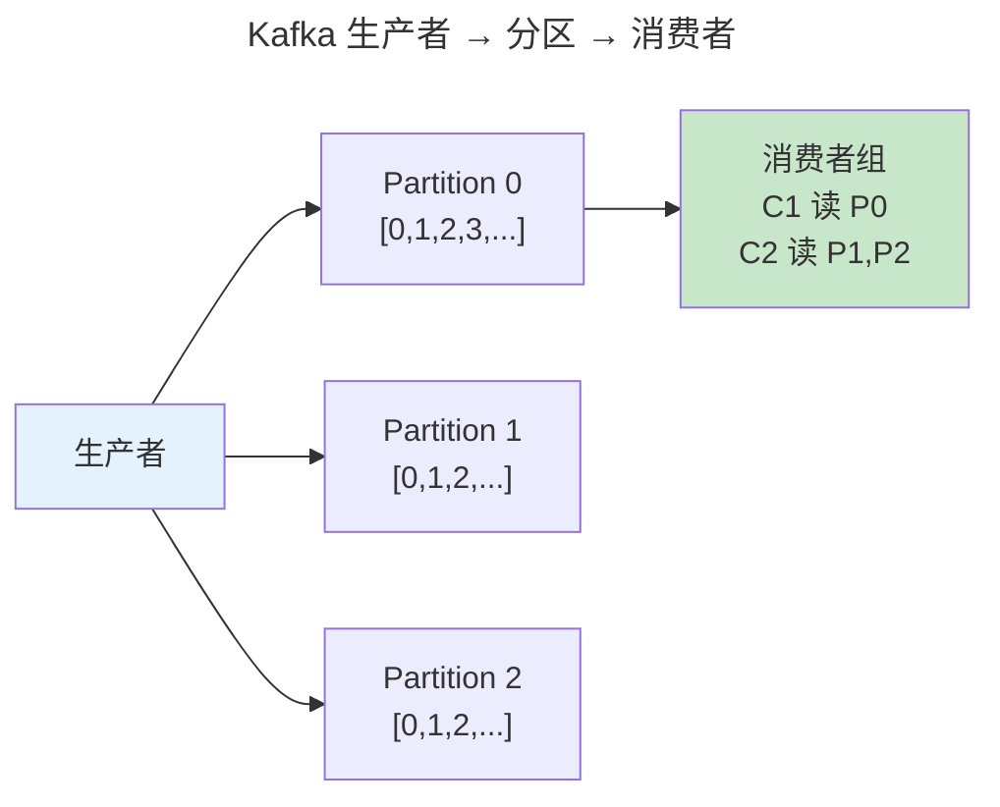
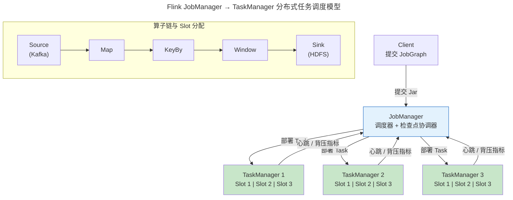

> 让数据流动起来。

数据库擅长存储当前状态但不擅长描述状态如何变化。数据流水线将数据视为持续的**事件流**。本章覆盖 Kafka 分布式日志、流处理的时间语义与 Exactly-Once 保证。

---

## Kafka：分区化不可变日志

Kafka 的核心抽象是分区日志——每个 Topic 被切分为多个有序分区，每条消息有单调递增的偏移量。分区内严格有序，跨分区无序。

ISR（同步副本集）确保消息在多数副本确认后才视为已提交——类似 [Raft 的多数确认](../04-consensus-protocols/)。当 Follower 落后超过阈值被踢出 ISR。

---

## 流处理：事件时间 vs 处理时间

**水位线**（Watermark）是事件时间处理的基石——告诉引擎"所有时间戳早于 T 的事件都已到达"。Flink 通过**检查点**实现状态的故障恢复：协调者注入 Barrier 沿数据流图传播，每个算子收到 Barrier 后异步保存状态——实现 Exactly-Once 语义。

---

## Lambda vs Kappa 架构

| 架构 | 批处理层 | 流处理层 | 复杂度 |
|------|---------|---------|--------|
| **Lambda** | Spark/MapReduce | Storm/Flink | 高（两套代码） |
| **Kappa** | 不需要——流引擎回放 | Flink/Kafka Streams | 低（单引擎） |

Kappa 的核心思想：**批处理只是从 offset 0 回放到最后 offset 的流处理特例**。

---

## 分布式任务调度：Flink JobManager 与 Task Slot

流处理引擎不只是"处理数据"，它本质上是一个**分布式任务调度器**——将 DAG 中的算子分配到多台机器的多个 Slot 上，并持续监控故障和背压。

Flink 任务调度的核心概念：

| 概念 | 含义 | 类比 |
|------|------|------|
| **JobManager** | 中央调度器，负责 JobGraph → ExecutionGraph 转换、Slot 分配、检查点协调 | Kubernetes Scheduler |
| **TaskManager** | 工作节点，提供 Task Slot 执行具体算子 | Kubernetes Kubelet |
| **Task Slot** | TaskManager 内的资源隔离单元（内存 + 线程），一个 Slot 可运行算子链中的多个算子 | Linux CPU Core |
| **算子链** (Operator Chain) | 相邻且无数据 shuffle 的多个算子合并为一个 Task——减少线程切换和网络序列化 | CPU 流水线指令融合 |
| **Slot Sharing** | 同一 Job 的不同算子可以共享 Slot——均匀分摊各 Slot 的负载 | 线程池共享 |

### 调度策略与 CFS 的跨卷呼应

Flink 默认使用**轮询**（Round-Robin）策略在可用 TaskManager 间均匀分配 Slot——这与负载均衡的 Round Robin 策略完全同构。但 Flink 的调度器面临一个 CFS 不需要考虑的维度：**数据局部性**。

当 Source 算子从 Kafka Partition 读取数据时，Flink 尽量将 Source Task 调度到 Kafka Leader 所在节点——减少网络传输。这一优化与 Linux [NUMA 调度器](../../01-weichen/04-memory-hierarchy/) 的"内存就近分配"原则同源：调度器追求"让计算靠近数据"，无论调度粒度是进程（Linux）、Pod（K8s）还是 Task（Flink）。

:::tip[跨卷链接]
Flink 的 Slot 分配逻辑是 [CFS 调度器 `vruntime` 公平性（调度算法：CFS 与 EEVDF）](../../03-qiankun/01-process-and-thread/#调度算法cfs-与-eevdf) 在集群维度的推广——CFS 在 **单核时间分片** 上追求公平（`vruntime` 最小优先），Flink 在 **集群 Slot 资源** 上追求公平（已有 Task 最少的 Slot 优先分配）。两者在算法层面都使用最小堆（PriorityQueue），只是比较的键不同：vruntime vs slotUsageCount。
:::

---

## 跨卷连接

| 概念 | 关联 |
|------|------|
| Kafka 分区日志 | [LSM Tree SSTable 分段追加](../02-storage-engine/) |
| Exactly-Once | [WAL + 2PC 的两阶段提交](../03-distributed-fundamentals/) |
| Flink 检查点 | [进程与线程的 CRIU 快照机制](../../03-qiankun/01-process-and-thread/) |
| Flink Slot 调度 | [CFS `vruntime` 公平调度算法（调度算法：CFS 与 EEVDF）](../../03-qiankun/01-process-and-thread/#调度算法cfs-与-eevdf) |

:::tip[卷四内部路径]
- [**存储引擎**](../02-storage-engine/)：LSM Tree 压缩——Kafka Log Compaction
- [**共识协议**](../04-consensus-protocols/)：Raft——Kafka KRaft 共识基础
:::
