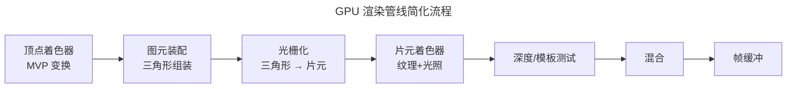

> 从顶点到像素的旅程。

GPU 是现代计算机中并行度最高的处理器——一块 NVIDIA H100 拥有 16896 个 CUDA 核心。但它的起源是一个更简单的问题：如何高效地将三维顶点转换为屏幕上的二维像素？**渲染管线**（Rendering Pipeline）就是这个问题的答案——一条从顶点输入到像素输出的流水线，将[矩阵变换与光照模型](../02-computer-graphics/)的数学转换为每秒钟数十亿像素的视觉现实。

---

## 顶点处理与坐标变换

顶点的旅程始于**顶点着色器**（Vertex Shader）——一个完全可编程的阶段。输入是顶点属性（位置、法线、纹理坐标），输出是经过变换的顶点位置和插值属性。核心变换：

| 矩阵 | 空间变换 | 作用 |
|------|---------|------|
| **Model** | 物体空间 → 世界空间 | 放置、旋转、缩放物体 |
| **View** | 世界空间 → 相机空间 | 从相机视角观察 |
| **Projection** | 相机空间 → 裁剪空间 | 透视投影（近大远小） |

三个矩阵合为一个 MVP 矩阵：$P_{clip} = M_{proj} \cdot M_{view} \cdot M_{model} \cdot P_{local}$

---

## 光栅化与片元处理

光栅化（Rasterization）是管线的固定功能阶段——将三角形"拆解"为离散的像素。每个像素生成一个**片元**（Fragment），附带从顶点属性插值得到的数据（颜色、深度、纹理坐标）。

片元着色器（Fragment Shader）对每个片元执行：纹理采样、光照计算、颜色混合。最终片元经过**深度测试**（丢弃被遮挡的像素）和**混合**（处理透明度）后写入帧缓冲。

:::tip[跨卷链接]
GPU 的 SIMT（单指令多线程）执行模型与 [CPU 的 SIMD 向量化指令](../../01-weichen/05-instruction-set-architecture/#cisc-与-risc两套哲学的五十年对决) 共享同一设计哲学——一条指令处理多个数据。区别在于规模：CPU 的 AVX-512 一次处理 16 个 32 位浮点数，而 GPU Warp 一次调度 32 个线程执行同一条着色器指令。
:::

---

## 跨卷连接

| 概念 | 关联 |
|------|------|
| MVP 矩阵变换 | [线性代数——矩阵乘法的组合变换](../../00-lingxi/01-mathematical-foundations/) |
| 光栅化 Bresenham | [组合逻辑——整数增量误差累加器](../../01-weichen/02-digital-logic/) |
| GPU 并行架构 | [FPGA 可编程逻辑——粗粒度并行 vs 细粒度并行](../../01-weichen/02-digital-logic/) |

:::tip[卷五内部路径]
- [**计算机图形学**](../02-computer-graphics/)：MVP 矩阵与光照模型的数学推导
- [**前端工程**](../03-frontend-engineering/)：WebGL——GPU 管线在浏览器中的实现
:::
