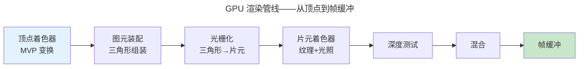
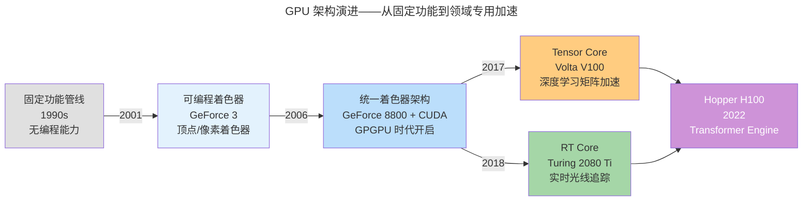

> 从顶点到像素的旅程。

GPU 是现代计算机并行度最高的处理器（H100 有 16896 个 CUDA 核心）。渲染管线是顶点 → 像素的完整流水线。

---

## 顶点处理与 MVP 变换



$P_{clip} = M_{proj} \cdot M_{view} \cdot M_{model} \cdot P_{local}$——三个矩阵合为一个 MVP，将物体坐标变换到裁剪空间。

---

## 光栅化与片元处理

光栅化将三角形"拆解"为离散像素——每个像素生成片元附带插值属性。片元着色器执行纹理采样和光照计算。深度测试丢弃被遮挡像素，混合处理透明度——最终写入帧缓冲。

### 边函数与三角形遍历

GPU 通过**边函数**（Edge Function）判断像素是否在三角形内部。对于屏幕空间顶点 $V_0(x_0,y_0)$、$V_1(x_1,y_1)$、$V_2(x_2,y_2)$（逆时针排列），边 $V_i \to V_j$ 的边函数定义为：

$$
E_{ij}(x, y) = (x_j - x_i)(y - y_i) - (y_j - y_i)(x - x_i)
$$

几何意义：$E_{ij}$ 等于向量 $\vec{V_iV_j}$ 与 $\vec{V_iP}$ 的叉积——即三角形 $V_i V_j P$ 有向面积的 2 倍。像素 $P$ 在三角形内部，当且仅当三条边函数同号：

$$
E_{01} \geq 0 \;\land\; E_{12} \geq 0 \;\land\; E_{20} \geq 0
$$

:::note[增量计算：从 Bresenham 到边函数]
GPU 不逐像素重新计算边函数。利用线性性质，相邻像素只需一次整数加法：

$$
E(x+1, y) = E(x, y) + \underbrace{(y_i - y_j)}_{\Delta_x E},\qquad
E(x, y+1) = E(x, y) + \underbrace{(x_j - x_i)}_{\Delta_y E}
$$

这与 [Bresenham 画线算法](../../01-weichen/02-digital-logic/) 中误差累加器的增量计算**数学同构**——均利用一阶差分避免逐点乘法。GPU 光栅化器本质上是对三角形区域并行执行二维 Bresenham。
:::

### 重心坐标与透视校正插值

边函数的值恰好是有向面积的 2 倍，因此**重心坐标**（Barycentric Coordinates）可直接由边函数得出：

$$
\alpha = \frac{E_{12}(x,y)}{E_{12}(x_0,y_0)},\quad
\beta = \frac{E_{20}(x,y)}{E_{20}(x_1,y_1)},\quad
\gamma = 1 - \alpha - \beta
$$

片元的任意顶点属性（颜色、法线、纹理坐标）通过 $(\alpha, \beta, \gamma)$ 加权插值。然而透视投影下，屏幕空间线性插值会产生失真——远处纹理拉伸，近处压缩。**透视校正插值**（Perspective-Correct Interpolation）先对 $\frac{attr}{w}$ 和 $\frac{1}{w}$ 分别做屏幕空间线性插值，再做除法恢复：

$$
attr_{correct} = \frac{\alpha \cdot \frac{attr_0}{w_0} + \beta \cdot \frac{attr_1}{w_1} + \gamma \cdot \frac{attr_2}{w_2}}{\alpha \cdot \frac{1}{w_0} + \beta \cdot \frac{1}{w_1} + \gamma \cdot \frac{1}{w_2}}
$$

其中 $w$ 是 MVP 变换中投影矩阵赋予的齐次坐标分量——这是 [图形学齐次坐标](../02-computer-graphics/) 在光栅化阶段的直接应用。

### 深度测试与多重采样

每个片元携带插值后的深度值 $z$。**Z-Buffer** 记录每个像素的当前最近深度——只有 $z < z_{buffer}[x][y]$ 的片元通过测试并更新缓冲。Early-Z 优化可将深度测试提前至片元着色器之前执行，前提是着色器不修改深度值（`gl_FragDepth`）。

**多重采样抗锯齿**（MSAA $n \times$）在每个像素内放置 $n$ 个子采样点（常见 $2\times2=4\times$），对每个子采样点独立执行边函数和深度测试，但片元着色器仍以像素为单位执行一次——以适中的计算代价（$n$ 倍 Z-Buffer 带宽）换取几何边缘的平滑。

---

## GPU 架构演进

从图形加速卡到通用并行计算引擎，GPU 经历了五次范式跃迁——每一次都是"固定功能 → 可编程 → 领域专用"的螺旋上升。



- **固定功能管线**（1990s）：每个阶段由硬件固化——变换、光照、光栅化按固定路径执行。开发者只能配置参数，无法控制算法。
- **可编程着色器**（2001，GeForce 3）：引入顶点着色器和像素着色器，开发者首次可以用类 C 语言（HLSL / GLSL）编写 GPU 程序。但顶点和像素单元仍分立——负载不均衡。
- **统一着色器架构**（2006，GeForce 8800 / Tesla 架构）：顶点、几何、像素着色器统一为同一种可编程核心（CUDA Core）。同一批核心动态调度到不同着色阶段——消除资源闲置。CUDA 的发布将 GPU 从图形加速器拓展为通用并行计算平台。
- **Tensor Core**（2017，Volta V100）：专用矩阵乘加单元，单周期完成 $4\times4$ 矩阵的 $D = A \times B + C$ 运算（FP16→FP32）。将深度学习训练吞吐推至 100+ TFLOPS。
- **RT Core**（2018，Turing 2080 Ti）：专用光线-三角形求交和 BVH 遍历硬件。将光线追踪从离线渲染带入实时（10 GigaRays/s）。
- **Hopper**（2022，H100）：Transformer Engine 支持 FP8 精度动态缩放，DPX 指令加速动态规划——从图形到 AI 的完全蜕变。

:::tip[架构演进的主线]
从**固定功能**到**可编程**，再到**领域专用加速**（Tensor Core / RT Core）——GPU 演进遵循"通用计算为基，专用硬件为峰"的 [异构计算哲学](../../01-weichen/03-microarchitecture/)。
:::

---

## GPU 并行架构

GPU 的 SIMT 模型：一条指令在 Warp（32 线程）上同时执行——与 [CPU SIMD](../../01-weichen/05-instruction-set-architecture/) 同根，但规模大百倍。

### SIMT 执行模型

NVIDIA GPU 的最小调度单位是 **Warp**（32 线程），AMD 称为 **Wavefront**（64 线程）。一个 Warp 内的所有线程在同一周期执行同一条指令——就像 SIMD 的向量通道，但每个线程拥有独立寄存器和程序计数器（从开发者视角）。

当 Warp 内线程因分支走向不同路径时，GPU 通过**执行掩码**（Execution Mask）串行执行各分支路径，空闲线程被屏蔽。这种现象称为**线程发散**（Thread Divergence）——是 GPU 编程的核心性能陷阱。

:::caution[线程发散——GPU 的隐形减速带]
```c
// 坏：相邻线程走不同分支 → Warp 串行执行两路
if (threadIdx.x % 2 == 0) { /* path A */ } else { /* path B */ }

// 好：Warp 内线程走向一致 → 单次通过
if (threadIdx.x / 32 == blockIdx.x) { /* ... */ }
```
发散使有效吞吐量除以分支数量——等价于 CPU 分支预测失败时的流水线冲刷，但 GPU 以空间换时间：损失的是并行度而非流水线深度。
:::

### 存储层次

GPU 存储体系自近而远、自快而慢、自小而大：

| 层次 | 典型大小（H100 / SM） | 延迟 | 作用域 |
|------|:--:|:--:|------|
| 寄存器文件 | 256 KB / SM | ~0 cycles | 单线程私有 |
| 共享内存 + L1 | 256 KB（可配分） | ~30 cycles | Warp / Block 内共享 |
| L2 Cache | 50 MB（全芯片） | ~200 cycles | 全 GPU 共享 |
| HBM3 显存 | 80 GB | ~400-800 cycles | 全 GPU + 跨 Kernel |

**占用率**（Occupancy）是 SM 上活跃 Warp 数与理论最大 Warp 数之比：

$$
occupancy = \frac{active\_warps\_per\_SM}{max\_warps\_per\_SM}
$$

高占用率意味着更多 Warp 可供调度器在访存延迟期间切换——GPU 用海量线程的**延迟隐藏**（Latency Hiding）替代 CPU 的大容量缓存策略。H100 每 SM 最多 64 个 Warp（2048 线程），全芯片 132 SM × 2048 = 约 27 万线程同时驻留。

### 计算瓶颈 vs 访存瓶颈：Roofline 模型

**Roofline 模型**将 Kernel 性能上界表达为算术强度 $I$（FLOP/Byte）的函数：

$$
P = \min(\pi,\; \beta \cdot I)
$$

其中 $\pi$ 是峰值计算吞吐（FLOP/s），$\beta$ 是峰值显存带宽（Byte/s）。临界点 $I^* = \pi / \beta$ 划分两个优化域：

- **$I < I^*$**：访存瓶颈——优化方向是数据复用（共享内存、寄存器分块）、算子融合
- **$I > I^*$**：计算瓶颈——优化方向是降低精度（FP16/BF16/INT8）、减少发散、利用 Tensor Core

以 H100 SXM 为例（FP16 Tensor Core: $\pi \approx 990$ TFLOPS，$\beta = 3.35$ TB/s）：

$$
I^* = \frac{990 \times 10^{12}}{3.35 \times 10^{12}} \approx 296\ \text{FLOP/Byte}
$$

> 对比 CPU（$\pi \approx 2$ TFLOPS FP32，$\beta \approx 100$ GB/s）：$I^* \approx 20$ FLOP/Byte。GPU 的临界点高一个数量级——意味着 GPU 对数据局部性要求**更苛刻**。因此 [FlashAttention](../../06-xumi/03-transformer-family/#flashattention) 的核心策略就是通过 SRAM 分块将算术强度推过临界点。

### GPU 与浏览器合成

现代浏览器的**合成器线程**将页面拆分为独立图层，每个图层光栅化为纹理后，由 GPU 完成位移（`transform`）、透明度（`opacity`）和图层叠加——这些操作只触发合成阶段，完全不走 Layout / Paint 流水线。这就是 [前端工程章 60fps 动画秘诀](../03-frontend-engineering/) 的硬件基础：利用 GPU 的多图层合成能力，将页面动画从 CPU 重计算转为 GPU 纹理拼接。

---

## 跨卷连接

| 概念 | 关联 |
|------|------|
| MVP 矩阵变换 | [线性代数矩阵乘法](../../00-lingxi/01-mathematical-foundations/) |
| 光栅化 Bresenham | [整数增量误差累加器](../../01-weichen/02-digital-logic/) |
| SIMT Warp | [SIMD 向量化指令](../../01-weichen/05-instruction-set-architecture/) |

:::tip[卷五内部路径]
- [**计算机图形学**](../02-computer-graphics/)：MVP 矩阵与光照的数学
- [**数据可视化**](../04-data-visualization/)：WebGL 大规模渲染
:::
