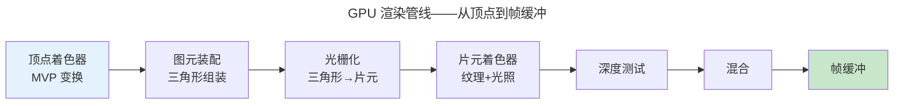

> 从顶点到像素的旅程。

GPU 是现代计算机并行度最高的处理器（H100 有 16896 个 CUDA 核心）。渲染管线是顶点 → 像素的完整流水线。

---

## 顶点处理与 MVP 变换

$P_{clip} = M_{proj} \cdot M_{view} \cdot M_{model} \cdot P_{local}$——三个矩阵合为一个 MVP，将物体坐标变换到裁剪空间。

---

## 光栅化与片元处理

光栅化将三角形"拆解"为离散像素——每个像素生成片元附带插值属性。片元着色器执行纹理采样和光照计算。深度测试丢弃被遮挡像素，混合处理透明度——最终写入帧缓冲。

---

## GPU 并行架构

GPU 的 SIMT 模型：一条指令在 Warp（32 线程）上同时执行——与 [CPU SIMD](../../01-weichen/05-instruction-set-architecture/) 同根，但规模大百倍。

---

## 跨卷连接

| 概念 | 关联 |
|------|------|
| MVP 矩阵变换 | [线性代数矩阵乘法](../../00-lingxi/01-mathematical-foundations/) |
| 光栅化 Bresenham | [整数增量误差累加器](../../01-weichen/02-digital-logic/) |
| SIMT Warp | [SIMD 向量化指令](../../01-weichen/05-instruction-set-architecture/) |

:::tip[卷五内部路径]
- [**计算机图形学**](../02-computer-graphics/)：MVP 矩阵与光照的数学
- [**数据可视化**](../04-data-visualization/)：WebGL 大规模渲染
:::
