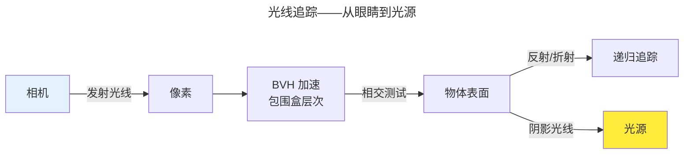

> 数学变成光影的艺术。

GPU 提供硬件加速，着色器代码需要数学来指导——这就是图形学。它解答：如何用矩阵表达旋转？如何模拟光的反射？如何用蒙特卡洛积分模拟全局光照？

---

## 齐次坐标与变换矩阵

三维图形学使用 4D 齐次坐标——因为 4×4 矩阵可统一表示旋转、平移、缩放和透视投影。旋转矩阵正交（$R^T = R^{-1}$），平移在第四列，投影矩阵将视锥体映射到 NDC 立方体。

---

## PBR 与渲染方程

PBR（Physically Based Rendering）基于 Kajiya 1986 年的渲染方程：

$$
L_o(p, \omega_o) = L_e(p, \omega_o) + \int_{\Omega} f_r(p, \omega_i, \omega_o) L_i(p, \omega_i)(\omega_i \cdot n) d\omega_i
$$

实时渲染通过重要性采样近似，离线渲染通过路径追踪的蒙特卡洛积分求解。

---

## 光线追踪

NVIDIA RTX 的 RT Core 硬件加速了光线-三角形相交——将光线追踪带入实时渲染。

---

## 跨卷连接

| 概念 | 关联 |
|------|------|
| 矩阵正交性 | [线性代数——特征值分解](../../00-lingxi/01-mathematical-foundations/) |
| BVH | [B+Tree 分层查找](../../04-yuanhai/01-relational-database/) |

:::tip[卷五内部路径]
- [**GPU 渲染管线**](../01-gpu-rendering-pipeline/)：着色器——图形学的执行器
:::
