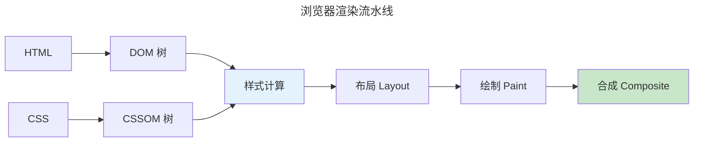

> 浏览器的画布，交互的舞台。

浏览器是最广泛部署的跨平台运行时——集成 HTML 解析、CSS 布局、JS JIT、WebGL 图形和网络协议栈。

---

## 关键渲染路径

1. **解析**：HTML → DOM 树，CSS → CSSOM 树
2. **样式计算**：CSS 规则应用到 DOM 节点
3. **布局**（Reflow）：计算盒模型
4. **绘制**（Paint）：生成绘制指令
5. **合成**（Composite）：图层合并

`transform` 和 `opacity` 只触发合成——60fps 流畅动画的关键。

---

## 布局与状态管理

Flexbox（一维）和 Grid（二维）是现代 CSS 布局支柱。`contain: layout style paint` 告诉浏览器元素独立渲染——大型 SPA 性能秘诀。

状态管理三路线：Redux（单一不可变状态树）、Signals（细粒度响应式）、编译时框架（Svelte 编译为直接 DOM 操作）。

---

## 跨卷连接

| 概念 | 关联 |
|------|------|
| 浏览器合成器 | [GPU 多图层合成](../01-gpu-rendering-pipeline/) |
| 虚拟 DOM Diff | [最长公共子序列——动态规划](../../00-lingxi/04-algorithm-theory/) |
| CSS Grid | [图论——二维约束求解](../../00-lingxi/04-algorithm-theory/) |

:::tip[卷五内部路径]
- [**数据可视化**](../04-data-visualization/)：D3.js——前端图形侧
- [**人机交互**](../05-human-computer-interaction/)：WCAG——可访问性实践
:::
