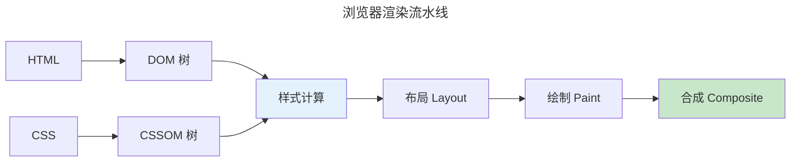
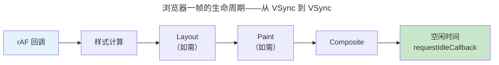
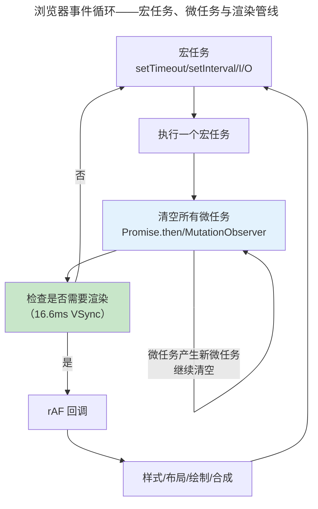

> 浏览器的画布，交互的舞台。

浏览器是最广泛部署的跨平台运行时——集成 HTML 解析、CSS 布局、JS JIT、WebGL 图形和网络协议栈。

---

## 关键渲染路径

1. **解析**：HTML → DOM 树，CSS → CSSOM 树
2. **样式计算**：CSS 规则应用到 DOM 节点
3. **布局**（Reflow）：计算盒模型
4. **绘制**（Paint）：生成绘制指令
5. **合成**（Composite）：图层合并

`transform` 和 `opacity` 只触发合成——60fps 流畅动画的关键。

---

### 布局抖动与强制同步布局

浏览器为效率将 JavaScript 修改 DOM/CSS 后的重排（Reflow）**延迟批处理**。然而一旦 JavaScript 读取布局属性（如 `offsetWidth`、`getBoundingClientRect()`），浏览器必须**强制同步布局**（Forced Synchronous Layout）——立即停下 JS 执行，完成所有待处理的重排。

读→写→读模式触发布局抖动：修改 DOM（写）→ 读取 `offsetWidth`（读）→ 浏览器被迫立即 Layout → 修改 DOM → 读取……每帧多次 Layout，性能崩溃。

解决方案是**先读后写**——将所有读取操作集中、写入操作集中，中间用 `requestAnimationFrame` 隔开。这与 [React 并发模式时间切片](../../06-xumi/04-large-language-models/) 同构：将长任务分解为可中断的微任务。

### requestAnimationFrame 与 VSync

`requestAnimationFrame`（rAF）将回调注册到浏览器的**帧边界**——在显示器垂直同步信号（VSync，60Hz 约 16.6ms）之前执行。一帧的生命周期：

> 如果 rAF 回调耗时超过 16.6ms → 丢帧 → 用户感知卡顿。`requestIdleCallback` 利用帧末空闲时间执行低优先级任务，为时间切片调度器提供底层原语。

### 合成器与图层提升

合成器线程独立于主线程，负责将页面**图层**（Layer）拼接为最终屏幕图像。元素在以下条件被提升为独立图层：

- 3D transform（`translateZ(0)`）
- `<video>`、`<canvas>`、`<iframe>`
- CSS `will-change: transform`
- 被 `overflow: scroll` 裁剪的元素

:::caution[图层爆炸]
每提升一个图层，GPU 显存分配一块纹理——就像 [内存管理中的页表膨胀](../../03-qiankun/02-memory-management/) 一样，图层过多（>100 个）反而拖累性能。Chrome DevTools 的 Layers 面板是诊断图层爆炸的首要工具。
:::

---

## 布局与状态管理

Flexbox（一维）和 Grid（二维）是现代 CSS 布局支柱。`contain: layout style paint` 告诉浏览器元素独立渲染——大型 SPA 性能秘诀。

状态管理三路线：Redux（单一不可变状态树）、Signals（细粒度响应式）、编译时框架（Svelte 编译为直接 DOM 操作）。

### Flexbox 弹性计算公式

Flexbox 的 `flex-grow` 按权重分配剩余空间。设容器剩余空间为 $S$，子项 $i$ 的基础大小为 $w_i^{base}$，弹性系数为 $g_i$：

$$
w_i = w_i^{base} + \frac{g_i}{\sum_{j} g_j} \cdot S
$$

`flex-shrink` 的收缩公式更复杂——收缩权重由 `flex-shrink × flex-basis` 决定，防止小元素被过度压缩：

$$
\Delta w_i = \frac{s_i \cdot w_i^{base}}{\sum_j (s_j \cdot w_j^{base})} \cdot |S_{deficit}|
$$

这本质上是 [线性规划中对偶变量的按权重分配](../../00-lingxi/01-mathematical-foundations/) 问题：约束空间的总和，按贡献比例分摊。

### 状态管理三路线对比

| 路线 | 代表库 | 数据流 | 更新粒度 | 适用场景 |
|------|--------|--------|:--:|------|
| 不可变状态树 | Redux / Zustand | 单向数据流，`dispatch(action) → reducer → new state` | 组件树重渲染 | 大型 SPA，需时间旅行调试 |
| 细粒度响应式 | SolidJS / Qwik / Preact Signals | 自动依赖追踪，`signal → effect` | 单个 DOM 节点 | 高性能场景，细粒度更新 |
| 编译时优化 | Svelte / Marko | 编译为直接 DOM 操作，无 Virtual DOM | 赋值触发微更新 | 轻量应用，极小程序包 |

:::tip[响应式与硬件缓存一致性协议的同构]
Signals 的自动依赖追踪——当源信号变化时，所有依赖该信号的 effect 自动重新执行——与 [MESI 缓存一致性协议](../../01-weichen/04-memory-hierarchy/#mesi引入-exclusive-态优化读转写) 中的**无效化广播**机制共享同一设计模式：写入者通知所有读取者"你的缓存已失效"。这是分布式系统中 **Observer 模式的极限特化**。
:::

---

## Virtual DOM 与 Diff 算法

React 引入 Virtual DOM 的本质动机：直接操作真实 DOM 的代价极高（一次 `innerHTML` 可能触发完整的 Layout→Paint→Composite 流水线）。Virtual DOM 在 JavaScript 内存中维护一棵轻量树，通过 Diff 算法计算最小变更集，再批量提交到真实 DOM。

### 树编辑距离与 O(n) 启发式

两棵树的**编辑距离**（Tree Edit Distance）——通过插入、删除、替换节点将 A 转为 B 的最小操作数——在最坏情况下是 NP 难问题。React 的 Diff 算法采用三条约简假设，将复杂度降至 $O(n)$：

1. **同层比较**：只比较同一层级的节点，不跨层级匹配
2. **类型判异**：节点类型不同时，整棵子树替换（不递归比较子节点）
3. **Key 标识**：通过 `key` 属性标记兄弟节点身份，支持原地复用

$$
T_{diff}(n) = O(n) \quad \text{（同层线性遍历，每节点 O(1) 比较）}
$$

对比通用树编辑距离的 $O(n^3)$（Zhang-Shasha 算法），React 用假设换速度——这是 [动态规划最优子结构理论](../../00-lingxi/04-algorithm-theory/#动态规划最优子结构的艺术) 在 UI 工程中的直接应用：放弃全局最优，追求启发式最优。

### Key 与列表 Diff——Enter / Update / Exit 三态

当子节点是列表时，`key` 属性使 Diff 算法可以识别节点的**身份**而非位置。无 key 时，列表头部插入会导致所有节点被误判为"修改"；有 key 后，只需移动现有节点 + 插入新节点。

这恰好映射到 **D3.js 数据绑定的 enter / update / exit 三元组**——前端声明式 UI 的底层同构：

| 状态 | D3 Data Join | Virtual DOM Diff | 操作 |
|------|-------------|-----------------|------|
| **Enter** | 数据多于 DOM 元素 | 新 key 未匹配到旧节点 | 创建新组件实例 |
| **Update** | 数据已绑定 DOM 元素 | key 相同，type 相同 | 复用并更新 props |
| **Exit** | DOM 元素无对应数据 | 旧 key 未匹配到新节点 | 卸载组件 + 动画过渡 |

> [数据可视化章的 D3 enter/update/exit 模式](../04-data-visualization/) 恰是 Virtual DOM Diff 在数据文档中的映射——二者都遵循"以数据驱动 DOM 变更"的声明式哲学。

:::caution[Key 使用陷阱]
- ❌ `key={index}`：列表重排序时 key 错位 → Diff 失败 → DOM 重写而非移动
- ✅ `key={item.id}`：稳定的业务标识符 → 最小 DOM 操作
:::

---

## 事件循环与异步模型

### 浏览器事件循环

JavaScript 是单线程语言，通过**事件循环**（Event Loop）实现异步非阻塞。执行模型分三个队列：

- **宏任务**（Macrotask）：`setTimeout`、`setInterval`、I/O、UI 事件——每轮一个
- **微任务**（Microtask）：`Promise.then`、`queueMicrotask`、`MutationObserver`——每轮清空到队列为空
- **渲染管线**：仅在宏任务间、且达到 VSync 边界时插入执行

### Node.js 事件循环与 libuv

Node.js 的异步能力来自 **libuv**——一个跨平台的 reactor 模式实现。它将不同平台的异步 I/O 原语（Linux epoll、macOS kqueue、Windows IOCP）统一为事件循环抽象。这与 [网络编程章的 epoll 详解](../../03-qiankun/08-network-programming/) 共享同一内核机制——libuv 本质上是 **epoll 在应用层的跨平台封装**。

Node.js 事件循环分六个阶段（timers → pending callbacks → idle/prepare → poll → check → close），其中 `process.nextTick` 和 `Promise` 微任务在每个阶段间隙执行——与浏览器的事件循环在结构上同构，但在**渲染管线的插入位置**上有本质区别（Node.js 无渲染阶段）。

---

## 跨卷连接

| 概念 | 关联 |
|------|------|
| 浏览器合成器 | [GPU 多图层合成与 VSync 时序](../01-gpu-rendering-pipeline/) |
| 虚拟 DOM Diff | [动态规划：最优子结构的艺术](../../00-lingxi/04-algorithm-theory/#动态规划最优子结构的艺术) |
| Flexbox flex-grow | [线性规划的按权重分配——对偶变量](../../00-lingxi/01-mathematical-foundations/) |
| Signals 响应式 | [MESI 缓存一致性协议——无效化广播同构](../../01-weichen/04-memory-hierarchy/#mesi引入-exclusive-态优化读转写) |
| Node.js libuv 事件循环 | [epoll——Linux 异步 I/O 的核心](../../03-qiankun/08-network-programming/) |
| Enter / Update / Exit 三态 | [D3 Data Join——声明式数据绑定的三态模型](../04-data-visualization/) |
| CSS Grid 二维布局 | [图论——二维约束求解](../../00-lingxi/04-algorithm-theory/) |

:::tip[卷五内部路径]
- [**数据可视化**](../04-data-visualization/)：D3.js——前端图形侧
- [**人机交互**](../05-human-computer-interaction/)：WCAG——可访问性实践
:::
