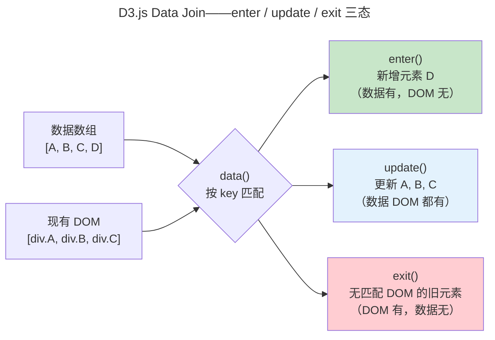

> 让数据讲故事。

一幅精心设计的图表能在瞬间传达表格数百行的关系。数据可视化是感知心理学、图形设计和计算机图形学的交叉学科。

---

## 可视化管道：从数据到感知


每一步都是独立的决策点：数据变换决定"展示什么"，可视化编码决定"如何展示"，渲染技术决定性能边界。

---

## 可视化编码：Bertin 的视觉通道

Bertin 在 1967 年提出了六大视觉通道（Retinal Variables），按感知精度排序：

| 通道 | 精度排名 | 适合数据类型 | 不适合 |
|------|:--:|------|------|
| **位置** | 1（最高） | 定量（散点图、折线图） | — |
| **长度** | 2 | 定量比较（柱状图） | 面积比较不精确 |
| **角度/斜率** | 3 | 定量（饼图不如柱状图） | 精确值读取 |
| **面积** | 4 | 定量概览（气泡图） | 精确比较 |
| **颜色亮度** | 5 | 定量（热力图） | 离散分类 |
| **颜色色相** | 6 | 分类（最多 7 类） | 定量（人眼不敏感） |

**Stevens 幂律**描述了人类感知与物理刺激的非线性关系。视觉长度的感知是指数的（$S \propto I^{1.0}$，接近线性），而亮度的感知被压缩（$S \propto I^{0.33}$）。这解释了为什么位置编码（散点图）比颜色亮度（热力图）精确——不仅是设计选择，是**人眼生理学决定的**。

---

## D3.js：Data Join 的核心哲学

D3 的核心创新是 **Data Join**——将数据数组与 DOM 元素的一一绑定：



这个三态模型与 [虚拟 DOM Diff 的 enter/update/exit 三元组](../03-frontend-engineering/) 同构——React/Vue 的虚拟 DOM 本质上是对 D3 数据绑定思想在 UI 组件层面的推广应用。过渡动画 `transition()` 在 250ms 内平滑插值，利用了人眼对**连续运动**的敏感性（格式塔共同命运原则）。

### 比例尺：数据空间到屏幕空间的映射

D3 的比例尺（Scale）将数据域映射到视觉范围——这是 [线性代数中仿射变换](../../00-lingxi/01-mathematical-foundations/) 在最实用场景的体现：

```javascript
// 线性比例尺：温度 [0°C, 40°C] → 屏幕高度 [400px, 0px]
const yScale = d3.scaleLinear()
  .domain([0, 40])     // 数据空间
  .range([400, 0]);    // 屏幕空间（Y 轴翻转）
```

`range` 中 Y 轴翻转（400→0）是因为屏幕坐标系原点在左上角——数学坐标与屏幕坐标的转换是所有可视化库的底层阿喀琉斯之踵。

---

## 信息设计原则

**格式塔原则**解释视觉自动分组：
- **接近律**：距离近的元素被视为一组 → 散点图中的聚类
- **相似律**：颜色/形状相同视为一组 → 折线图中同色=同系列
- **连续律**：沿平滑路径排列的元素被视为连续 → 趋势线一眼可见

**Tufte 的数据-墨水比**：一片图形中，用于展示数据的"墨水"占总墨水的比例应最大化。消除 chart junk——3D 柱状图、装饰性网格线、无意义的渐变——它们消耗视觉注意力却不传递信息。

---

## 跨卷连接

| 概念 | 关联 |
|------|------|
| D3 Data Join 三态 | [虚拟 DOM enter/update/exit 三态](../03-frontend-engineering/) |
| 比例尺 affine 映射 | [齐次坐标与变换矩阵](../02-computer-graphics/) |
| WebGL 大规模渲染 | [GPU 片元着色器并行绘制](../01-gpu-rendering-pipeline/) |
| Stevens 幂律感知压缩 | [对数尺度——数量级的直观表达](../../00-lingxi/01-mathematical-foundations/) |
| 格式塔连续律 | [贝塞尔曲线 smooth 插值——视觉连续性的数学保证](../02-computer-graphics/) |

:::tip[卷五内部路径]
- [**前端工程**](../03-frontend-engineering/)：D3 的 Web 技术栈集成——SVG/Canvas API
- [**人机交互**](../05-human-computer-interaction/)：信息设计的感知心理学基础——预注意处理
:::
