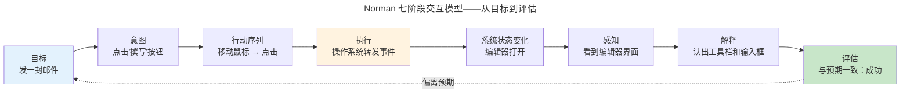
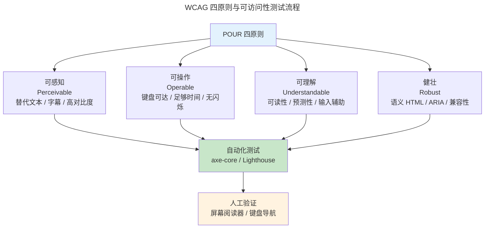

> 技术的终点是人。

HCI 关注人的感知、认知和行为。一个技术上完美的系统，如果用户无法理解如何使用它，仍然是失败的。

---

## 交互模型：从感知到行动

Norman 七阶段模型将用户行为分解为**执行鸿沟**（目标→执行）和**评估鸿沟**（系统状态→评估）。设计师的工作是**缩小这两个鸿沟**——让用户知道"我能做什么"（ affordance ）和"刚才发生了什么"（feedback）。

---

## Nielsen 十大可用性启发

| # | 原则 | 例 |
|---|------|----|
| 1 | 系统状态可见 | 进度条、剩余时间估计 |
| 2 | 匹配现实世界 | 回收站图标、文件夹隐喻 |
| 3 | 用户控制与自由 | Undo、关闭按钮 |
| 4 | 一致性与标准 | 同一平台 Ctrl+C = 复制 |
| 5 | 错误预防 | 灰色化不可用按钮 |
| 6 | 识别而非回忆 | 菜单 vs 命令行 |
| 7 | 灵活与高效 | 快捷键、宏 |
| 8 | 美观与简约 | 隐藏低频选项 |
| 9 | 帮助诊断错误 | "密码至少 8 位"而非"错误" |
| 10 | 帮助文档 | 搜索框 + 情境相关 |

---

## 量化交互：Fitts 与 Hick

### Fitts 法则——移动到目标的时间

$$
T = a + b \log_2\left(\frac{2D}{W}\right)
$$

其中 $D$ 是到目标的距离，$W$ 是目标宽度。ID（难度指数）$= \log_2(2D/W)$，单位是比特。这条法则解释了：

- **屏幕角落的按钮最容易点击**：鼠标被屏幕边缘"截停"，有效宽度 $W$ 趋近无限大——ID 趋近 0
- **右键菜单比菜单栏高效**：光标已在目标附近，$D$ 极小
- **饼图选中扇形的难度**随角度减小急剧上升——细扇区几乎无法悬停

Fitts 法则直接指导了 macOS 全局菜单栏（屏幕顶部边缘 = 无限宽度）和 Windows 开始按钮（屏幕左下角 = 双向截停）的设计决策。

### Hick 法则——选择时间随选项数对数增长

$$
T = b \log_2(n + 1)
$$

选项从 2 个增到 4 个，选择时间翻倍。这就是为什么：

- **汉堡菜单隐藏低频选项**——降低高频操作的 $n$
- **渐进式披露**（Progressive Disclosure）——先展示核心选项，按需展开高级选项
- **搜索框优于层级菜单**——当 $n > 50$ 时，直接搜索比逐层浏览更快

---

## 无障碍设计

ARIA 属性（`role`、`aria-label`、`aria-live`）补充 HTML 原生语义，使屏幕阅读器能正确解读现代 Web 应用——特别是动态更新的 SPA。`aria-live="polite"` 使屏幕阅读器在用户空闲时播报内容变化，实现了"不打断但告知"的交互平衡。

无障碍不是"额外的功能"——全球 10 亿人有某种形式的残障，且**键盘导航和语义 HTML 对所有用户都有益**（开发者依赖键盘、SEO 依赖语义）。

---

## 跨卷连接

| 概念 | 关联 |
|------|------|
| Fitts 法则 ID 对数 | [信息论——量化不确定性的比特](../../00-lingxi/01-mathematical-foundations/) |
| Fitts 屏幕角落无限宽度 | [DMA 环形缓冲——尽头的"自动截停"](../../02-jiezi/04-peripheral-drivers/#dma解放-cpu-的数据搬运工) |
| Hick 法则选项数对数 | [B+Tree O(log n) 查找——层级菜单的数学最优解](../../04-yuanhai/01-relational-database/#btree-索引磁盘友好的查找树) |
| ARIA live region 异步播报 | [epoll——事件就绪而非轮询的等待哲学](../../03-qiankun/08-network-programming/#io-多路复用select--poll--epoll) |
| Norman 执行-评估鸿沟 | [CPU 流水线——取指/译码/执行的阶段状态机](../../01-weichen/03-microarchitecture/) |

:::tip[卷五内部路径]
- [**前端工程**](../03-frontend-engineering/)：WCAG 实现——语义 HTML 与 ARIA
- [**数据可视化**](../04-data-visualization/)：信息设计——HCI 原则的可视化应用
:::
