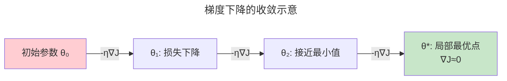

> 让机器从数据中学习规律。

ML 不是程序员编写规则，而是数据驱动的自动参数调整。

---

## 三大范式

| 范式 | 数据 | 目标 |
|------|------|------|
| **监督学习** | (X, y) | 学习 $f(X) \approx y$ |
| **无监督学习** | X | 发现隐藏结构 |
| **强化学习** | (S, A, R) | 最大化累积奖励 |

---

## 梯度下降

$$
\theta_{t+1} = \theta_t - \eta \nabla J(\theta_t)
$$

**Adam** 结合 Momentum（累积历史梯度方向）和 RMSprop（自适应学习率）——深度学习的事实标准。

---

## 偏差-方差权衡

| 问题 | 症状 | 应对 |
|------|------|------|
| **高偏差** | 训练误差高 | 增加复杂度 |
| **高方差** | 过拟合 | 正则化/L1/L2/Dropout |

---

## 跨卷连接

| 概念 | 关联 |
|------|------|
| 梯度下降 | [概率——最大似然估计](../../00-lingxi/01-mathematical-foundations/) |
| Adam | [PID 控制器——比例/积分/微分调节](../../02-jiezi/02-interrupts/) |

:::tip[卷六内部路径]
- [**深度学习**](../02-deep-learning/)：多层梯度下降
- [**Transformer**](../03-transformer-family/)：注意力——自学习表征
:::
