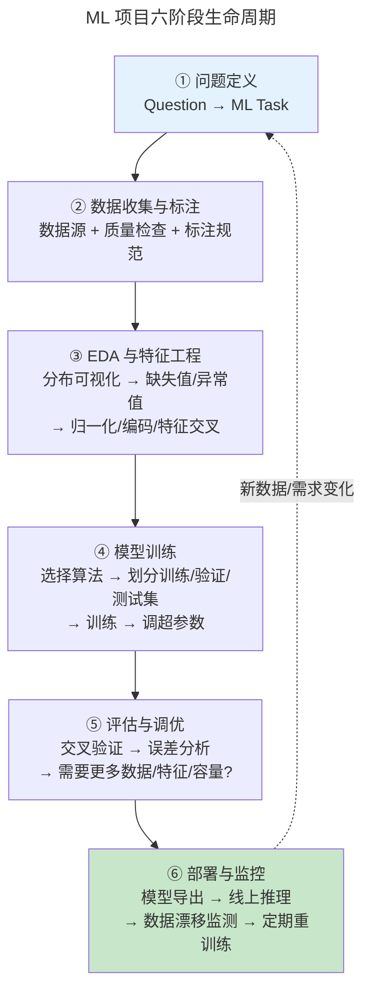
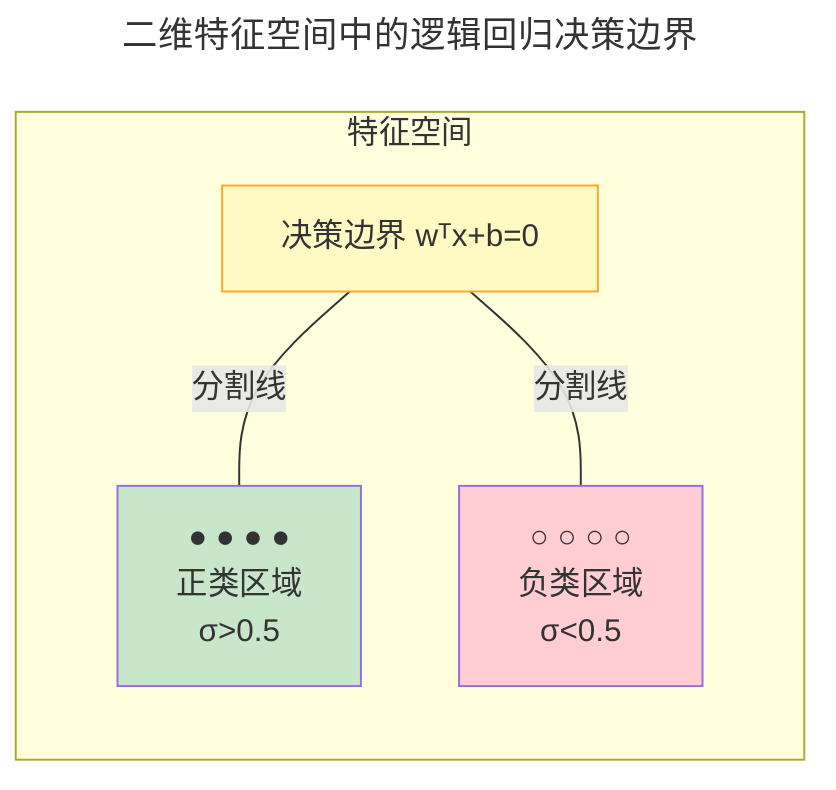
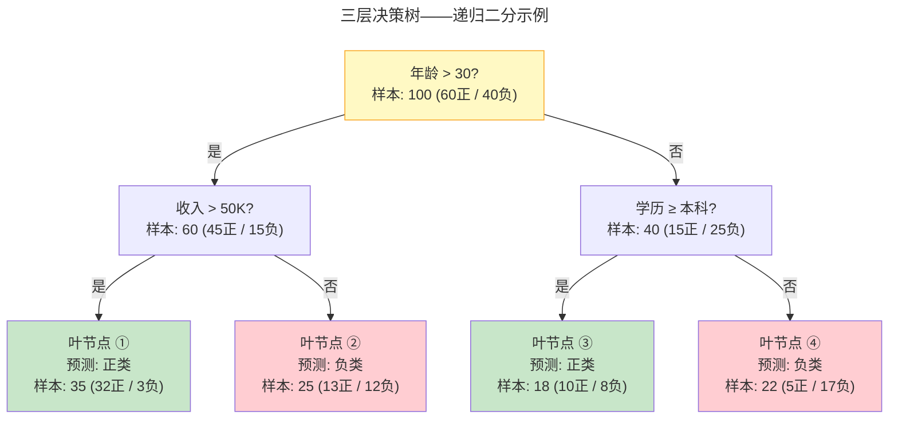
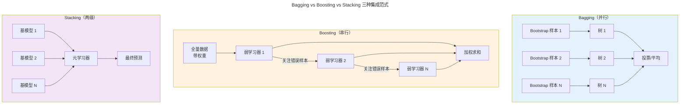
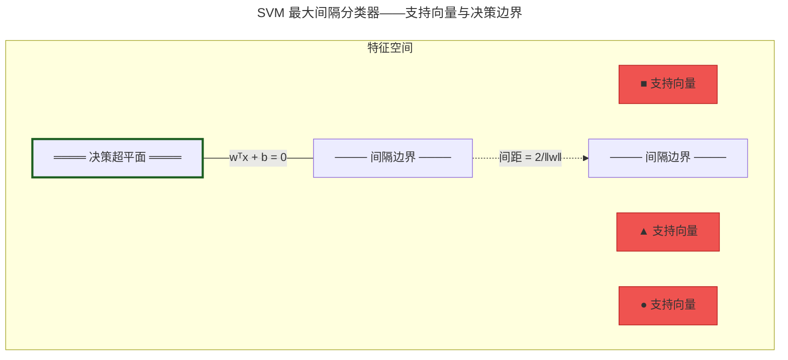

> 让机器从数据中学习规律。

ML 不是程序员编写规则，而是数据驱动的自动参数调整。

---

## 三大范式

| 范式 | 数据 | 目标 |
|------|------|------|
| **监督学习** | (X, y) | 学习 $f(X) \approx y$ |
| **无监督学习** | X | 发现隐藏结构 |
| **强化学习** | (S, A, R) | 最大化累积奖励 |

---

### ML 项目的完整生命周期

在深入具体算法之前，我们先建立 ML 工程的全局视图——ML 不是跑一个 `.fit()` 就结束的魔术，而是一条需要反复迭代的六阶段流水线。

**① 问题定义**：首先要明确"这是分类还是回归？聚类还是降维？"业务指标（如"减少客户流失 10%"）必须翻译为 ML 可优化的损失函数（如"最大化召回率"）。这一步决定了后续所有设计选择的边界。

**② 数据收集与标注**：数据的数量与质量直接决定模型性能的上限。关键问题包括：数据来源是否可信？标注标准是否一致（两位标注员对同一张图是否打相同的标签）？是否需要处理类别不平衡？真实场景中，这一步往往占据项目总时间的 30%～50%。

**③ 探索性数据分析（EDA）与特征工程**：在建模之前，通过直方图、散点图、相关性矩阵理解数据分布。处理缺失值（删除 / 均值填充 / KNN 填充）、识别异常值（IQR 法 / Z-score 法）。接着是特征工程——归一化（MinMax：缩放到 $[0,1]$）或标准化（Z-score：均值 0 方差 1）、类别编码（One-Hot / Ordinal）、特征交叉（多项式特征）。好的特征工程可以让你用一个简单模型击败用原始特征训练的复杂模型。

**④ 模型训练**：按 6:2:2 或 8:1:1 划分训练集 / 验证集 / 测试集（测试集在最终评估前绝不使用）。选择一个基线算法快速建立性能基准，然后迭代：训练 → 调超参数 → 再训练。超参数（学习率、正则化系数、树深度）通过网格搜索（Grid Search）或贝叶斯优化（Bayesian Optimization）在验证集上选择。

**⑤ 评估与调优**：用 k 折交叉验证获得可靠泛化估计。分析误差模式——模型在哪类样本上犯错？是否需要更多数据（数据增强 / 合成数据）？更多特征？还是更大模型容量？这一步是判断高偏差还是高方差（见下文偏差-方差分解）的关键时刻。

**⑥ 部署与监控**：模型不是训练完就结束的。部署后需要持续监控——线上数据分布是否与训练时一致？是否出现数据漂移（Data Drift）或概念漂移（Concept Drift）？设置重训练触发器（定时触发 / 性能退化触发），保证模型在变化的环境中持续有效。这六阶段是一个循环——线上反馈数据往往成为下一轮训练的新数据源。

---

### 线性回归：监督学习的起点

线性回归是最简单的监督学习模型——假设输出是输入特征的线性组合：

$$
\hat{y} = w^T x + b = \sum_{j=1}^{d} w_j x_j + b
$$

均方误差（MSE）损失函数：

$$
J(w, b) = \frac{1}{2m} \sum_{i=1}^{m} (\hat{y}^{(i)} - y^{(i)})^2
$$

当 $X^T X$ 可逆时（$d \leq m$ 且特征线性无关），存在闭式解（正规方程）：

$$
w^* = (X^T X)^{-1} X^T y
$$

:::note[闭式解与数值稳定性]
当 $X^T X$ 接近奇异（特征共线或 $d \gg m$），$(X^T X)^{-1}$ 的最小特征值趋近于零 → 参数估计的方差爆炸。这正是 [线性代数中特征值分解与矩阵条件数](../../00-lingxi/01-mathematical-foundations/) 的工程后果：条件数 $\kappa(X^T X) = \frac{\lambda_{\max}}{\lambda_{\min}}$ 决定了数值稳定性，$\kappa$ 每增 10 倍，精度损失约 1 位有效数字。
:::

### 逻辑回归：从回归到分类的桥接

线性回归的输出范围是 $(-\infty, +\infty)$，直接用于分类有两个致命问题：

1. **输出无法解释为概率**——当 $w^T x + b$ 取大正值或大负值时，预测值没有自然的概率语义
2. **离群点严重影响决策边界**——MSE 对大残差平方惩罚极重，一个极端离群点就能把决策边界拉偏

#### Sigmoid 函数：将实数映射到概率

逻辑回归在线性组合 $z = w^T x + b$ 上套一层 **Sigmoid** 函数，将 $(-\infty, +\infty)$ 压缩到 $(0, 1)$：

$$
\sigma(z) = \frac{1}{1 + e^{-z}}
$$

手算 5 个关键点，直观感受 S 形曲线：

| $z$ | $e^{-z}$ | $\sigma(z)$ | 含义 |
|:--:|:--:|:--:|------|
| $-2$ | $7.389$ | $0.119$ | 远低于决策边界，预测接近 0 |
| $-1$ | $2.718$ | $0.269$ | 预测偏向负类 |
| $0$ | $1$ | $0.500$ | 决策边界——完全不确定 |
| $1$ | $0.368$ | $0.731$ | 预测偏向正类 |
| $2$ | $0.135$ | $0.881$ | 远高于决策边界，预测接近 1 |

$\sigma(z)$ 在 $z=0$ 附近近似线性（梯度最大），在两端趋近饱和（梯度趋近零）——这一性质在反向传播中有深层含义。

#### 决策边界

$\hat{y} = \sigma(w^T x + b)$ 的输出可解释为 $P(y=1|x)$。通常以 0.5 为阈值：

$$
\hat{y} > 0.5 \Rightarrow \text{预测正类},\quad \hat{y} < 0.5 \Rightarrow \text{预测负类}
$$

由于 $\sigma(z) = 0.5 \iff z = 0$，决策边界等价于 $w^T x + b = 0$——一条在特征空间中的直线（二维）或超平面（高维）：

线性决策边界意味着逻辑回归是一个**线性分类器**——无法直接处理 XOR 这类线性不可分问题（需要特征交叉或核方法）。

#### 交叉熵损失：最大似然估计的产物

MSE 不适合分类的原因：当 $\hat{y}$ 接近 0 或 1 时，$\frac{\partial}{\partial z}(y-\sigma(z))^2 = -2(y-\sigma(z))\sigma(z)(1-\sigma(z))$——由于 $\sigma(z)(1-\sigma(z))$ 在两端趋近 0，梯度消失，学习停滞。

逻辑回归使用**交叉熵**——从最大似然估计（MLE）推导出的自然损失。对于单个样本，给定标签 $y \in \{0,1\}$ 和预测概率 $\hat{y} = P(y=1|x)$：

$$
P(y|x) = \hat{y}^y (1-\hat{y})^{1-y}
$$

取负对数得到单个样本的损失：

$$
L(y, \hat{y}) = -\big[y \log \hat{y} + (1-y) \log(1-\hat{y})\big]
$$

当 $y=1$ 时 $L = -\log \hat{y}$——预测越接近 1，损失越低；预测接近 0 时惩罚趋向 $+\infty$。当 $y=0$ 时 $L = -\log(1-\hat{y})$——对称行为。这一梯度在高置信度错误时极大，保证了有效的学习信号。

#### 多分类扩展：Softmax

从二分类到 $K$ 类，将 Sigmoid 泛化为 **Softmax**：

$$
\text{softmax}(z)_i = \frac{e^{z_i}}{\sum_{j=1}^{K} e^{z_j}}
$$

指数运算确保输出为正，分母归一化确保 $\sum_i \text{softmax}(z)_i = 1$。Softmax 是 Sigmoid 在 $K=2$ 时的特例（令 $z' = z_1 - z_0$，则 $\text{softmax}([z_0, z_1])_1 = \sigma(z')$）。多分类交叉熵为：

$$
L = -\sum_{i=1}^{K} y_i \log \hat{y}_i
$$

其中 $y_i$ 是 one-hot 编码的真实标签。

:::note[交叉熵与信息论]
交叉熵损失 $H(p, q) = -\sum p_i \log q_i$ 源于 [信息论中熵与 KL 散度](../../00-lingxi/01-mathematical-foundations/)——其中 $p$ 是真实分布，$q$ 是预测分布。最小化交叉熵等价于最小化 KL 散度 $D_{KL}(p\|q)$（真实分布与预测分布的距离），因为 $H(p, q) = H(p) + D_{KL}(p\|q)$，而 $H(p)$ 是常数。
:::

---

## 梯度下降

$$
\theta_{t+1} = \theta_t - \eta \nabla J(\theta_t)
$$

**Adam** 结合 Momentum（累积历史梯度方向）和 RMSprop（自适应学习率）——深度学习的事实标准。

### 梯度下降的三种形态

按每步更新所用样本数，梯度下降有三种变体：

| 形态 | 更新公式 | 每步样本 | 特点 |
|------|:--:|:--:|------|
| **Batch GD** | $\theta_{t+1} = \theta_t - \frac{\eta}{m}\sum_{i=1}^{m}\nabla J_i(\theta_t)$ | 全部 $m$ | 稳定，但大数据集慢 |
| **SGD** | $\theta_{t+1} = \theta_t - \eta \nabla J_i(\theta_t)$ | 1 个 | 快但噪声大，收敛振荡 |
| **Mini-batch GD** | $\theta_{t+1} = \theta_t - \frac{\eta}{|B|}\sum_{i \in B}\nabla J_i(\theta_t)$ | 32~256 | 两全——GPU 向量化 + 梯度平滑 |

### Momentum 与 Adam 的数学

朴素 SGD 在峡谷地形中锯齿状振荡。**Momentum** 引入指数加权移动平均，累积历史梯度方向：

$$
v_t = \beta v_{t-1} + (1 - \beta)\nabla J(\theta_t)
$$
$$
\theta_{t+1} = \theta_t - \eta v_t
$$

$\beta = 0.9$ 意味着过去 $\frac{1}{1-\beta} \approx 10$ 步的梯度有显著贡献。这与 [PID 控制器积分项消除稳态误差](../../02-jiezi/02-interrupts/) 共享同一设计原理——累积历史信号以抑制噪声。

**Adam**（Adaptive Moment Estimation）融合 Momentum 和 RMSprop：用一阶矩 $m_t$ 估算梯度方向，二阶矩 $v_t$ 自适应调整学习率：

$$
m_t = \beta_1 m_{t-1} + (1 - \beta_1) g_t,\quad
v_t = \beta_2 v_{t-1} + (1 - \beta_2) g_t^2
$$

偏差校正（因 $m_0 = v_0 = 0$ 导致初估计偏低）：

$$
\hat{m}_t = \frac{m_t}{1 - \beta_1^t},\quad
\hat{v}_t = \frac{v_t}{1 - \beta_2^t}
$$

最终更新：

$$
\theta_{t+1} = \theta_t - \frac{\eta}{\sqrt{\hat{v}_t} + \epsilon} \hat{m}_t
$$

默认超参数 $\eta = 0.001$，$\beta_1 = 0.9$，$\beta_2 = 0.999$，$\epsilon = 10^{-8}$。Adam 自 2015 年提出后成为深度学习事实标准——无需手动调学习率衰减。

---

## 偏差-方差分解

泛化误差可以分解为三个不可约减的组成部分。对于测试点 $x$，期望预测误差为：

$$
\mathbb{E}\big[(y - \hat{f}(x))^2\big] = \underbrace{\big(\mathbb{E}[\hat{f}(x)] - f(x)\big)^2}_{\text{Bias}^2} + \underbrace{\mathbb{E}\big[(\hat{f}(x) - \mathbb{E}[\hat{f}(x)])^2\big]}_{\text{Variance}} + \underbrace{\sigma^2_{\epsilon}}_{\text{Irreducible Error}}
$$

- **Bias$^2$**（偏差平方）：模型平均预测与真实值的差距——模型族**表达能力**的度量
- **Variance**（方差）：不同训练集训练的模型预测之间的差异——模型对数据**扰动敏感度**的度量
- **$\sigma_\epsilon^2$**（不可约误差）：数据本身的噪声——即使知道真实函数也无法消除

:::tip[Bias-Variance Tradeoff 与 VC 维]
增加模型复杂度 → Bias 下降但 Variance 上升。最优复杂度出现在 Bias$^2$ 与 Variance 交点附近。这一权衡在 [计算理论的 VC 维分析](../../00-lingxi/03-theory-of-computation/) 中有严格的 PAC 学习框架支撑：VC 维越高，Bias 越低但泛化界越松。
:::

| 问题 | 训练误差 | 验证误差 | 应对 |
|------|:--:|:--:|------|
| **高偏差（欠拟合）** | 高 | 高 | 增加模型容量、特征工程、减少正则化 |
| **高方差（过拟合）** | 低 | 高 | 正则化（L1/L2）、Dropout、数据增强、早停 |

---

## 正则化：L1 与 L2

正则化在损失函数上追加惩罚项，约束模型复杂度。L1 和 L2 是两种最基本的正则化范式——它们不仅数值行为不同，还导出了**截然不同的解结构**。

### L2 正则化（Ridge / 权重衰减）

$$
J_{L2}(\theta) = J(\theta) + \frac{\lambda}{2} \|\theta\|_2^2 = J(\theta) + \frac{\lambda}{2} \sum_{j} \theta_j^2
$$

梯度下降的更新变为：

$$
\theta_{t+1} = \theta_t - \eta \big(\nabla J(\theta_t) + \lambda \theta_t\big) = (1 - \eta\lambda)\theta_t - \eta \nabla J(\theta_t)
$$

每步将所有权重向零缩放 $1 - \eta\lambda$——这就是"权重衰减"名称的由来。$\lambda$ 越大，衰减越强。

### L1 正则化（Lasso / 稀疏特征选择）

$$
J_{L1}(\theta) = J(\theta) + \lambda \|\theta\|_1 = J(\theta) + \lambda \sum_{j} |\theta_j|
$$

绝对值在 $\theta_j = 0$ 处不可导，使用**次梯度**（Subgradient）：

$$
\frac{\partial J_{L1}}{\partial \theta_j} = \frac{\partial J}{\partial \theta_j} + \lambda \cdot \text{sign}(\theta_j), \quad \text{sign}(0) \in [-1, 1]
$$

L1 的关键性质：更新时无论 $\theta_j$ 多大，惩罚力度**恒定**（$\pm\lambda$）——这与 L2 的"越大越惩罚"截然不同。后果是许多 $\theta_j$ 被推到**精确零值**，实现特征自动选择。

:::tip[几何直觉：L1 钻石 vs L2 圆]
将正规化视为 Lagrange 约束：L1 的约束域 $|\theta_1| + |\theta_2| \leq t$ 是菱形（四角在坐标轴上），L2 的约束域 $\theta_1^2 + \theta_2^2 \leq t$ 是圆形。损失函数的等高线首次"碰到"约束边界时：
- L1 的菱形角在坐标轴上 → 解中某些 $\theta_j$ **精确为零** → 稀疏性
- L2 的圆与等高线切点通常在非轴位置 → 所有 $\theta_j$ **均非零** → 均匀收缩

这一几何性质直接链接到 [线性规划单纯形法的顶点最优解原理](../../00-lingxi/01-mathematical-foundations/)——两者都是"角点解"在凸优化中的实例。
:::

### Elastic Net

结合 L1 和 L2 的优点——处理特征高度相关时 Lasso 表现不稳定的问题：

$$
J_{Elastic}(\theta) = J(\theta) + \lambda_1 \|\theta\|_1 + \frac{\lambda_2}{2} \|\theta\|_2^2
$$

---

### 决策树与集成方法：非参数学习的另一极

线性模型（回归、逻辑回归）假设数据服从特定的参数化形式，而**决策树**走另一条路——不对数据分布做任何假设，纯粹通过递归二分来划分特征空间。

#### 一棵决策树的结构

决策树由三部分组成：**根节点**（第一个分裂条件）→ **内部节点**（中间分裂）→ **叶节点**（最终预测）。每个节点选择一个特征和一个阈值，将数据一分为二：

核心问题是：**在每个节点，选择哪个特征和阈值来分裂？** 答案是——选"纯度提升最大"的那一个。

#### 分裂准则：信息增益

**熵**（Entropy）度量一个节点的不确定性。对于 $K$ 类、各类占比 $p_i$ 的节点：

$$
H = -\sum_{i=1}^{K} p_i \log_2 p_i
$$

当所有类均匀混合（$p_i = 1/K$），$H = \log_2 K$ 最大；当节点纯净（某 $p_i = 1$），$H = 0$。

**基尼不纯度**（Gini Impurity）是熵的近似替代，计算更简单：

$$
Gini = 1 - \sum_{i=1}^{K} p_i^2
$$

**信息增益** = 分裂前的不纯度 − 分裂后各子节点不纯度的加权平均：

$$
IG = H(\text{parent}) - \sum_{c \in \text{children}} \frac{|c|}{|\text{parent}|} H(c)
$$

#### 手算示例：感受"纯度提升"

假设根节点有 3 个样本：2 个正类（+）、1 个负类（−）。

**分裂前**：$p_+ = 2/3$，$p_- = 1/3$，$H(\text{parent}) = -(\frac{2}{3}\log_2\frac{2}{3} + \frac{1}{3}\log_2\frac{1}{3}) \approx 0.918$

按某个特征分裂后：
- 左子节点：2 正 + 0 负（纯净，$H = 0$），占比 $2/3$
- 右子节点：0 正 + 1 负（纯净，$H = 0$），占比 $1/3$

$$
IG = 0.918 - \left(\frac{2}{3} \times 0 + \frac{1}{3} \times 0\right) = 0.918
$$

分裂后的两个子节点**完全纯净**——信息增益等于原始熵，这是一次完美分裂。工程中不期望完美，但信息增益越大，说明选的特征越好。

#### 集成学习："三个臭皮匠，顶个诸葛亮"

单棵决策树容易过拟合（一棵很深的树可以完美记忆训练数据），**集成方法**通过组合多棵弱树构建强学习器。

| 范式 | 训练方式 | 核心思想 | 代表算法 |
|------|:--:|------|------|
| **Bagging** | 并行 | Bootstrap 采样 → 独立训练 → 投票/平均 | Random Forest |
| **Boosting** | 串行 | 新学习器关注前一学习器犯错的样本 | AdaBoost, GBDT, XGBoost |
| **Stacking** | 两级 | 基学习器输出作为"新特征"训练元学习器 | 任意组合 |

**Bagging**（Bootstrap Aggregating）：从训练集中有放回采样 $N$ 个 Bootstrap 样本，每个样本训练一棵独立的决策树。分类问题用多数投票，回归用平均。关键在于"随机性"——不同 Bootstrap 样本 + 随机特征子集（Random Forest 的核心创新），迫使每棵树学到不同的数据视角，最终集成降低方差。

**Boosting**：顺序训练弱学习器，每个新学习器"聚焦"前一学习器的错误。

- **AdaBoost**：通过调整样本权重——被前一轮分错的样本获得更高权重，迫使下一轮学习器关注它们
- **Gradient Boosting**：AdaBoost 的泛化——每一轮新学习器拟合**残差的负梯度** $r_i = -\frac{\partial L(y_i, F(x_i))}{\partial F(x_i)}$，而非直接调整权重

**XGBoost**（Extreme Gradient Boosting）是 Gradient Boosting 的工程化巅峰，其目标函数包含损失项 + 正则化项：

$$
\text{Obj} = \sum_{i=1}^{m} L(y_i, \hat{y}_i) + \sum_{k=1}^{K} \Omega(f_k)
$$

其中单棵树的复杂度 $\Omega(f) = \gamma T + \frac{1}{2}\lambda \|w\|^2$：$T$ 是叶子节点数（鼓励树更浅）、$w$ 是叶子权重（鼓励权重更小）。XGBoost 对损失函数做**二阶泰勒展开** $L(y, \hat{y}^{(t-1)} + f_t) \approx L(y, \hat{y}^{(t-1)}) + g_i f_t + \frac{1}{2}h_i f_t^2$，比传统 GBDT 只用一阶梯度收敛更快——这一思想与 [牛顿法用二阶信息加速优化](../../00-lingxi/01-mathematical-foundations/) 同源。

#### 选择指南

| 场景 | 推荐 | 理由 |
|------|:--:|------|
| 表格数据的 baseline | Random Forest | 几乎不需要调参，对缺失值和异常值鲁棒 |
| 竞赛和生产 | XGBoost / LightGBM | 精度最高，内置正则化、缺失值处理、GPU 加速 |
| 解释性优先 | 单棵决策树 | 可追溯每一个预测的决策路径 |
| 异构数据组合 | Stacking | 融合不同模型族的优势（如 RF + 逻辑回归 + SVM） |

---

### 支持向量机：最大间隔分类器

SVM 不满足于"找到一条能分开的线"——它要找那条**离两类数据都尽可能远**的线，即最大化最小间隔（Margin）。

#### 核心直觉

图中红色实心点是**支持向量**——距离决策超平面最近的样本点。SVM 的关键性质：**只有支持向量决定最终决策边界**，非支持向量的点可以移除而不改变模型。这与线性回归中"每个样本都有影响"形成鲜明对比。

#### 硬间隔 SVM 的优化问题

假设数据线性可分。我们希望最大化间隔 $\frac{2}{\|w\|}$，等价于最小化 $\frac{1}{2}\|w\|^2$，约束条件为所有样本正确分类：

$$
\min_{w,b} \frac{1}{2}\|w\|^2 \quad \text{s.t.} \quad y_i(w^T x_i + b) \geq 1,\; \forall i
$$

约束 $y_i(w^T x_i + b) \geq 1$ 的含义：正类样本的决策函数值 $\geq 1$，负类样本 $\leq -1$——既要求正确分类，又要求有一定的"信心余量"。

#### 软间隔：接受不完美

现实中数据极少完全线性可分。引入**松弛变量** $\xi_i \geq 0$ 允许部分点落在间隔内或错误一侧：

$$
\min_{w,b,\xi} \frac{1}{2}\|w\|^2 + C \sum_i \xi_i \quad \text{s.t.} \quad y_i(w^T x_i + b) \geq 1 - \xi_i,\; \xi_i \geq 0
$$

参数 $C$ 是惩罚系数——$C$ 大 → 严格惩罚误分类（可能过拟合，对噪声敏感）；$C$ 小 → 宽容（更大的间隔、更好的泛化但也可能欠拟合）。

#### 核技巧：升维突破线性不可分

当数据在原始空间中不可线性分离时，通过核函数将数据**隐式映射到高维空间**，在高维中寻找线性决策边界。

**手算示例**：考虑二维平面上的同心圆分布——内圆（半径 $r=1$）是一类，外环（$r=2$）是另一类。在二维中无法用一条直线分开。

映射 $\phi(x) = (x_1, x_2, x_1^2 + x_2^2)$ 将二维点 $(x_1, x_2)$ 升维到三维 $(x_1, x_2, r^2)$。在三维空间中，$r^2$ 维度天然分离了内圆和外环——$z = 1$ 附近是内圆，$z = 4$ 附近是外环——一个平面可以完美切分。

直接在高维空间计算内积 $\phi(x)^T \phi(x')$ 代价高昂。**核函数** $K(x, x') = \phi(x)^T \phi(x')$ 允许我们在原始空间中直接计算高维内积，无需显式构造 $\phi$。最常用的是 **RBF 核**（径向基函数，又称高斯核）：

$$
K(x, x') = \exp(-\gamma \|x - x'\|^2)
$$

$\gamma$ 控制单个样本的影响半径——$\gamma$ 越大，每个支持向量的影响越局部（可能过拟合）；$\gamma$ 越小，影响越平滑（可能欠拟合）。RBF 核隐含地将数据映射到**无穷维**空间——这正是 [线性代数中基变换与升维](../../00-lingxi/01-mathematical-foundations/) 思想的极致体现：原始特征空间的线性不可分性，通过升维在高维（甚至无穷维）空间中消除了。

---

## 模型评估与交叉验证

### k 折交叉验证

将数据均匀划分为 $k$ 份，依次以 1 份为验证集、$k-1$ 份为训练集。最终性能为 $k$ 轮验证结果的平均：

$$
CV_{(k)} = \frac{1}{k} \sum_{i=1}^{k} \text{Err}_i
$$

- $k = m$（每样本一折）：**留一交叉验证**（LOOCV）——偏差低但计算代价高，等价于 [统计学 Jackknife 重采样](https://en.wikipedia.org/wiki/Jackknife_resampling) 的预测应用
- $k = 5$ 或 $k = 10$：计算与可靠性的工程平衡点

### 分类评估指标

混淆矩阵的四个象限导出所有二元分类指标：

|  | 预测正 | 预测负 |
|--|:--:|:--:|
| **实际正** | TP | FN |
| **实际负** | FP | TN |

$$
\text{Precision} = \frac{TP}{TP + FP},\quad
\text{Recall} = \frac{TP}{TP + FN},\quad
F_1 = 2 \cdot \frac{\text{Precision} \cdot \text{Recall}}{\text{Precision} + \text{Recall}}
$$

Precision（精确率）关注"预测为正中有多少是真"，Recall（召回率）关注"真正的正中找到了多少"——$F_1$ 是二者的调和平均，惩罚极端的 Precision-Recall 失衡。

### ROC-AUC 与 PR 曲线

混淆矩阵的四个数字在单一阈值下描述了模型性能，但很多场景需要**跨阈值评估**——模型在不同"严格程度"下的表现。ROC 和 PR 两条曲线分别从不同角度回答了这个问题。

#### ROC 曲线

**ROC**（Receiver Operating Characteristic，接收者操作特征）以**假阳率 FPR** 为横轴、**真阳率 TPR**（即召回率）为纵轴：

$$
FPR = \frac{FP}{FP + TN},\quad TPR = \frac{TP}{TP + FN}
$$

曲线上每个点对应一个**分类阈值**：

- **阈值极高**（保守）→ 几乎不预测正类 → FPR 低、TPR 低 → 左下角
- **阈值极低**（激进）→ 几乎都预测正类 → FPR 高、TPR 高 → 右上角
- 理想分类器：FPR=0 处 TPR=1 → 曲线紧贴左上角

**AUC**（Area Under Curve，曲线下面积）有简洁的统计解释：

> AUC = 随机选一个正例和一个负例，模型给正例的分数高于负例的概率。

- AUC = 1.0：完美排序——所有正例的预测分数都高于所有负例
- AUC = 0.5：随机猜测——对角线
- AUC < 0.5：比随机猜还差——把预测标签翻转反而更好

#### PR 曲线

**PR 曲线**（Precision-Recall）以**召回率 Recall** 为横轴、**精确率 Precision** 为纵轴。与 ROC 的关键区别在于：

| 特性 | ROC | PR |
|------|-----|-----|
| 横轴 | FPR（受 TN 影响） | Recall（与 TN 无关） |
| 对类别不平衡的敏感度 | **低**——TN 数量大会压低 FPR，曲线可能虚高 | **高**——TN 不参与计算，揭示少数类的真实表现 |
| 随机分类器基线 | 对角线（AUC=0.5） | 正类占比 $\frac{P}{P+N}$ 的水平线 |

#### 手算示例：10 样本对比

假设 10 个样本（2 正、8 负），模型预测分数从高到低排列：

| 排序 | 分数 | 真实标签 | 按分数从高到低逐个纳入预测 |
|:--:|:--:|:--:|------|
| 1 | 0.95 | 正 ✓ | 阈值 > 0.95：TP=1, FP=0, FN=1 → TPR=0.5, FPR=0, P=1.0, R=0.5 |
| 2 | 0.82 | 负 ✗ | 阈值 > 0.82：TP=1, FP=1, FN=1 → TPR=0.5, FPR=0.125, P=0.5, R=0.5 |
| 3 | 0.70 | 负 | 阈值 > 0.70：TP=1, FP=2, FN=1 → TPR=0.5, FPR=0.25, P=0.33, R=0.5 |
| 4 | 0.61 | 正 ✓ | 阈值 > 0.61：TP=2, FP=2, FN=0 → TPR=1.0, FPR=0.25, P=0.5, R=1.0 |
| 5 | 0.45 | 负 | 此后 FP 持续增加，TPR 已触顶 1.0 |

观察：当负样本远超正样本时，FPR 即使翻倍（0→0.25）也绝对值小，ROC 看起来优秀。但 PR 曲线中 Precision 从 1.0 急剧跌到 0.33——揭示了模型在少数类上的脆弱。

#### 选择指南

| 场景 | 推荐 | 理由 |
|------|:--:|------|
| 类别平衡 | ROC-AUC | 全局性能指标，一个数字概括排序能力 |
| 类别不平衡（如欺诈检测、罕见病诊断） | PR 曲线 | 负样本多会"掩藏"ROC 中的问题 |
| 需要选择具体分类阈值 | 两者都看 | ROC 观察全局排序，PR 关注正类的精确率-召回率权衡 |

---

## 跨卷连接

| 概念 | 关联 |
|------|------|
| 线性回归闭式解 | [特征值分解与矩阵条件数——κ 决定精度](../../00-lingxi/01-mathematical-foundations/) |
| 梯度下降 | [概率——最大似然估计的对数似然梯度](../../00-lingxi/01-mathematical-foundations/) |
| Adam 动量 | [PID 控制器——积分项消除稳态误差的递推平均](../../02-jiezi/02-interrupts/) |
| Bias-Variance Tradeoff | [计算理论——VC 维与 PAC 可学习性](../../00-lingxi/03-theory-of-computation/) |
| L1 正则化稀疏性 | [压缩感知——l0 范数的凸松弛 l1 范数](../../00-lingxi/04-algorithm-theory/) |
| 交叉验证 | [抽样理论与无偏估计——Jackknife 重采样](../../00-lingxi/01-mathematical-foundations/) |
| 朴素贝叶斯 | [贝叶斯定理——条件独立性与先验更新](../../00-lingxi/01-mathematical-foundations/) |

:::tip[卷六内部路径]
- [**深度学习**](../02-deep-learning/)：多层梯度下降——链式法则的反向传播
- [**Transformer**](../03-transformer-family/)：注意力——从手工特征到自学习表征
- [**大语言模型**](../04-large-language-models/)：正则化在 Scaling Law 中的作用
:::
