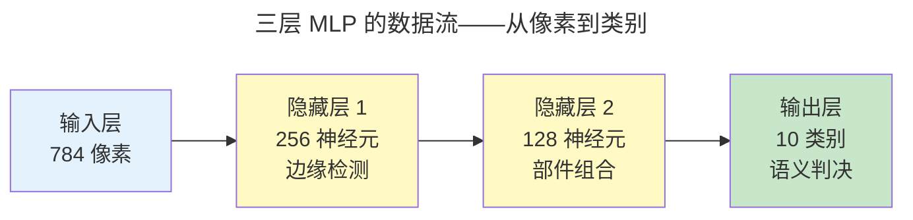
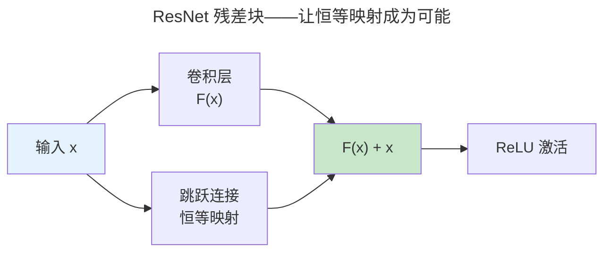
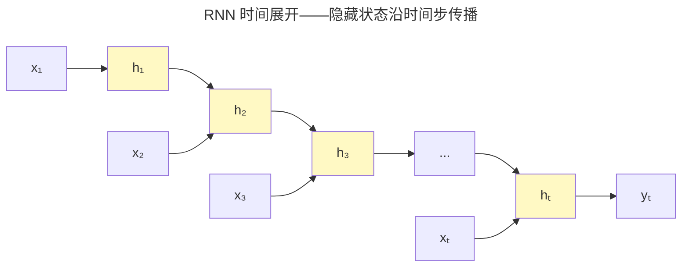
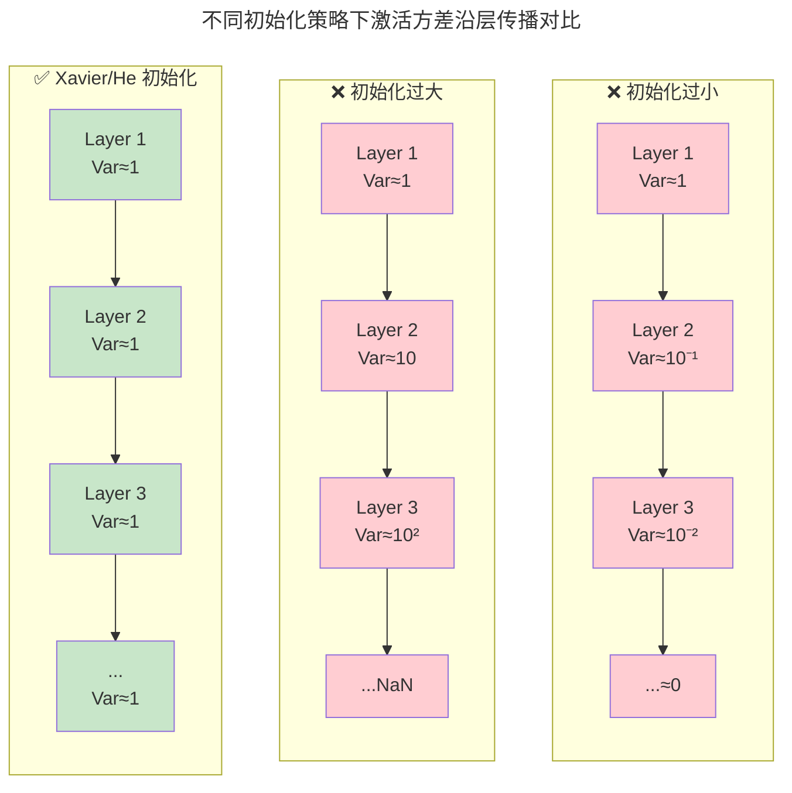
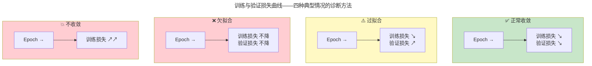

> 多层抽象的特征学习。

当神经网络从 1-2 层扩展到数十层时，网络自动学习到**层次化特征**——浅层学边缘纹理，中层学形状部件，深层学语义概念。

---

## 反向传播：链式法则的计算图实现

前向传播是权重矩阵的层层变换。反向传播是将链式法则应用于计算图——从损失函数逐层回传梯度并更新权重。

设损失函数为 $\mathcal{L}$，第 $l$ 层的权重为 $W^{(l)}$，激活值 $a^{(l)} = \sigma(z^{(l)})$ 其中 $z^{(l)} = W^{(l)} a^{(l-1)} + b^{(l)}$。反向传播的两条核心递推：

$$
\delta^{(l)} = \frac{\partial \mathcal{L}}{\partial z^{(l)}} = (W^{(l+1)})^T \delta^{(l+1)} \odot \sigma'(z^{(l)})
$$

$$
\frac{\partial \mathcal{L}}{\partial W^{(l)}} = \delta^{(l)} (a^{(l-1)})^T
$$

第一条是**误差反向流动**——将输出层的误差 $\delta^{(L)}$ 通过权重矩阵的转置逐层回传。第二条是**梯度计算**——利用前向传播中缓存的 $a^{(l-1)}$ 计算当前层权重的梯度。PyTorch 的 autograd 基于动态计算图，在每次前向传播时构建 DAG，反向传播时沿 DAG 反向遍历。

### 梯度消失与激活函数

Sigmoid 的导数 $\sigma'(x) = \sigma(x)(1-\sigma(x))$ 最大值为 0.25。经过 10 层连乘，梯度缩小到 $0.25^{10} \approx 10^{-6}$——消失殆尽。ReLU 的导数在正区间为常数 1，从根本上解决了深层网络的梯度消失问题。这也是 ResNet 残差连接能工作的前提——跳跃连接提供了梯度高速公路，恒等映射的导数为 1。

---

## 从神经元到深层网络：层的本质

反向传播告诉我们如何训练网络，但在深入 CNN 之前，有一个更基本的问题值得驻足：**网络的"层"究竟是什么？为什么堆叠多层比单层更强大？**

### 单个神经元：线性回归 + 非线性开关

一个神经元执行的操作极其简单——对输入加权求和，通过激活函数做非线性映射：

$$
y = \sigma\left(\sum_{i=1}^{n} w_i x_i + b\right)
$$

直觉上，神经元就像一个小开关：当输入加权和超过某个阈值时，它被"激活"（输出接近 1）；否则保持静默（输出接近 0）。使用 Sigmoid 时，阈值化身为偏置 $b$——偏置越大，神经元越容易被激活。

:::note[神经元的生物学渊源]
1943 年 McCulloch-Pitts 提出第一个人工神经元模型时，直接类比了生物神经元"树突接收信号 → 胞体整合 → 轴突发放"的结构。如今深度网络中的神经元已高度数学化，但这个"加权求和 + 阈值触发"的核心范式一直延续至今。
:::

### 一层网络：并行投票

一层网络是 $m$ 个神经元的并行组合，可用矩阵乘法一次完成：

$$
h = \sigma(Wx + b), \quad W \in \mathbb{R}^{m \times n}
$$

权重矩阵 $W$ 的**每一行**对应一个神经元对所有输入特征的权重。$m$ 个神经元同时对输入 $x$ 做出各自的判决——就像 $m$ 个专家从同一份报告中提取不同的信号。偏置向量 $b$ 则给每个神经元独立的激活门槛。

### 多层网络：层层抽象

深度网络的核心洞察是**层次化特征学习**。三层 MLP 的数据流直观展示了这个逐层抽象的过程：



第一层神经元学习检测简单模式（如特定方向的边缘），第二层将这些边缘组合为部件（眼睛、鼻子），第三层将部件组合为完整对象（人脸、汽车）。这种逐层抽象不是人工设计的——它完全通过反向传播从数据中自动涌现。以人脸识别为例：浅层神经元对特定朝向的边缘条有强烈响应，中层神经元对眼睛/鼻子/嘴巴的组合模式敏感，深层神经元则对人脸整体概念激活——每一层都在前一层的"词汇表"上构建更高阶的"语法"。

### 全连接层的参数量爆炸

全连接层虽然表达能力强，但参数量随输入维度急剧膨胀。考虑 MNIST 手写数字识别：输入为 $28 \times 28 = 784$ 维像素向量，第一个隐藏层设置 256 个神经元：

$$
784 \times 256 + 256 = 200{,}960 \text{ 个参数}
$$

仅第一层就超过 20 万参数。如果输入是 $224 \times 224 \times 3 = 150{,}528$ 维的彩色图像，即使隐藏层缩减到 64 个神经元，参数也将近 1000 万。更重要的是——全连接层将图像的**空间结构彻底打散**：像素 $(i, j)$ 和像素 $(i, j+1)$ 的空间相邻关系在展平为向量后完全丢失。

这两个痛点——参数量爆炸和空间信息丢失——正是 CNN 卷积核"权值共享 + 局部连接"设计的根本动机。

### 非线性激活：深度有意义的前提

如果没有非线性激活函数，多层网络将**退化为单层线性变换**。设两层网络无激活：

$$
h = W_2(W_1 x) = (W_2 W_1) x = W' x
$$

任意多层线性变换等价于一个矩阵乘法——"深度"失去了意义。非线性激活函数将每一层的输出空间折叠弯曲，使多层网络能表达任意复杂的决策边界。这正是[通用逼近定理](../../00-lingxi/04-information-theory/)的核心直觉——足够宽的单隐藏层加非线性激活即可逼近任何连续函数，而**深度**使逼近所需的神经元总数指数级下降：一个 $k$ 层的网络可以用 $O(n)$ 的神经元表达某些需要 $O(2^n)$ 个神经元的浅层网络才能表达的函数。

---

## CNN 与 ResNet

CNN 通过卷积核滑动窗口提取局部特征——权值共享使参数量与输入尺寸解耦：一个 3×3 卷积核无论处理 32×32 还是 224×224 的图像，参数量都是 $3 \times 3 \times C_{in} \times C_{out}$。

ResNet 的残差连接 $y = F(x) + x$ 解决了深层网络的退化问题——56 层网络在 CIFAR-10 上的训练误差高于 20 层网络，这一反直觉现象被 He 等人追溯到优化难度而非过拟合。残差连接将优化目标从"学习 $H(x)$"变为"学习残差 $F(x) = H(x) - x$"——当恒等映射已足够好时，网络只需将 $F(x)$ 推向零。



### CNN 核心操作详解

卷积神经网络之所以能在图像任务上取得突破，不仅是"权值共享"的口号——五个核心操作共同构成了 CNN 的设计语言。

#### 卷积运算：滑动窗口的逐元素乘加

卷积核在输入矩阵上滑动，每个位置执行逐元素乘法再求和。以下是一个具体的手算示例——输入为 $3 \times 3$ 矩阵，卷积核为 $2 \times 2$，步长 stride = 1，无填充 padding = 0：

$$
\text{Input } X = \begin{bmatrix} 1 & 2 & 3 \\ 4 & 5 & 6 \\ 7 & 8 & 9 \end{bmatrix}, \quad \text{Kernel } K = \begin{bmatrix} 1 & 0 \\ 0 & 1 \end{bmatrix}
$$

卷积核从左上角开始，每次右移或下移一格：

$$
\begin{aligned}
O(0,0) &= 1 \times 1 + 2 \times 0 + 4 \times 0 + 5 \times 1 = 1 + 5 = 6 \\[4pt]
O(0,1) &= 2 \times 1 + 3 \times 0 + 5 \times 0 + 6 \times 1 = 2 + 6 = 8 \\[4pt]
O(1,0) &= 4 \times 1 + 5 \times 0 + 7 \times 0 + 8 \times 1 = 4 + 8 = 12 \\[4pt]
O(1,1) &= 5 \times 1 + 6 \times 0 + 8 \times 0 + 9 \times 1 = 5 + 9 = 14
\end{aligned}
$$

输出为 $2 \times 2$ 矩阵：

$$
O = \begin{bmatrix} 6 & 8 \\ 12 & 14 \end{bmatrix}
$$

这个看似简单的操作有一个深刻性质：**平移等变性**——如果输入图像向右平移一个像素，输出特征图也向右平移一个像素。这是卷积适合处理图像的数学根基。

#### Pooling：降采样与平移不变性

池化层对特征图进行降采样，三种经典类型各司其职：

| 池化类型 | 操作 | 效果 |
|---------|------|------|
| **Max Pooling** | 取窗口内最大值 | 保留最强激活，引入小幅平移不变性 |
| **Average Pooling** | 取窗口内平均值 | 平滑特征，保留整体强度信息 |
| **Global Average Pooling** | 整个通道取均值 | 替代全连接层，参数量为零 |

Max Pooling 带来的**平移不变性**有一个简洁直觉：如果一只猫在图像中向右移动了 2 个像素，在 $2 \times 2$ Max Pooling 窗口内，最大值的位置可能变了，但最大值本身大概率不变——网络仍然"看见"了猫。这种不变性不是绝对的（平移超过池化窗口就会丢失），但在小范围内非常实用。

Global Average Pooling（GAP）是现代 CNN 的优雅收尾——它将每个通道的 $H \times W$ 特征图压缩为一个标量，直接送入分类器。以 ResNet-50 为例，最后的 $7 \times 7 \times 2048$ 特征图经 GAP 变为 2048 维向量，替代了早期 AlexNet 中数百万参数的全连接层。

#### Padding 与 Stride：输出尺寸的精确控制

卷积输出尺寸由输入尺寸 $i$、填充 $p$、卷积核尺寸 $k$ 和步长 $s$ 四个参数共同决定：

$$
o = \left\lfloor \frac{i + 2p - k}{s} \right\rfloor + 1
$$

三种经典配置的对比（以输入 $5 \times 5$，卷积核 $3 \times 3$ 为例）：

| 配置 | p | s | 公式计算 | 输出尺寸 |
|------|---|---|---------|---------|
| **VALID**（无填充） | 0 | 1 | $\lfloor (5+0-3)/1 \rfloor + 1$ | $3 \times 3$ |
| **SAME**（保持尺寸） | 1 | 1 | $\lfloor (5+2-3)/1 \rfloor + 1$ | $5 \times 5$ |
| **带 stride** | 0 | 2 | $\lfloor (7+0-3)/2 \rfloor + 1$ | $3 \times 3$ |

SAME padding 的填充量 $p = \lfloor k/2 \rfloor$ 确保 stride = 1 时输出尺寸与输入相同。带 stride 的卷积可以替代池化层进行降采样——这是全卷积网络（FCN）的核心技巧。

#### 感受野：深层神经元"看见"的范围

感受野（Receptive Field）指某个神经元在原始输入上"看到"的区域大小。它沿卷积层递推增长：

$$
RF_l = RF_{l-1} + (k_l - 1) \times \prod_{i=1}^{l-1} s_i
$$

以三层 $3 \times 3$ 卷积、stride = 1 为例：

$$
\begin{aligned}
RF_1 &= 1 + (3-1) \times 1 = 3 \\
RF_2 &= 3 + (3-1) \times 1 = 5 \\
RF_3 &= 5 + (3-1) \times 1 = 7
\end{aligned}
$$

三个 $3 \times 3$ 卷积堆叠，最终层神经元能"看到" $7 \times 7$ 的输入区域——等价于一个 $7 \times 7$ 卷积的感受野，但参数量从 $7 \times 7 = 49$ 降至 $3 \times 3 \times 3 = 27$（per channel），同时多了两层非线性。这就是为什么现代 CNN 偏好"小卷积核堆叠"而非"大卷积核一次性"：同样的感受野，更少的参数、更多的非线性、更丰富的特征层次。

#### 1×1 卷积：通道间的融合枢纽

$1 \times 1$ 卷积在空间维度上不做任何操作，仅在**通道维度**上进行线性组合——它等价于对每个空间位置的通道向量做一次全连接。这个看似微小的操作是 Inception 和 ResNet bottleneck 的核心技巧：

- **降维**：256 通道 → 64 通道，将后续 $3 \times 3$ 卷积的计算量降低 4 倍
- **升维**：64 通道 → 256 通道，恢复表达能力
- **跨通道交互**：在不改变空间尺寸的前提下融合不同通道的信息

ResNet bottleneck 的经典结构 `1×1,64 → 3×3,64 → 1×1,256` 就是用两个 $1 \times 1$ 卷积包裹一个 $3 \times 3$ 卷积——先压缩再扩张，像沙漏一样控制计算瓶颈。

#### CNN 完整前向流程

以下 Mermaid 图展示了一个典型 CNN 从原始像素到分类概率的完整数据流，标注了每一步的张量形状变化：

```mermaid
---
title: CNN 完整前向流程——从像素到类别概率，张量形状逐步变化
---
graph LR
    IN["Input<br/>224×224×3"] --> C1["Conv2D 7×7,s2<br/>112×112×64"]
    C1 --> BN1["BatchNorm + ReLU"]
    BN1 --> MP1["MaxPool 3×3,s2<br/>56×56×64"]
    MP1 --> B1["Bottleneck×3<br/>56×56×256"]
    B1 --> B2["Bottleneck×4<br/>28×28×512"]
    B2 --> B3["Bottleneck×6<br/>14×14×1024"]
    B3 --> B4["Bottleneck×3<br/>7×7×2048"]
    B4 --> GAP["Global AvgPool<br/>1×1×2048"]
    GAP --> FC["FC 1000"]
    FC --> SM["Softmax<br/>1000 类概率"]

    style IN fill:#e3f2fd
    style C1 fill:#fff9c4
    style B1 fill:#c8e6c9
    style B4 fill:#c8e6c9
    style SM fill:#ffccbc
```



关键观察：空间尺寸逐步缩小（$224 \to 112 \to 56 \to 28 \to 14 \to 7 \to 1$），通道数逐步增加（$3 \to 64 \to 256 \to 512 \to 1024 \to 2048$）。这个"空间换通道"的模式几乎是所有成功 CNN 架构的共性——网络从"在哪里"（空间定位）逐渐过渡到"是什么"（语义抽象）。

---

## 循环神经网络：RNN/LSTM/GRU

CNN 处理空间结构（图像），RNN 处理时间结构（序列）。当输入是"先有前面的词再有后面的词"的序列时，网络必须**记住过去**才能理解现在。

### RNN 的时间展开

RNN 的核心是一个沿时间步递归的隐藏状态：

$$
h_t = \tanh(W_{hh} h_{t-1} + W_{xh} x_t + b_h)
$$

每个时间步 $t$，隐藏状态 $h_t$ 同时接收当前输入 $x_t$ 和上一时刻的隐藏状态 $h_{t-1}$。这使网络拥有了"记忆"——$h_t$ 是过去所有输入 $x_1, x_2, \dots, x_t$ 的压缩摘要。



RNN 的优雅在于：所有时间步**共享同一组参数** $(W_{hh}, W_{xh}, b_h)$。无论序列长度是 10 还是 1000，参数量不变——这类似于 CNN 的权值共享，只是共享维度从空间换到了时间。

### BPTT：穿越时间的梯度之路

RNN 的训练需要**穿越时间反向传播**（Backpropagation Through Time, BPTT）。损失对权重的梯度沿时间链回传：

$$
\frac{\partial L}{\partial W} = \sum_t \frac{\partial L_t}{\partial h_t} \prod_{k=1}^{t} \frac{\partial h_k}{\partial h_{k-1}}
$$

其中的连乘项 $\prod \frac{\partial h_k}{\partial h_{k-1}}$ 是梯度消失/爆炸的源头。每步的雅可比 $\frac{\partial h_k}{\partial h_{k-1}}$ 近似为 $W_{hh} \cdot \tanh'(\cdot)$。由于 $\tanh' \leq 1$：

- 若 $||W_{hh}|| < 1$，连乘 $t$ 步后梯度**指数衰减**——早期时间步收不到有效梯度信号（梯度消失）
- 若 $||W_{hh}|| > 1$，连乘 $t$ 步后梯度**指数爆炸**——参数更新失控

梯度消失是 RNN 处理长序列的核心障碍：当序列长度超过 $\sim$20 步时，标准 RNN 几乎无法学习长期依赖。

:::tip[梯度消失与反向传播中的 Sigmoid 消失]
BPTT 中的梯度消失与[反向传播](#梯度消失与激活函数)中的 Sigmoid 导数消失是**两个独立的问题**叠加：Sigmoid 的 $\sigma' \leq 0.25$ 使每层梯度衰减至多 $1/4$，而 BPTT 中 $W_{hh}$ 的范数再加一层衰减。两者联手让长序列训练几乎不可能——直到 LSTM 出世。
:::

### LSTM：门控记忆的六道公式

LSTM（长短期记忆网络）通过三个门和一个细胞状态解决了梯度消失问题。细胞状态 $C_t$ 是贯穿时间的高速公路——信息可以无损地流过，只有门控选择性地写入或擦除。

**遗忘门**——决定丢弃旧记忆的哪些部分：

$$
f_t = \sigma(W_f [h_{t-1}, x_t] + b_f)
$$

**输入门**——决定写入哪些新信息：

$$
i_t = \sigma(W_i [h_{t-1}, x_t] + b_i)
$$

**候选细胞状态**——本次可能写入的新信息：

$$
\tilde{C}_t = \tanh(W_C [h_{t-1}, x_t] + b_C)
$$

**细胞状态更新**——遗忘门擦除旧记忆 + 输入门写入新记忆：

$$
C_t = f_t \odot C_{t-1} + i_t \odot \tilde{C}_t
$$

**输出门**——决定暴露细胞状态的哪些部分：

$$
o_t = \sigma(W_o [h_{t-1}, x_t] + b_o)
$$

**隐藏状态**——经过输出门过滤的细胞状态：

$$
h_t = o_t \odot \tanh(C_t)
$$

门控机制的精髓在于**选择性**。一个手算示例：假设 $C_{t-1} = [2.0, -1.5]$，$\tilde{C}_t = [0.5, 3.0]$，遗忘门输出 $f_t = [0.0, 1.0]$（第一维全忘，第二维全保留），输入门输出 $i_t = [1.0, 0.0]$（第一维写入，第二维不写）：

$$
C_t = [0.0, 1.0] \odot [2.0, -1.5] + [1.0, 0.0] \odot [0.5, 3.0]
= [0.0, -1.5] + [0.5, 0.0] = [0.5, -1.5]
$$

第一个维度的旧记忆被完全擦除并写入新值，第二个维度完美保留了旧记忆。这就是 LSTM 能跨越数百个时间步记住关键信息的秘密——只要遗忘门保持接近 1，梯度在细胞状态路径上几乎无损回传。

### GRU：两扇门的简约之美

GRU（门控循环单元）将 LSTM 的三个门精简为两个，同时合并了细胞状态和隐藏状态：

**重置门**——控制忽略多少过去信息：

$$
r_t = \sigma(W_r [h_{t-1}, x_t] + b_r)
$$

**更新门**——控制保留多少旧状态 vs 写入多少新状态：

$$
z_t = \sigma(W_z [h_{t-1}, x_t] + b_z)
$$

**候选隐藏状态**——经重置门过滤后的新信息：

$$
\tilde{h}_t = \tanh(W_h [r_t \odot h_{t-1}, x_t] + b_h)
$$

**隐藏状态更新**——更新门做插值：

$$
h_t = (1 - z_t) \odot h_{t-1} + z_t \odot \tilde{h}_t
$$

GRU 的更新门 $z_t$ 同时扮演了 LSTM 遗忘门和输入门的角色——当 $z_t \to 0$ 时保留旧状态，$z_t \to 1$ 时写入新状态。数学上更简洁，实践中表达能力与 LSTM 接近。

### LSTM vs GRU 选择指南

| 维度 | LSTM | GRU |
|------|------|-----|
| 门的数量 | 3（遗忘 + 输入 + 输出） | 2（重置 + 更新） |
| 细胞状态 | 独立的 $C_t$（与 $h_t$ 分离） | 合并为 $h_t$ |
| 参数量 | 较多（4 组权重矩阵） | 较少（3 组权重矩阵） |
| 长期依赖 | 更强（细胞状态高速公路） | 略弱但足够 |
| 适用场景 | 机器翻译、长文档理解 | 小数据集、资源受限 |

一条实用经验：不确定时先用 LSTM，资源受限或数据量不大时换 GRU。

RNN 家族在理论上有深远意义——RNN 是[图灵完备的](../../00-lingxi/03-computation-theory/)（有足够隐藏单元时可模拟任意图灵机），而 LSTM 的细胞状态 $C_t$ 与 [CPU 寄存器文件](../../01-weichen/03-microarchitecture/) 有神似之处：两者都是贯穿时间的"状态保持器"，区别在于 LSTM 的门控是连续可微的（允许梯度流过），而 CPU 寄存器是离散锁存的（时钟沿写入）。

---

## 权重初始化：深度网络训练的第一步

在反向传播开始之前，网络需要一个初始参数状态。**初始化的质量直接决定训练能否收敛**——错误的初始化会在第一个前向传播后就扼杀训练。

### 为什么零初始化失败

将所有权重初始化为零会导致**对称性问题**：同一层的每个神经元接收相同的梯度、执行相同的更新、学习相同的特征。无论网络有多深多宽，所有神经元永远同步——等价于每层只有一个神经元。

"对称性破坏"是权重初始化必须满足的第一个条件。不同的初始随机种子让不同神经元走向不同的局部最优方向——这是深度网络能够"分工协作"的前提。

### Xavier/Glorot 初始化：维持方差平衡

Xavier 初始化的核心问题是：**如何让激活值和梯度的方差在每一层保持不变？** 设第 $l$ 层的前向传播为 $z^{(l)} = W^{(l)} a^{(l-1)}$，输入维度为 $n_{in}$，输出维度为 $n_{out}$：

维持前向方差需要 $n_{in} \cdot \operatorname{Var}(W) = 1$，维持反向梯度方差需要 $n_{out} \cdot \operatorname{Var}(W) = 1$。取调和平均：

$$
\operatorname{Var}(W) = \frac{2}{n_{in} + n_{out}}
$$

对于均匀分布 $U[-a, a]$，方差为 $a^2/3$，解得 $a = \sqrt{6/(n_{in} + n_{out})}$：

$$
W \sim U\left(-\sqrt{\frac{6}{n_{in} + n_{out}}},\; \sqrt{\frac{6}{n_{in} + n_{out}}}\right)
$$

### He/Kaiming 初始化：为 ReLU 修正

Xavier 推导基于"激活函数在零点附近近似线性"的假设。ReLU 破坏了这个假设——它**置零了一半的激活值**。He 初始化对此做了修正：

$$
\operatorname{Var}(W) = \frac{2}{n_{in}}
$$

即 $W \sim \mathcal{N}(0, \sqrt{2/n_{in}})$。多出的因子 2 恰好补偿了 ReLU 清零 50% 激活值造成的方差衰减。对于 LeakyReLU 斜率为 $\alpha$ 的情况，修正为 $2/(1+\alpha^2)n_{in}$。



### 初始化实践指南

| 激活函数 | 推荐初始化 | 分布 | 备注 |
|---------|-----------|------|------|
| ReLU / LeakyReLU / PReLU | **He (Kaiming)** | $\mathcal{N}(0, \sqrt{2/n_{in}})$ | PyTorch 默认 `kaiming_uniform_` |
| Tanh / Sigmoid | **Xavier (Glorot)** | $U(-\sqrt{6/(n_{in}+n_{out})}, \dots)$ | PyTorch 默认 `xavier_uniform_` |
| Linear（无激活） | **Xavier** | 同上 | 线性层后方差必须保持 |
| SELU | **LeCun** | $\mathcal{N}(0, \sqrt{1/n_{in}})$ | SELU 自带自归一化性质 |

:::caution[Batch Norm 不能替代好初始化]
Batch Norm 确实能容忍更差的初始化，但它不是"免初始化"金牌。极端错误的初始化（如 $\mathcal{N}(0, 100)$）仍会导致 Batch Norm 在首个 batch 上收到数值溢出。好初始化 + Batch Norm 的组合始终优于只靠一边。
:::

---

## 归一化技术：训练稳定的基石

| 归一化 | 归一化维度 | 适用 | 为什么 |
|--------|-----------|------|------|
| **Batch Norm** | 跨 batch 样本 | CNN | 利用 batch 内统计量，大 batch 效果好 |
| **Layer Norm** | 跨特征维度 | Transformer（**必选**） | 不依赖 batch 大小，序列建模天然适配 |
| **Instance Norm** | 跨 H×W 空间 | 风格迁移 | 保持每个样本的风格统计 |
| **Group Norm** | 跨通道组 | 小 batch 检测 | BN 与 LN 的折中 |

Batch Norm 的归一化操作：

$$
\hat{x}_i = \frac{x_i - \mu_B}{\sqrt{\sigma_B^2 + \epsilon}}, \quad y_i = \gamma \hat{x}_i + \beta
$$

其中 $\mu_B$ 和 $\sigma_B^2$ 是当前 mini-batch 的均值和方差，$\gamma$ 和 $\beta$ 是可学习的缩放和偏移参数——保证网络的表达能力不被归一化削弱。测试时使用训练期间累积的全局均值和方差（移动平均），避免单样本归一化抖动。

Batch Norm 有效的根本原因不是"减少内部协变量偏移"（原论文的假设，后被证伪），而是**平滑了损失景观**——使梯度更可预测，允许更大的学习率。

---

## 正则化与训练技巧

深度网络的参数量动辄百万级，而标注样本常常只有万级——**过拟合是永恒的影子**。以下五种技巧是深度学习训练的基本武器。

### Dropout：隐式集成学习

Dropout 在每次训练迭代中以概率 $p$ 随机将神经元的输出置零——该神经元在本轮"请假"不参与。测试时所有神经元都参与，但输出乘以 $(1-p)$ 以保证期望一致。

$$
\text{训练时：}\; h_{\text{train}} = m \odot h, \quad m_i \sim \text{Bernoulli}(1-p)
$$

$$
\text{测试时：}\; h_{\text{test}} = (1-p) \cdot h
$$

为什么 Dropout 有效？核心在于**防止神经元间的共适应（co-adaptation）**。在没有 Dropout 时，某些神经元会"偷懒"——依赖其他神经元纠正自己的错误。Dropout 强制每个神经元独立学习有意义的特征，因为它的"同事"随时可能消失。

从集成学习的视角看，Dropout 每次训练时从 $2^n$ 个可能的子网络中随机采样一个进行训练，测试时通过权重缩放隐式地集成所有子网络的预测——这是一种极其廉价的 Bagging。

| 层位置 | 推荐 Dropout 概率 | 原因 |
|--------|------------------|------|
| 输入层 | $p = 0.2$ | 少丢，保留更多原始信息 |
| 隐藏层 | $p = 0.5$ | 标准设置，最大化子网络多样性 |
| 输出层 | **不放 Dropout** | 输出层需要完整信息做最终决策 |
| CNN 卷积层 | $p = 0.1 \sim 0.3$ | 卷积层已有空间冗余，Dropout 可保守使用 |

### Data Augmentation：数据增强即先验注入

数据增强通过对训练样本施加保持语义标签不变的变换，人工扩充训练集。它的本质是**将领域不变性知识作为先验注入模型**：

| 模态 | 增强方法 | 注入的不变性 |
|------|---------|-------------|
| 图像 | 随机翻转、裁剪、旋转 | 平移/旋转不变性 |
| 图像 | 色彩抖动、亮度/对比度调整 | 光照不变性 |
| 文本 | 同义词替换、随机删除 | 措辞不变性 |
| 文本 | 回译（中→英→中） | 表达方式不变性 |
| 音频 | 时间拉伸、音高偏移 | 语速/音调不变性 |

:::tip[Augmentation 与手动特征工程的对比]
传统计算机视觉中，平移不变性通过手工设计的 SIFT/HOG 等特征实现。Data Augmentation 换了一个思路：不设计不变特征，而是让模型**从变换后的数据中自己学到不变性**。这与深度学习"端到端学习替代手工设计"的哲学一脉相承。
:::

### Learning Rate Schedule：学习率的节奏感

固定学习率在整个训练过程中不够灵活——初期需要大步伐快速进展，后期需要小步伐精细收敛。三种经典策略：

**Step Decay**：每 $N$ 个 epoch 将学习率乘以衰减因子（如 $\times 0.1$）：

$$
\eta_t = \eta_0 \times \gamma^{\lfloor t / N \rfloor}
$$

**Cosine Annealing**：学习率沿余弦曲线平滑下降，到达最小值后可选择热重启：

$$
\eta_t = \eta_{\min} + \frac{1}{2}(\eta_{\max} - \eta_{\min})\left(1 + \cos\left(\frac{t}{T}\pi\right)\right)
$$

**Warmup**：前 $K$ 步学习率从接近零线性增长到目标值，之后按余弦或阶梯衰减。Warmup 在训练初期非常关键——随机初始化的网络梯度方向不稳定，大学习率可能导致参数"起飞"。对于 Transformer 等大型模型，warmup 几乎是必需品。

### Early Stopping：最简单的正则化

当验证集损失连续 `patience` 个 epoch 不下降时停止训练，并恢复到最佳 checkpoint：

$$
\text{Stop if } \min_{t' \in [t - \text{patience}, t]} \mathcal{L}_{\text{val}}(t') = \mathcal{L}_{\text{val}}(t - \text{patience})
$$

`patience = 10 \sim 20` 是常用实践。Early Stopping 优雅地避免了手动选择训练 epoch 数的问题——让验证集替你决定何时停下。它与 [机器学习基础中的早停策略](../01-machine-learning-basics/) 一脉相承，但深度学习实践中通常配合 `ModelCheckpoint` 回调保存验证损失最低的权重。

### 训练/验证损失曲线诊断



| 现象 | 诊断 | 应对 |
|------|------|------|
| 训练与验证同时下降 | 模型在学习 | 继续训练 |
| 训练降、验证不降或上升 | 过拟合 | 加 Dropout / 数据增强 / 减少模型容量 |
| 两者都不降 | 欠拟合或学习率太小 | 增加模型容量 / 调大学习率 |
| 训练损失上升或震荡 | 学习率过大 | 降低学习率 / 启用 warmup |

---

## 深度学习训练全流程与超参数调优

将上述所有技巧串联起来，就是一整套深度学习训练流水线。

### 训练循环伪代码

```python
# 1. 数据准备
train_loader = DataLoader(train_set, batch_size=64, shuffle=True)
val_loader = DataLoader(val_set, batch_size=64, shuffle=False)

# 2. 模型、损失、优化器、调度器
model = ResNet50(num_classes=1000).cuda()
criterion = nn.CrossEntropyLoss()
optimizer = optim.SGD(model.parameters(), lr=0.1,
                       momentum=0.9, weight_decay=1e-4)
scheduler = optim.lr_scheduler.CosineAnnealingLR(optimizer, T_max=200)

# 3. 训练循环
for epoch in range(num_epochs):
    # --- 训练阶段 ---
    model.train()
    for images, labels in train_loader:
        images, labels = images.cuda(), labels.cuda()
        optimizer.zero_grad()              # 清零累积梯度
        outputs = model(images)            # 前向传播
        loss = criterion(outputs, labels)  # 计算损失
        loss.backward()                    # 反向传播
        optimizer.step()                   # 更新权重

    # --- 验证阶段 ---
    model.eval()
    val_loss = 0.0
    with torch.no_grad():
        for images, labels in val_loader:
            images, labels = images.cuda(), labels.cuda()
            outputs = model(images)
            val_loss += criterion(outputs, labels).item()
    val_loss /= len(val_loader)

    scheduler.step()  # 更新学习率

    # Early stopping 检查
    if val_loss < best_val_loss:
        best_val_loss = val_loss
        torch.save(model.state_dict(), "best_model.pth")
        patience_counter = 0
    else:
        patience_counter += 1
        if patience_counter >= patience:
            print(f"Early stopping at epoch {epoch}")
            break
```

### 超参数调优：三种搜索策略

超参数空间通常包含 5-10 个维度，穷举不可行。三种策略按效率递增：

| 策略 | 方法 | 效率 | 适用 |
|------|------|------|------|
| **Grid Search** | 每个参数离散取值，笛卡尔积遍历 | 低（指数爆炸） | ≤3 个超参数 |
| **Random Search** | 从分布中随机采样 $N$ 组 | 中（Bergstra & Bengio 2012 证明优于 Grid） | 3-10 个超参数 |
| **Bayesian Optimization** | 高斯过程代理模型，采样效率最高 | 高 | ≥5 个超参数，训练昂贵 |

典型的超参数搜索空间：

| 超参数 | 搜索范围 | 采样策略 |
|--------|---------|---------|
| learning_rate | $[10^{-4}, 10^{-1}]$ | log-uniform |
| batch_size | $\{16, 32, 64, 128, 256\}$ | 离散选择 |
| weight_decay | $[10^{-6}, 10^{-2}]$ | log-uniform |
| dropout_rate | $[0.1, 0.6]$ | uniform |
| optimizer | {SGD, Adam, AdamW} | 离散选择 |

### Batch Size 的硬件约束

batch size 的上限由 GPU 显存决定：

$$
\text{max\_batch\_size} = \left\lfloor \frac{\text{GPU\_VRAM} - \text{model\_memory}}{\text{memory\_per\_sample}} \right\rfloor
$$

例如：一张 24GB 显存的 RTX 4090，模型占用 8GB，每个样本（含激活值缓存）占用 200MB → 最大 batch size = $(24-8)/0.2 = 80$。这与 [GPU 内存层次设计](../../01-weichen/03-microarchitecture/) 直接相关——显存大小、带宽和缓存层级共同决定了可行的 batch size 上限。

:::tip[梯度累积：突破显存限制]
如果需要的有效 batch size 超过显存上限，梯度累积是标准解法：每 $N$ 个 micro-batch 才执行一次 `optimizer.step()`，有效 batch size = micro_batch_size × N。代价是训练变慢（更多前向/反向），但不改变最终模型质量。
:::

### 混合精度训练

混合精度训练同时使用 FP16 和 FP32——前向和反向传播用 FP16 加速，权重主副本保持 FP32 精度：

```python
scaler = torch.cuda.amp.GradScaler()

for images, labels in train_loader:
    optimizer.zero_grad()
    with torch.cuda.amp.autocast():  # FP16 前向
        outputs = model(images)
        loss = criterion(outputs, labels)
    scaler.scale(loss).backward()     # 缩放梯度防止下溢
    scaler.step(optimizer)            # 反缩放 + 更新
    scaler.update()                   # 动态调整缩放因子
```

FP16 的指数位只有 5 位，能表示的最小正数约为 $6 \times 10^{-8}$。许多小梯度低于此阈值后会变为零——**Loss Scaling** 将损失放大（如 $\times 1024$），使梯度上移到 FP16 的可靠范围，`scaler.step()` 再将梯度缩小回原始尺度再更新 FP32 权重。

---

## 跨卷连接

| 概念 | 关联 |
|------|------|
| 卷积滑动窗口权值共享 | [FPGA 流水线——卷积核硬件并行化](../../01-weichen/02-digital-logic/) |
| 残差跳跃连接 | [CPU 流水线前递——旁路设计绕过阻塞](../../01-weichen/03-microarchitecture/) |
| Batch Norm 移动平均 | [EMA 指数移动平均——EWMA 的衰减因子选择](../../08-qianli/04-observability/) |
| 计算图反向传播 | [编译器 SSA 的 use-def 链——数据依赖的逆向追踪](../../00-lingxi/05-compiler-theory/) |
| 梯度消失与 ReLU | [MOSFET 亚阈值摆幅——导通到关断的指数衰减](../../01-weichen/01-semiconductor-physics/) |

:::tip[卷六内部路径]
- [**机器学习基础**](../01-machine-learning-basics/)：梯度下降——反向传播的顶层驱动力
- [**Transformer 家族**](../03-transformer-family/)：Layer Norm——Transformer 训练的必需品
:::
