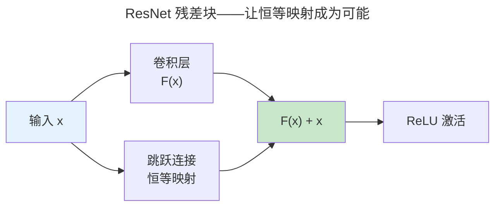

> 多层抽象的特征学习。

当神经网络从 1-2 层扩展到数十层时，网络自动学习到**层次化特征**——浅层学边缘纹理，中层学形状部件，深层学语义概念。

---

## 反向传播与计算图

前向传播是权重矩阵的层层变换。反向传播是将链式法则应用于计算图——从损失函数逐层回传梯度并更新权重。PyTorch 的 autograd 基于动态计算图。

## CNN 与 ResNet

CNN 通过卷积核滑动窗口提取局部特征——权值共享使参数量与输入尺寸解耦。ResNet 的残差连接 $y = F(x) + x$ 解决了深层网络的退化问题。

---

## 归一化技术

| 归一化 | 归一化维度 | 适用 |
|--------|-----------|------|
| **Batch Norm** | 跨 batch 样本 | CNN |
| **Layer Norm** | 跨特征维度 | Transformer（**必选**） |

---

## 跨卷连接

| 概念 | 关联 |
|------|------|
| 卷积滑动窗口 | [FPGA 流水线——卷积核并行化](../../01-weichen/02-digital-logic/) |
| 残差连接 | [CPU 流水线前递——旁路设计](../../01-weichen/03-microarchitecture/) |

:::tip[卷六内部路径]
- [**Transformer**](../03-transformer-family/)：自注意力——取代 CNN/RNN 的新范式
:::
