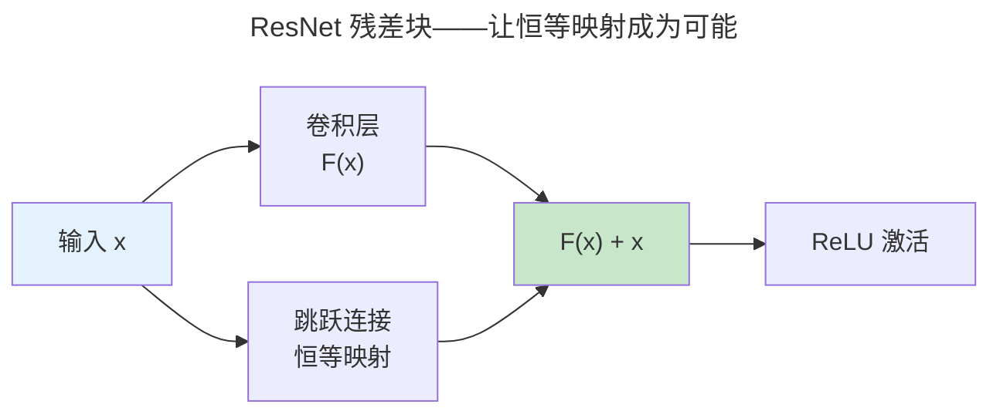

> 多层抽象的特征学习。

当神经网络从 1-2 层扩展到数十层时，网络自动学习到**层次化特征**——浅层学边缘纹理，中层学形状部件，深层学语义概念。

---

## 反向传播：链式法则的计算图实现

前向传播是权重矩阵的层层变换。反向传播是将链式法则应用于计算图——从损失函数逐层回传梯度并更新权重。

设损失函数为 $\mathcal{L}$，第 $l$ 层的权重为 $W^{(l)}$，激活值 $a^{(l)} = \sigma(z^{(l)})$ 其中 $z^{(l)} = W^{(l)} a^{(l-1)} + b^{(l)}$。反向传播的两条核心递推：

$$
\delta^{(l)} = \frac{\partial \mathcal{L}}{\partial z^{(l)}} = (W^{(l+1)})^T \delta^{(l+1)} \odot \sigma'(z^{(l)})
$$

$$
\frac{\partial \mathcal{L}}{\partial W^{(l)}} = \delta^{(l)} (a^{(l-1)})^T
$$

第一条是**误差反向流动**——将输出层的误差 $\delta^{(L)}$ 通过权重矩阵的转置逐层回传。第二条是**梯度计算**——利用前向传播中缓存的 $a^{(l-1)}$ 计算当前层权重的梯度。PyTorch 的 autograd 基于动态计算图，在每次前向传播时构建 DAG，反向传播时沿 DAG 反向遍历。

### 梯度消失与激活函数

Sigmoid 的导数 $\sigma'(x) = \sigma(x)(1-\sigma(x))$ 最大值为 0.25。经过 10 层连乘，梯度缩小到 $0.25^{10} \approx 10^{-6}$——消失殆尽。ReLU 的导数在正区间为常数 1，从根本上解决了深层网络的梯度消失问题。这也是 ResNet 残差连接能工作的前提——跳跃连接提供了梯度高速公路，恒等映射的导数为 1。

---

## CNN 与 ResNet

CNN 通过卷积核滑动窗口提取局部特征——权值共享使参数量与输入尺寸解耦：一个 3×3 卷积核无论处理 32×32 还是 224×224 的图像，参数量都是 $3 \times 3 \times C_{in} \times C_{out}$。

ResNet 的残差连接 $y = F(x) + x$ 解决了深层网络的退化问题——56 层网络在 CIFAR-10 上的训练误差高于 20 层网络，这一反直觉现象被 He 等人追溯到优化难度而非过拟合。残差连接将优化目标从"学习 $H(x)$"变为"学习残差 $F(x) = H(x) - x$"——当恒等映射已足够好时，网络只需将 $F(x)$ 推向零。

---

## 归一化技术：训练稳定的基石

| 归一化 | 归一化维度 | 适用 | 为什么 |
|--------|-----------|------|------|
| **Batch Norm** | 跨 batch 样本 | CNN | 利用 batch 内统计量，大 batch 效果好 |
| **Layer Norm** | 跨特征维度 | Transformer（**必选**） | 不依赖 batch 大小，序列建模天然适配 |
| **Instance Norm** | 跨 H×W 空间 | 风格迁移 | 保持每个样本的风格统计 |
| **Group Norm** | 跨通道组 | 小 batch 检测 | BN 与 LN 的折中 |

Batch Norm 的归一化操作：

$$
\hat{x}_i = \frac{x_i - \mu_B}{\sqrt{\sigma_B^2 + \epsilon}}, \quad y_i = \gamma \hat{x}_i + \beta
$$

其中 $\mu_B$ 和 $\sigma_B^2$ 是当前 mini-batch 的均值和方差，$\gamma$ 和 $\beta$ 是可学习的缩放和偏移参数——保证网络的表达能力不被归一化削弱。测试时使用训练期间累积的全局均值和方差（移动平均），避免单样本归一化抖动。

Batch Norm 有效的根本原因不是"减少内部协变量偏移"（原论文的假设，后被证伪），而是**平滑了损失景观**——使梯度更可预测，允许更大的学习率。

---

## 跨卷连接

| 概念 | 关联 |
|------|------|
| 卷积滑动窗口权值共享 | [FPGA 流水线——卷积核硬件并行化](../../01-weichen/02-digital-logic/) |
| 残差跳跃连接 | [CPU 流水线前递——旁路设计绕过阻塞](../../01-weichen/03-microarchitecture/) |
| Batch Norm 移动平均 | [EMA 指数移动平均——EWMA 的衰减因子选择](../../08-qianli/04-observability/) |
| 计算图反向传播 | [编译器 SSA 的 use-def 链——数据依赖的逆向追踪](../../00-lingxi/05-compiler-theory/) |
| 梯度消失与 ReLU | [MOSFET 亚阈值摆幅——导通到关断的指数衰减](../../01-weichen/01-semiconductor-physics/) |

:::tip[卷六内部路径]
- [**机器学习基础**](../01-machine-learning-basics/)：梯度下降——反向传播的顶层驱动力
- [**Transformer 家族**](../03-transformer-family/)：Layer Norm——Transformer 训练的必需品
:::
