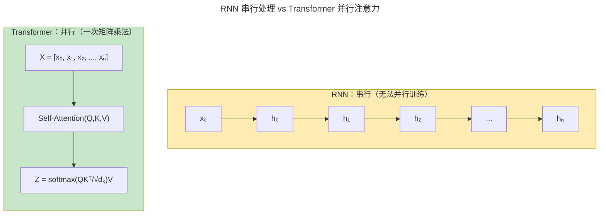
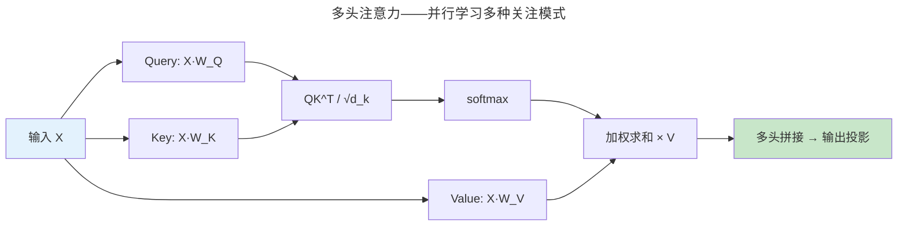
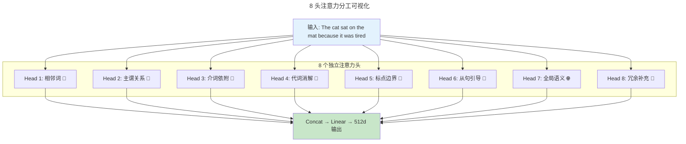
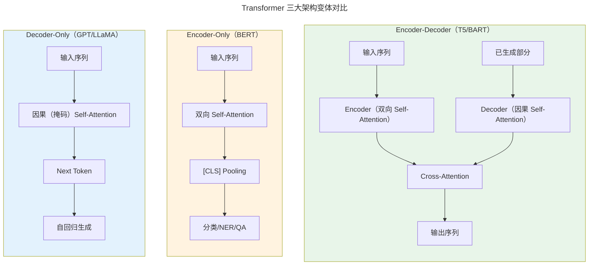
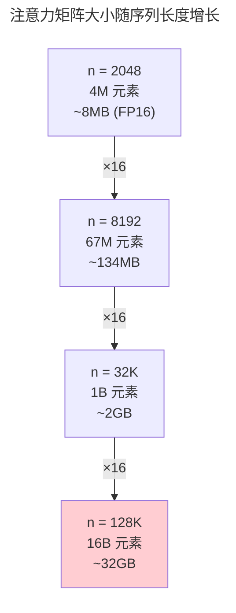

> 注意力即一切。

2017 年 Google 的 *Attention Is All You Need* 提出了一种全新架构——Transformer。它抛弃 RNN 循环和 CNN 卷积，完全基于**自注意力**。七年后，Transformer 统治了 NLP、计算机视觉（ViT）和蛋白质折叠（AlphaFold）。

---

## 为什么需要 Transformer

在 Transformer 之前，序列建模的绝对主宰是**循环神经网络**。RNN 按时间步逐个处理 token：

$$
h_t = f(W_h h_{t-1} + W_x x_t + b)
$$

这一公式看似简洁，却暗藏三个根本性困境：

**困境一：串行依赖——训练的物理瓶颈。** 计算 $h_t$ 必须等待 $h_{t-1}$ 完成，整个序列无法并行。在 GPU 上训练一个 100 词句子的 RNN，需要 100 次串行迭代——其余 99 个周期里大量 CUDA 核心（[GPGPU 的 SIMT 并行](../../05-wanxiang/01-gpu-rendering-pipeline/#gpu-并行架构)）处于空闲。这与 CPU 的[流水线处理器（将时间维度展开为空间）](../../01-weichen/03-microarchitecture/#流水线处理器将时间维度展开为空间)形成了鲜明的同构对比——串行执行是吞吐量的最大敌人。

**困境二：长程遗忘——梯度消失的诅咒。** 反向传播穿过 100 个时间步后，梯度被连乘的权重矩阵反复缩放。若 $\|W_h\| < 1$，梯度指数衰减；token 0 对 token 99 的影响趋近于零。LSTM/GRU 的门控机制缓解了但未根治这一问题。

**困境三：位置偏斜——近期 > 远期。** 即使梯度完整到达，RNN 的隐状态 $h_t$ 以递归方式编码历史——最近输入的信号最强，早期输入的信号被层层覆盖。模型天然偏向近期上下文。

Transformer 的核心洞察是：**让每个 token 直接"看到"序列中的每一个其他 token**，通过计算注意力分数来加权聚合信息——不再需要一步步传递隐状态。

:::tip[直觉类比：Attention 像一次 SQL 查询]
- **Query** $Q$ 相当于 `WHERE` 条件——"我在找什么？"
- **Key** $K$ 相当于索引字段——"我有什么可以被匹配？"
- **Value** $V$ 相当于要取回的数据——"匹配后返回什么？"
- Attention 输出 = 对所有 Value 的加权和，权重由 Query-Key 相似度决定。
:::

这就像你在一堆文档（Value）中搜索，先用自己的问题（Query）匹配每篇文档的摘要（Key），然后按匹配程度加权阅读。一次矩阵乘法 $QK^T$ 同时完成所有匹配，彻底消除了 RNN 的串行瓶颈。

---

## 自注意力机制

$$
\text{Attention}(Q, K, V) = \text{softmax}\left(\frac{QK^T}{\sqrt{d_k}}\right)V
$$

缩放因子 $\sqrt{d_k}$ 至关重要——不缩放时大维度下 softmax 饱和，梯度接近零。

### 多头注意力的分头计算

单一注意力头输出的是一组固定的 Query-Key 匹配模式——所有 token 之间的关系被压缩到同一个投影空间。这引出了一个问题：**一个头够吗？**

假设 $d_{model} = 512$，使用 $h = 8$ 个头，每个头的维度 $d_k = d_{model} / h = 64$。每个头拥有独立的投影矩阵：

$$
\text{head}_i = \text{Attention}(X W_i^Q, X W_i^K, X W_i^V), \quad W_i^Q, W_i^K \in \mathbb{R}^{512 \times 64}, \; W_i^V \in \mathbb{R}^{512 \times 64}
$$

8 个头并行计算，各自输出的 $64$ 维向量拼接成 $512$ 维后再经一次线性投影：

$$
\text{MultiHead}(X) = \text{Concat}(\text{head}_1, ..., \text{head}_8) \cdot W^O
$$

**手算示例**：输入序列 `"The cat sat on the mat because it was tired"`，8 个头各自学到什么？

| Head | 可能学到的模式 | 注意力焦点示例 |
|------|--------------|-------------|
| Head 1 | 相邻词共现 | `sat` $\leftrightarrow$ `on` |
| Head 2 | 主语-动词关系 | `cat` $\leftrightarrow$ `sat` |
| Head 3 | 宾语-介词依附 | `mat` $\leftrightarrow$ `on` |
| Head 4 | 代词共指消解 | `it` $\leftrightarrow$ `cat`（跨 8 个 token） |
| Head 5 | 标点与句子边界 | `.` $\leftrightarrow$ `tired` |
| Head 6 | 从句引导关系 | `because` $\leftrightarrow$ `tired` |
| Head 7 | 全局语义主题 | 整句的关键词分布 |
| Head 8 | 冗余/后备 | 与其他头互补的模式 |

**为什么必须多头？——单头的均值回归效应。** 如果只有一个头，所有 token 之间的关系被强制压缩到同一个相似度函数中。

$$
\text{SingleHead}(X) = \text{softmax}\left(\frac{XW^Q (XW^K)^T}{\sqrt{d_k}}\right) XW^V
$$

这个单一注意力分布必须同时处理语法、语义、位置、共指等所有关系。结果往往是"什么都关注一点，什么都不精确"——退化为对所有 token 的平均加权。多头机制允许模型在**不同的低维子空间**中独立学习不同的注意力模式，然后通过 $W^O$ 投影融合——就像 [GPGPU 的 SIMT 并行](../../05-wanxiang/01-gpu-rendering-pipeline/#gpu-并行架构)中多个线程束同时执行不同指令流。每个头的输出也可以通过[层归一化（Layer Normalization）](../02-deep-learning/#归一化技术训练稳定的基石)来稳定训练。

---

## RoPE：旋转位置编码

自注意力公式 $\text{softmax}(QK^T/\sqrt{d_k})V$ 存在一个盲区：它对 token 的**位置**完全无感。"A 爱 B"与"B 爱 A"的注意力矩阵可以相同，但语义截然相反。位置编码的任务是将位置信息注入 token 表示中。四种主流范式如下。

### ① 正弦位置编码（Sinusoidal, 2017）

原始 Transformer 使用固定的正弦/余弦函数编码绝对位置：

$$
PE(pos, 2i) = \sin\left(\frac{pos}{10000^{2i/d}}\right), \quad PE(pos, 2i+1) = \cos\left(\frac{pos}{10000^{2i/d}}\right)
$$

其中 $pos$ 是 token 位置，$i$ 是维度索引，$d$ 是模型维度。不同频率 $10000^{-2i/d}$ 为每个维度分配一个"时钟速度"——低维度变化慢（波长长，编码全局位置），高维度变化快（波长短，编码局部位置）。

这种频率分层机制与傅里叶变换的信号处理视角（[数学基础（频域分析）](../../00-lingxi/01-mathematical-foundations/)）异曲同工——用多频率正弦基表示位置信号。

关键性质：**线性外推可能性。** 对于任意偏移量 $k$：

$$
PE(pos+k, 2i) = \sin\left(\frac{pos+k}{10000^{2i/d}}\right)
$$

$PE_{pos+k}$ 可以表示为 $PE_{pos}$ 的线性变换（通过旋转矩阵），这意味着模型理论上可以泛化到未见过的位置。然而实践中外推效果有限，因为模型学到的权重并未被训练去利用这一性质。

### ② 可学习位置编码（Learned, BERT, 2018）

BERT 将位置视为可训练的参数矩阵 $P \in \mathbb{R}^{L_{max} \times d}$，每个位置有一个独立的嵌入向量。训练时通过反向传播学习。

- **优点**：灵活，让数据决定最优编码方式。
- **缺点**：无法外推到超过 $L_{max}$ 的位置（如训练最大 512，推理不能处理 513）。

### ③ RoPE——旋转位置编码（2021）

RoPE 的数学核心是**旋转矩阵**。对位置 $pos$ 处的向量 $x \in \mathbb{R}^d$，将其按维度对 $(2i, 2i+1)$ 分组，每组施加一个 $2 \times 2$ 旋转：

$$
R_{\Theta,pos}^d = \text{diag}\left(
\begin{bmatrix} \cos(pos\theta_1) & -\sin(pos\theta_1) \\ \sin(pos\theta_1) & \cos(pos\theta_1) \end{bmatrix},
\begin{bmatrix} \cos(pos\theta_2) & -\sin(pos\theta_2) \\ \sin(pos\theta_2) & \cos(pos\theta_2) \end{bmatrix},
...,
\begin{bmatrix} \cos(pos\theta_{d/2}) & -\sin(pos\theta_{d/2}) \\ \sin(pos\theta_{d/2}) & \cos(pos\theta_{d/2}) \end{bmatrix}
\right)
$$

其中 $\theta_i = 10000^{-2(i-1)/d}$，与正弦编码同频。RoPE 对 Q 和 K 分别施加位置旋转：

$$
\tilde{Q} = R_{pos_1} Q, \quad \tilde{K} = R_{pos_2} K
$$

代入点积：

$$
\tilde{Q} \cdot \tilde{K} = (R_{pos_1} Q)^T (R_{pos_2} K) = Q^T R_{pos_1}^T R_{pos_2} K = Q^T R_{pos_2 - pos_1} K
$$

最后一步利用了旋转矩阵的正交性 $R_{a}^T R_{b} = R_{b-a}$。**注意力分数仅依赖相对位置 $pos_2 - pos_1$**——这正是 RoPE 优雅的核心。LLaMA、Mistral、Qwen 等主流 LLM 均采用 RoPE。

### ④ ALiBi——最简单的方案（2022）

ALiBi（Attention with Linear Biases）完全抛弃位置嵌入，直接在注意力分数上减去一个线性偏置：

$$
\text{Attention}(Q, K, V) = \text{softmax}\left(\frac{QK^T}{\sqrt{d_k}} - m \cdot |i - j|\right) V
$$

其中 $m$ 是头特定的斜率（如 $1/2, 1/4, 1/8, ..., 1/2^h$），$|i-j|$ 是 token 间距离。

- **优点**：零额外参数，极端外推能力——训练 1024 长度，直接推理 4096+ 效果依然良好。
- **缺点**：表达能力受限（仅线性衰减），长程衰减对所有头相同。

### 四种方案对比

| 方案 | 参数 | 外推能力 | 计算代价 | 代表模型 |
|------|:--:|:------:|:------:|------|
| 正弦（Sinusoidal） | 0 | 中等 | 极低 | 原始 Transformer |
| 可学习（Learned） | $L_{max} \times d$ | 无 | 极低 | BERT、GPT-2 早期 |
| RoPE | 0 | 良好 | 低（旋转运算） | LLaMA、Mistral、Qwen |
| ALiBi | 0 | 优秀 | 极低 | BLOOM |

> RoPE 目前占据主导地位，因为它在**外推能力**（优于可学习编码）和**表达能力**（优于 ALiBi 的纯线性衰减）之间取得了最佳平衡。

---

## Transformer 三大架构变体

原始 Transformer 采用 Encoder-Decoder 架构，但实践中分化出三个家族：

**Encoder-Only（BERT）**：双向 Self-Attention——每个 token 能看到所有其他 token（左侧和右侧）。预训练目标为**掩码语言模型**：

$$
L_{MLM} = -\sum_{i \in masked} \log P(x_i | x_{\backslash masked})
$$

随机掩盖 15% 的输入 token，让模型从上下文预测被掩盖的内容。适合理解任务：分类、命名实体识别（NER）、问答。但无法直接生成文本。

**Decoder-Only（GPT/LLaMA）**：因果（掩码）Self-Attention——每个 token 只能看到当前位置及其左侧的 token。预训练目标为**下一 token 预测**：

$$
L_{NTP} = -\sum_t \log P(x_t | x_{<t})
$$

自回归生成：逐一预测下一个 token，将新 token 拼接到输入继续生成。适合生成任务：对话、续写、代码生成。目前 LLM 主流架构。

**Encoder-Decoder（T5/BART）**：Encoder 对输入做双向编码，Decoder 做自回归生成。两者通过 **Cross-Attention** 连接——Decoder 的 Query 来自自身隐状态，Key 和 Value 来自 Encoder 输出。适合输入-输出映射任务：翻译、摘要。

这种 Encoder-Decoder 分离设计与[编译器的前端-后端分离架构](../../00-lingxi/05-compiler-theory/)同构——前端理解输入（Encoder），后端生成目标（Decoder），中间表示（Cross-Attention 的隐状态）连接两者。

### 架构选择指南

| 任务 | 推荐架构 | 原因 |
|------|------|------|
| 文本分类/情感分析 | Encoder-Only | 双向上下文理解，无需生成 |
| 命名实体识别（NER） | Encoder-Only | token 级标注，双向视野 |
| 对话/Chat | Decoder-Only | 自回归生成，流式输出 |
| 代码生成 | Decoder-Only | 逐 token 生成，语法约束 |
| 机器翻译 | Encoder-Decoder | 输入输出长度不同，Cross-Attention 对齐 |
| 文本摘要 | Encoder-Decoder | 需理解全文后压缩生成 |

---

## Transformer 训练与工程细节

Transformer 的训练并非"调好超参数、按下运行"那么简单。以下五项工程实践决定了收敛与否。

### 学习率 Warmup

训练初期，模型权重随机初始化，梯度方差极大。如果直接使用全量学习率，参数更新剧烈震荡甚至发散。Warmup 从小学习率线性增长到目标值：

$$
lr(step) = lr_{max} \cdot \min\left(step^{-0.5},\; step \cdot warmup\_steps^{-1.5}\right)
$$

前 $warmup\_steps$ 步线性增加，之后按 $step^{-0.5}$ 衰减。原始 Transformer 使用 4000 步 warmup。这个设计让优化器在初期探索损失表面，找到合理区域后再加速。

### Pre-LN vs Post-LN

Layer Normalization 在子层之前还是之后，影响训练稳定性：

| 变体 | 结构 | 训练稳定性 | Warmup 需求 | 收敛效果 |
|------|------|:--:|:--:|:--:|
| Post-LN | $x + \text{Sublayer}(\text{LN}(x))$ | 较差 | 必须 | 略好 |
| Pre-LN | $\text{LN}(x) + \text{Sublayer}(x)$ | 良好 | 无需 | 略差 |

Post-LN 将 Layer Norm 放在残差连接**之后**，残差分支的输出通过 Norm 缩放，梯度路径更直接但方差累积严重——训练初期容易发散，必须配合 warmup。Pre-LN 将 Norm 放在子层**之前**，残差分支承载未归一化的信号，梯度更稳定，可以不使用 warmup。现代 LLM（GPT-2+、LLaMA）几乎全部采用 Pre-LN。

### FFN 激活函数演进

Transformer 的 Feed-Forward Network 经历了三代激活函数变迁：

$$
\begin{aligned}
\text{ReLU}(x) &= \max(0, x) \quad &\text{—— 原始 Transformer}\\
\text{GELU}(x) &= x \cdot \Phi(x) \approx 0.5x\left(1 + \tanh\left(\sqrt{2/\pi}(x + 0.044715x^3)\right)\right) \quad &\text{—— BERT/GPT-2}\\
\text{SwiGLU}(x) &= (xW_1 \cdot \sigma(xW_2)) \otimes (xW_3) \quad &\text{—— LLaMA/PaLM}
\end{aligned}
$$

SwiGLU 的核心创新是**门控双矩阵结构**：$xW_2$ 经过 sigmoid 产生门控信号（gate），$xW_1$ 产生激活值（up projection），两者逐元素相乘后经 $W_3$ 投影。

$$
\text{FFN}_{SwiGLU}(x) = (\text{SiLU}(xW_{gate}) \otimes xW_{up}) \cdot W_{down}
$$

SwiGLU 比 ReLU/GELU 多一个参数矩阵，但收敛更快、下游任务表现更好。

### 标签平滑（Label Smoothing）

将 one-hot 训练目标从"绝对正确"平滑为"相对确信"：

$$
\tilde{y} = \begin{cases}
1 - \epsilon & \text{if } k = k_{true} \\
\epsilon / (K-1) & \text{if } k \neq k_{true}
\end{cases}
$$

例如 $K=32000$（词表大小），$\epsilon=0.1$：正确 token 目标概率 $0.9$，其余 31999 个 token 各分得 $0.1/31999 \approx 3.1 \times 10^{-6}$。

效果：防止模型对训练数据过度自信（softmax 输出 $p \to 1.0$），提升泛化能力。但代价是困惑度（perplexity）数值上升——因为模型"承认"正确答案不唯一。

### DropPath（Stochastic Depth）

随机丢弃整个残差分支：

$$
\text{output} = \begin{cases}
x + \text{Sublayer}(x) & \text{with probability } 1-p \\
x & \text{with probability } p
\end{cases}
$$

与 Dropout（随机丢弃单个神经元）不同，DropPath 以层为单位随机跳过。这迫使网络不依赖任何单一子层，类似于集成学习中随机抽取子网络。现代 ViT 和大型 Transformer 常用。

---

## FlashAttention

将注意力矩阵切分为 SRAM 友好的 tile——利用 [GPU 并行架构](../../05-wanxiang/01-gpu-rendering-pipeline/#gpu-并行架构) 避免写入 HBM。注意力计算 2-4 倍加速。

---

## Transformer 的扩展：从文本到多模态

Transformer 的自注意力机制对输入形式不设限——任何可以表示为序列的数据都能处理。这一特性推动它从 NLP 走向多模态。

### ViT（Vision Transformer, 2020）

将 $224 \times 224$ 的 RGB 图像切分为 $16 \times 16$ 的 patches（不重叠的图块），得到 $14 \times 14 = 196$ 个图像块。每个 patch 被线性投影为一个向量（类似词嵌入），加上位置编码后送入标准 Transformer。

$$
\text{ViT}(I) = \text{Transformer}(\text{Linear}(\text{Patch}_1), ..., \text{Linear}(\text{Patch}_{196}) + PE)
$$

ViT 的 patch 切分与 [GPU 渲染管线的光栅化分块](../../05-wanxiang/01-gpu-rendering-pipeline/) 有概念上的呼应——两者都依赖将连续/大尺寸输入分解为可并行处理的单元。

### CLIP 对比学习（2021）

CLIP 用**图文对**训练双塔 Transformer——图像编码器（ViT）+ 文本编码器（Transformer）。核心是对比损失：

$$
\mathcal{L}_{CLIP} = -\frac{1}{2N} \sum_{i=1}^{N} \left[\log \frac{\exp(s_{ii}/\tau)}{\sum_j \exp(s_{ij}/\tau)} + \log \frac{\exp(s_{ii}/\tau)}{\sum_j \exp(s_{ji}/\tau)}\right]
$$

其中 $s_{ij}$ 是第 $i$ 张图像与第 $j$ 条文本的余弦相似度，$\tau$ 是温度参数。两项分别最大化图像→文本和文本→图像的匹配度。

### 多模态 LLM

LLaVA、Gemini、GPT-4V 等模型的工作流程：

1. 视觉编码器（如 ViT/CLIP）将图像编码为一系列视觉 token
2. 投影层将视觉 token 对齐到文本 token 空间
3. 拼接：`[图像 token 1, ..., 图像 token N, 文本 token 1, ..., 文本 token M]`
4. 送入统一的 Decoder-Only Transformer，自回归生成文本响应

关键设计在于视觉 token 和文本 token 共享同一个 Transformer 处理——模型无需区分"看到的"和"读到的"，一切统一为 token 序列。

---

## 自注意力的计算复杂度与优化动机

标准自注意力的时间和内存复杂度是序列长度的二次方：

$$
\text{时间}: O(n^2 \cdot d), \quad \text{内存}: O(n^2)
$$

当 $n=2048$（GPT-3 的上下文长度），注意力矩阵 $n \times n = 4M$ 元素——尚可管理。但当 $n=128K$（GPT-4 Turbo 上下文），注意力矩阵达到 $16B$ 元素——如果每元素 2 字节（FP16），单层注意力矩阵就需要 $32$ GB 显存，远超单张 H100（80GB）的容量。

这一 $O(n^2)$ 瓶颈驱动了三类优化：

| 优化方向 | 代表技术 | 核心思路 |
|------|------|------|
| **I/O 优化** | FlashAttention | Tiling（分块计算）+ Recomputation（不存中间结果，用时重算） |
| **缓存优化** | KV Cache | 推理时缓存历史 K/V，避免重复计算——将 $O(n^2)$（每步）降为 $O(n)$（每步） |
| **结构优化** | GQA / MQA | 多个 Query 头共享一组 Key/Value 头，减少 KV 缓存体积 |

:::note[GQA 与 MQA]
- **MQA**（Multi-Query Attention）：所有 Q 头共享一组 K 和 V——KV 缓存减少 $h$ 倍
- **GQA**（Grouped-Query Attention）：将 Q 头分组，组内共享 K/V——在质量和速度间折中。LLaMA 2/3 使用 GQA
:::

这三类优化共同作用，使 Transformer 从理论上的 $O(n^2)$ 扩展到实际可运行的 $n=128K$+ 上下文。

---

## 跨卷连接

| 概念 | 关联 |
|------|------|
| softmax 缩放 | [GPU 并行架构](../../05-wanxiang/01-gpu-rendering-pipeline/#gpu-并行架构) |
| FlashAttention tile | [Cache 组织形式：容量、速度与复杂度的三角博弈](../../01-weichen/04-memory-hierarchy/#cache-组织形式容量速度与复杂度的三角博弈) |

:::tip[卷六内部路径]
- [**深度学习**](../02-deep-learning/)：Layer Norm——Transformer 训练必需品
- [**大语言模型**](../04-large-language-models/)：GPT——Decoder-only Transformer
:::
