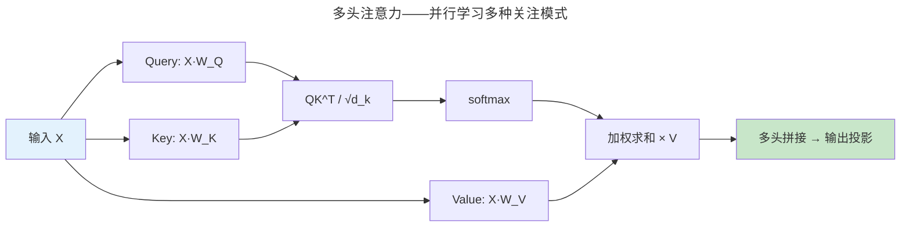

> 注意力即一切。

2017 年 Google 的 *Attention Is All You Need* 提出了一种全新架构——Transformer。它抛弃 RNN 循环和 CNN 卷积，完全基于**自注意力**。七年后，Transformer 统治了 NLP、计算机视觉（ViT）和蛋白质折叠（AlphaFold）。

---

## 自注意力机制

$$
\text{Attention}(Q, K, V) = \text{softmax}\left(\frac{QK^T}{\sqrt{d_k}}\right)V
$$

缩放因子 $\sqrt{d_k}$ 至关重要——不缩放时大维度下 softmax 饱和，梯度接近零。

---

## RoPE：旋转位置编码

RoPE 通过对 Q 和 K 向量施加旋转操作编码相对位置——旋转后 Q 和 K 的点积自然包含相对位置信息，数学性质优雅。是目前 LLaMA、Mistral 等主流 LLM 的标准位置编码。

## FlashAttention

将注意力矩阵切分为 SRAM 友好的 tile——利用 [GPU SRAM 的带宽优势](../../05-wanxiang/01-gpu-rendering-pipeline/) 避免写入 HBM。注意力计算 2-4 倍加速。

---

## 跨卷连接

| 概念 | 关联 |
|------|------|
| softmax 缩放 | [GPU Tensor Core 低精度矩阵乘法](../../05-wanxiang/01-gpu-rendering-pipeline/) |
| FlashAttention tile | [Cache 分块——SRAM 友好数据布局](../../01-weichen/04-memory-hierarchy/) |

:::tip[卷六内部路径]
- [**深度学习**](../02-deep-learning/)：Layer Norm——Transformer 训练必需品
- [**大语言模型**](../04-large-language-models/)：GPT——Decoder-only Transformer
:::
