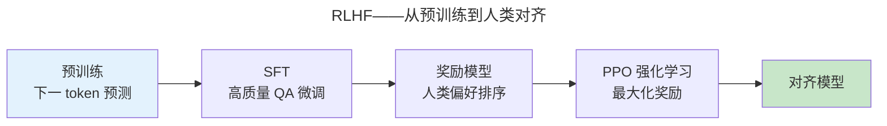

> 涌现：当参数规模跨越阈值。

GPT-3（1750 亿参数）证明了上下文学习能力的涌现。本章走过 LLM 完整生命周期：预训练、对齐和推理优化。

---

## Scaling Law：幂律统治一切

Kaplan 等人 (2020) 发现模型性能与参数量 $N$、数据量 $D$、训练算力 $C$ 呈幂律关系。Chinchilla (2022) 修正了数据量不足的偏差，给出了最优配比：

$$
L(N, D) = \frac{A}{N^{\alpha}} + \frac{B}{D^{\beta}} + E
$$

其中 $L$ 是测试损失，$\alpha \approx 0.34$，$\beta \approx 0.28$，$E$ 是不可约损失（数据自身的熵）。这意味着：

- 模型参数翻倍 → 损失降低约 $2^{-0.34} \approx 21\%$
- 数据量翻倍 → 损失降低约 $2^{-0.28} \approx 18\%$

**Chinchilla 最优**：在给定算力预算下，模型参数量和训练 token 数应**等比例增长**。GPT-3 的 1750 亿参数用了约 3000 亿 token 训练——按照 Chinchilla，同等算力下训练一个 700 亿参数模型配 1.4 万亿 token 效果更好。LLaMA 系列正是基于这一洞察：7B 模型配 1 万亿 token，性能超越参数大 3 倍但数据不足的模型。

### 涌现能力

当参数规模跨越特定阈值（通常在 10B-100B），模型突然展现出小模型完全不具备的能力：上下文学习、思维链推理、指令遵循。这些能力的出现不遵循平滑的 Scaling Law——在阈值以下几乎为零，阈值以上跳跃式增长。**涌现是 Scaling Law 的相变现象**，类似于 [统计力学中的临界点](../../00-lingxi/01-mathematical-foundations/)。

---

## RLHF 与 DPO：从生成到对齐

PPO 阶段的目标函数——在最大化奖励与不偏离 SFT 模型之间平衡：

$$
\mathcal{L}_{PPO} = \mathbb{E}\left[ r(x, y) - \beta \cdot \text{KL}\left(\pi_\theta(y|x) \parallel \pi_{SFT}(y|x)\right) \right]
$$

KL 散度惩罚项防止模型为追求高奖励而输出语法正确但语义空洞的文本——这被称为"奖励黑客"（Reward Hacking）。

**DPO**（Direct Preference Optimization）跳过奖励模型和 PPO——直接从偏好数据优化。其损失函数简洁得惊人：

$$
\mathcal{L}_{DPO} = -\mathbb{E}_{(x, y_w, y_l)} \left[ \log \sigma \left( \beta \log \frac{\pi_\theta(y_w|x)}{\pi_{ref}(y_w|x)} - \beta \log \frac{\pi_\theta(y_l|x)}{\pi_{ref}(y_l|x)} \right) \right]
$$

其中 $y_w$ 是偏好响应，$y_l$ 是非偏好响应。DPO 本质上是在 Reference 模型的约束下，增大偏好响应与非偏好响应的相对概率差——将 RL 问题转化为二分类问题。

---

## 推理优化

| 技术 | 原理 | 效果 |
|------|------|------|
| **KV Cache** | 缓存已计算的 Key/Value | 避免重复计算——自回归生成的 $O(n^2)$ → $O(n)$ |
| **量化（INT4/INT8）** | FP16 → 低位整数 | 显存减半、速度翻倍 |
| **投机解码** | 小模型生成候选 + 大模型验证 | 2-3x 加速 |

投机解码利用了 LLM 推理的**内存带宽瓶颈**：大模型生成一个 token 需要加载所有权重但只做少量计算。小模型生成 5 个候选 token 几乎免费，大模型在一个 forward pass 中并行验证——验证 5 个 token 和生成 1 个 token 的 latency 几乎相同。这与 [CPU 的分支预测投机执行（推测取指与分支预测）](../../01-weichen/03-microarchitecture/#推测取指与分支预测) 共享同一个洞见：**并行猜测比串行等待更快**。

量化利用了 LLM 权重的低秩特性——模型的大部分信息集中在少数大奇异值方向。这在数学上等价于 [奇异值分解的低秩近似](../../00-lingxi/01-mathematical-foundations/)，也是 LoRA（Low-Rank Adaptation）高效微调的数学基础。

---

## 跨卷连接

| 概念 | 关联 |
|------|------|
| Scaling Law 幂律 | [Moore 定律——晶体管密度的指数增长](../../01-weichen/01-semiconductor-physics/) |
| KV Cache 管理 | [Cache LRU 替换策略——有限容量的最优淘汰](../../03-qiankun/02-memory-management/) |
| 投机解码 | [分支预测——并行猜测比串行等待更快（推测取指与分支预测）](../../01-weichen/03-microarchitecture/#推测取指与分支预测) |
| 量化低秩分解 | [SVD 奇异值分解——用 r 个秩-1 矩阵逼近](../../00-lingxi/01-mathematical-foundations/) |
| PPO KL 散度约束 | [Curry-Howard 同构——类型系统约束防止错误程序](../../00-lingxi/02-formal-logic/#curry-howard-同构程序即证明) |

:::tip[卷六内部路径]
- [**Transformer 家族**](../03-transformer-family/)：GPT——Decoder-only 自注意力基础
- [**AI Agent**](../05-ai-agents/)：工具调用——LLM 从生成到行动
:::
