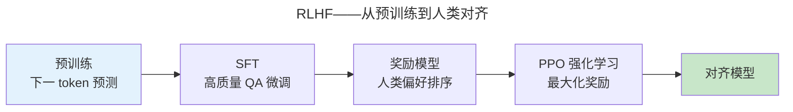

> 涌现：当参数规模跨越阈值。

GPT-3（1750 亿参数）证明了上下文学习能力的涌现。本章走过 LLM 完整生命周期：预训练、对齐和推理优化。

---

## Scaling Law

Kaplan 等人 (2020) 发现模型性能与参数量 $N$、数据量 $D$、训练算力 $C$ 呈幂律关系。三者必须同步扩展——用大量数据训练小模型或少量数据训练大模型都次优。

---

## RLHF 与 DPO

**DPO**（Direct Preference Optimization）跳过奖励模型和 PPO——直接从偏好数据优化，数学等价但实现更简单。

---

## 推理优化

| 技术 | 原理 | 效果 |
|------|------|------|
| **KV Cache** | 缓存已计算的 Key/Value | 避免重复计算 |
| **量化（INT4/INT8）** | FP16 → 低位整数 | 显存减半、速度翻倍 |
| **投机解码** | 小模型生成候选 + 大模型验证 | 2-3x 加速 |

---

## 跨卷连接

| 概念 | 关联 |
|------|------|
| KV Cache 管理 | [Cache LRU 替换策略](../../03-qiankun/02-memory-management/) |
| 分布式训练 AllReduce | [共识协议——分布式梯度同步](../../04-yuanhai/04-consensus-protocols/) |

:::tip[卷六内部路径]
- [**Transformer**](../03-transformer-family/)：GPT——Decoder-only 架构
- [**AI Agent**](../05-ai-agents/)：工具调用——LLM 从生成到行动
:::
