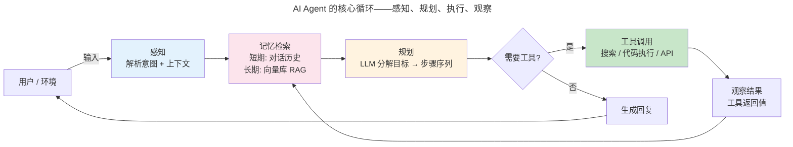
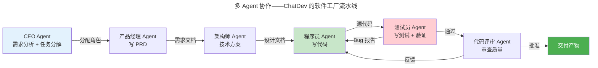

> 从生成到行动。

AI Agent 将 LLM 置于感知-规划-执行的循环中——Agent 观察环境、LLM 推理下一步、调用工具、观察结果——将"聊天机器人"升级为**自主智能体**。

---

## Agent 核心循环



这四个阶段的每一个都值得展开。

---

## 记忆系统：四层记忆架构

Agent 的记忆不是简单的"记住对话"——它模仿人类认知架构分为四层：

| 记忆类型 | 人类对应 | Agent 实现 | 生命周期 |
|---------|---------|-----------|---------|
| **工作记忆** | 前额叶——当前思考内容 | 对话上下文窗口（最后 N 轮） | 单次对话 |
| **情景记忆** | 海马体——经历过的事件 | 对话摘要 + 时间戳索引 | 跨对话 |
| **语义记忆** | 皮层——事实性知识 | 向量数据库（RAG）+ 知识图谱 | 持久 |
| **程序记忆** | 小脑——技能/习惯 | 工具调用 Schema + 提示模板 | 持久 |

工作记忆直接受限于 [LLM 上下文窗口的长度](../04-large-language-models/)。情景记忆通过**摘要压缩**将长对话浓缩为关键事件——这与 [分代垃圾回收中的"年轻代高频回收"策略](../../00-lingxi/05-compiler-theory/#垃圾回收自动内存管理) 共享相同的直觉：近期信息访问频率最高，随时间衰减。

语义记忆的核心是 **RAG（检索增强生成）**：查询时从向量库检索最相关的文档片段，与原始问题拼接后喂给 LLM。Embedding 模型将文本映射为高维向量，余弦相似度衡量语义相关性——这本质上是 [向量空间模型](../../00-lingxi/01-mathematical-foundations/#线性代数高维空间的几何直觉) 在语义搜索中的直接应用。

---

## 规划策略：从反应到深思

| 策略 | 原理 | 适用 | 代表框架 |
|------|------|------|---------|
| **ReAct** | 交替推理（Thought）和行动（Action） | 多步工具调用 | LangChain Agent |
| **Tree-of-Thought** | 探索多条推理路径，BFS/DFS 选最佳 | 复杂回溯推理 | ToT 论文实现 |
| **Plan-and-Solve** | 先生成完整计划再逐步执行 | 步骤可预测任务 | PlanBench |
| **Reflexion** | 执行失败后自我反思，修正后续规划 | 需要试错的任务 | Reflexion Agent |

### ReAct：推理与行动的交错

ReAct 是当前最主流的 Agent 范式。它的核心是一个交错序列：

```
Thought: 我需要查一下今天的天气才能建议穿什么
Action: search("北京今日天气")
Observation: 北京今日晴，15~25°C
Thought: 晴天且温度适中，建议穿薄外套
Action: respond("今天北京晴天，15~25°C，建议穿薄外套出门")
```

这种"思考-行动-观察"循环让 LLM 的推理能力与外部工具的执行能力结合——LLM 负责"想"，工具负责"做"。ReAct 的正确率在 HotpotQA 上比纯推理（Chain-of-Thought）高出 15 个百分点，因为外部知识纠正了 LLM 的幻觉。

### 工具调用的工程实现

工具调用在工程上依赖 **Function Calling** 机制——LLM 不直接执行代码，而是输出一个结构化的函数调用请求：

```json
{
  "name": "search_weather",
  "arguments": {
    "city": "北京",
    "date": "2026-06-20"
  }
}
```

Agent 框架（LangChain、AutoGPT）维护一个工具注册表，LLM 选择工具并生成参数，框架执行并将结果注入下一轮对话。这种"LLM 管决策、框架管执行"的分工，类似于 [操作系统中的用户态/内核态划分](../../03-qiankun/01-process-and-thread/)——LLM 在"用户态"做高层推理，工具执行在"内核态"完成实际 I/O。

---

## 多智能体协作



ChatDev、MetaGPT 等框架将软件开发拆分为多个专业 Agent 角色——产品经理写需求、架构师设计方案、程序员写代码、测试员验证——**模拟人类团队协作的沟通与审查流程**。这不是噱头：在 HumanEval 基准上，多 Agent 协作的代码生成正确率比单 Agent 高出 10-20 个百分点。

多 Agent 协作面临的核心挑战是**通信效率**——N 个 Agent 之间如果全对全通信，消息量是 $O(N^2)$。ChatDev 通过**角色流水线**将通信结构化（CEO → PM → Architect → Developer → Tester），将复杂度降至 $O(N)$。

多 Agent 间的消息传递协议（谁和谁通信、何时通信）是一个活跃研究方向——它既需要 [共识协议](../../04-yuanhai/04-consensus-protocols/) 确保 Agent 间对任务状态的一致性理解，又借鉴了 [OSPF 链路状态路由](../../03-qiankun/05-network-protocol-stack/) 的拓扑发现思想来动态调整通信拓扑。

---

## 跨卷连接

| 概念 | 关联 |
|------|------|
| Agent 工作记忆窗口 | [上下文窗口与 KV Cache 管理](../04-large-language-models/) |
| RAG 向量检索 | [B+Tree 索引：磁盘友好的查找树](../../04-yuanhai/01-relational-database/#btree-索引磁盘友好的查找树) |
| Function Calling 决策/执行分离 | [系统调用：用户态 → 内核态的陷阱门](../../03-qiankun/01-process-and-thread/) |
| 多 Agent 通信拓扑 | [OSPF 链路状态——全网拓扑发现](../../03-qiankun/05-network-protocol-stack/) |
| ReAct 的 thought-action 循环 | [调度算法：CFS 与 EEVDF](../../03-qiankun/01-process-and-thread/#调度算法cfs-与-eevdf) |
| 记忆衰减与摘要 | [LRU 近似——时间局部性的缓存哲学](../../03-qiankun/02-memory-management/) |

:::tip[卷六内部路径]
- [**大语言模型**](../04-large-language-models/)：Agent 的核心推理引擎——预训练 + 对齐
- [**Transformer 家族**](../03-transformer-family/)：自注意力——LLM 理解工具调用上下文的基础
:::
