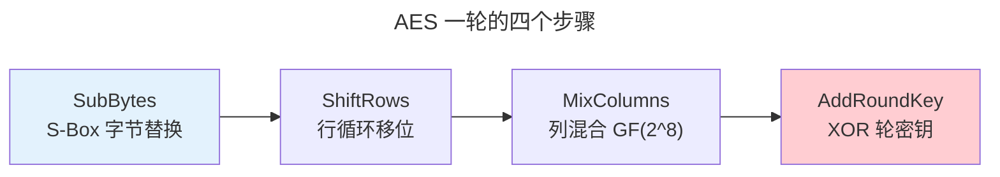

> 一把钥匙，锁住整个王国。

对称加密的核心：**混淆**（打乱明文与密文间的关系）与**扩散**（让每比特影响多比特密文）。本章深入 AES 内部结构、分组模式与 ChaCha20 流密码。

---

## AES：当代对称加密之王

AES-128 经受 10 轮变换。每轮四步，将 128 位状态矩阵 $S$（4×4 字节阵列）转换：

| 步骤 | 操作 | 密码学作用 |
|------|------|-----------|
| **SubBytes** | S-Box 查表（基于 $GF(2^8)$ 逆运算） | **混淆** |
| **ShiftRows** | 每行循环左移 | **扩散** |
| **MixColumns** | 列与 4×4 矩阵在 $GF(2^8)$ 上相乘 | **扩散** |
| **AddRoundKey** | 与轮密钥 XOR | 注入密钥材料 |



### S-Box：混淆的数学核心

AES S-Box 定义了 $GF(2^8)$ 上的非线性变换。对于输入字节 $x$：

1. 计算 $x$ 在 $GF(2^8)$ 中的乘法逆元：$x^{-1}$（$0 \to 0$）
2. 应用仿射变换：$y = Ax^{-1} + c$（在 $GF(2)$ 上）

$$
\begin{bmatrix} y_0 \\ y_1 \\ y_2 \\ y_3 \\ y_4 \\ y_5 \\ y_6 \\ y_7 \end{bmatrix} =
\begin{bmatrix}
1 & 0 & 0 & 0 & 1 & 1 & 1 & 1 \\
1 & 1 & 0 & 0 & 0 & 1 & 1 & 1 \\
1 & 1 & 1 & 0 & 0 & 0 & 1 & 1 \\
1 & 1 & 1 & 1 & 0 & 0 & 0 & 1 \\
1 & 1 & 1 & 1 & 1 & 0 & 0 & 0 \\
0 & 1 & 1 & 1 & 1 & 1 & 0 & 0 \\
0 & 0 & 1 & 1 & 1 & 1 & 1 & 0 \\
0 & 0 & 0 & 1 & 1 & 1 & 1 & 1
\end{bmatrix}
\begin{bmatrix} x_0 \\ x_1 \\ x_2 \\ x_3 \\ x_4 \\ x_5 \\ x_6 \\ x_7 \end{bmatrix} +
\begin{bmatrix} 1 \\ 1 \\ 0 \\ 0 \\ 0 \\ 1 \\ 1 \\ 0 \end{bmatrix}
$$

仿射变换的巧妙之处：它打破了 $GF(2^8)$ 逆运算的代数结构——单独使用逆运算会被代数攻击破解，加上仿射变换后 S-Box 成为高度非线性函数，抵抗线性和差分密码分析。

### 密钥扩展与 AES-NI

AES 的密钥扩展（Key Schedule）将 128 位主密钥扩展为 11 个 128 位轮密钥（AES-128）。现代 x86/ARM 处理器通过 **AES-NI 指令集**（`AESENC`, `AESENCLAST`, `AESKEYGENASSIST`）将一轮 AES 和密钥扩展在单周期内完成——软件 AES 约 100 MB/s，AES-NI 可达 3-5 GB/s。这是 [CISC 复杂指令](../../01-weichen/05-instruction-set-architecture/#cisc-与-risc两套哲学的五十年对决) 在现代处理器的经典案例。

---

## 分组模式：从 ECB 到 GCM

| 模式 | 并行 | 认证 | 致命风险 |
|------|:--:|:--:|------|
| **ECB** | ✓ | ✗ | 相同明文→相同密文——企鹅轮廓依然可见（**绝不用**） |
| **CBC** | 解密✓ | ✗ | IV 必须随机不可预测——TLS 1.0 CBC 的 BEAST 攻击 |
| **CTR** | ✓ | ✗ | Nonce 绝不重复——否则密钥流被 XOR 抵消 |
| **GCM** | ✓ | ✓ | CTR 加密 + GHASH 认证——TLS 1.3 推荐 |

GCM 的认证标签计算基于 $GF(2^{128})$ 上的多项式求值：

$$
\text{GHASH}(H, A, C) = A_1 H^{m+n+1} + \dots + A_m H^{n+1} + C_1 H^{n} + \dots + C_n H + L \cdot H
$$

其中 $H = \text{AES}_K(0^{128})$ 是哈希子密钥，$A$ 是关联数据，$C$ 是密文，$L$ 是长度块。该多项式被专门设计为对 forgery 攻击安全——任何密文或关联数据的比特翻转都会导致标签不匹配，概率 $1 - 2^{-128}$。

---

## ChaCha20：软件高效的流密码

ChaCha20 通过 20 轮 ARX（Add-Rotate-XOR）操作产生密钥流——无 AES 硬件加速下仍高效。每轮对 512 位状态执行：

```
a += b; d ^= a; d <<<= 16;  // Quarter Round 四分之一轮
c += d; b ^= c; b <<<= 12;
a += b; d ^= a; d <<<= 8;
c += d; b ^= c; b <<<= 7;
```

ARX 结构的优势：在通用 CPU 上，加法、异或和循环移位都是单周期指令——无需专用硬件。WireGuard VPN 和 TLS 1.3 都将 ChaCha20-Poly1305 作为备用算法套件。

---

## 跨卷连接

| 概念 | 关联 |
|---------|---------|
| AES S-Box $GF(2^8)$ 逆 + 仿射 | [有限域：AES 的代数舞台](../../00-lingxi/06-cryptographic-mathematics/#有限域aes-的代数舞台) |
| GCM GHASH 多项式 | [$GF(2^{128})$ 多项式乘法——二进制域的快速约简](../../00-lingxi/06-cryptographic-mathematics/) |
| AES-NI 单周期指令 | [CISC 与 RISC——指令复杂度与执行效率的博弈](../../01-weichen/05-instruction-set-architecture/#cisc-与-risc两套哲学的五十年对决) |
| ChaCha20 ARX 结构 | [SHA-256 的加法-移位-异或混合器](../../07-tianshu/03-hash-and-signature/) |

:::tip[卷七内部路径]
- [**非对称加密**](../02-asymmetric-cryptography/)：用 RSA/ECC 传输 AES 密钥——混合加密
- [**哈希与签名**](../03-hash-and-signature/)：HMAC——对称密钥的认证标签
:::
