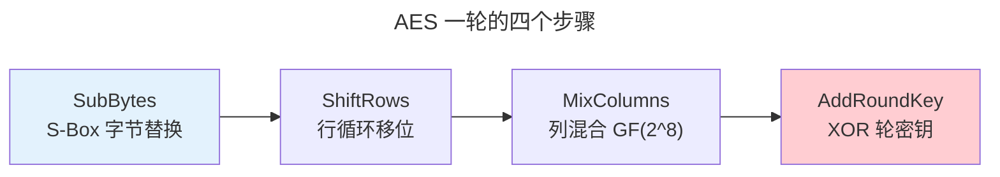

> 一把钥匙，锁住整个王国。

对称加密的核心：**混淆**（打乱明文与密文间的关系）与**扩散**（让每比特影响多比特密文）。本章深入 AES 内部结构、分组模式与 ChaCha20 流密码。

---

## AES：当代对称加密之王

AES-128 经受 10 轮变换。每轮四步：

| 步骤 | 操作 | 密码学作用 |
|------|------|-----------|
| **SubBytes** | S-Box 查表（基于 [$GF(2^8)$ 逆运算](../../00-lingxi/06-cryptographic-mathematics/)） | **混淆** |
| **ShiftRows** | 每行循环左移 | **扩散** |
| **MixColumns** | 列与 $4 \times 4$ 矩阵在 $GF(2^8)$ 上相乘 | **扩散** |
| **AddRoundKey** | 与轮密钥 XOR | 注入密钥材料 |

---

## 分组模式

| 模式 | 并行 | 认证 | 风险 |
|------|------|------|------|
| **ECB** | ✓ | ✗ | 相同明文→相同密文（**禁用**） |
| **CBC** | 解密✓ | ✗ | IV 必须随机不可预测 |
| **CTR** | ✓ | ✗ | Nonce 绝不重复 |
| **GCM** | ✓ | ✓ | CTR + GHASH（$GF(2^{128})$）—TLS 1.3 推荐 |

---

## ChaCha20：软件高效的流密码

ChaCha20 通过 20 轮 ARX（Add-Rotate-XOR）操作产生密钥流，无 AES 硬件加速下仍高效——WireGuard VPN 和 TLS 1.3 的备用算法。

---

## 跨卷连接

| 概念 | 关联 |
|---------|---------|
| AES S-Box $GF(2^8)$ | [有限域——密码学数学](../../00-lingxi/06-cryptographic-mathematics/) |
| GCM GHASH | [$GF(2^{128})$ 多项式乘法](../../00-lingxi/06-cryptographic-mathematics/) |
| AES-NI | [CISC 复杂指令密码学加速](../../01-weichen/05-instruction-set-architecture/) |

:::tip[卷七内部路径]
- [**非对称加密**](../02-asymmetric-cryptography/)：用 RSA/ECC 传输 AES 密钥
- [**哈希与签名**](../03-hash-and-signature/)：HMAC——对称密钥认证
:::
