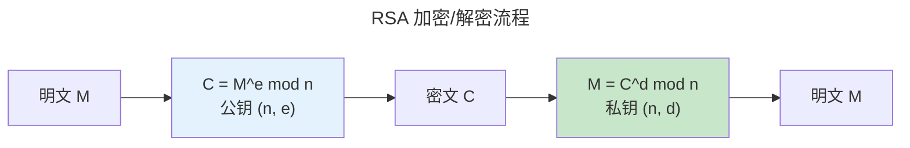

> 公钥与私钥的舞蹈。

对称加密的密钥分发困扰了密码学数千年。1976 年，Diffie 和 Hellman 提出了一个看似不可能的想法：**用一对数学相关的密钥**。公钥可公开，私钥保密。

---

## RSA：大数分解的数学基础

RSA 安全性基于大数分解的困难性。密钥生成：选择两个大素数 $p, q$，计算 $n = pq$ 和 $\phi(n) = (p-1)(q-1)$。加密 $C = M^e \bmod n$，解密 $M = C^d \bmod n$。

---

## ECC：更短密钥，同等安全

椭圆曲线密码学基于 [ECDLP 问题的困难性](../../00-lingxi/06-cryptographic-mathematics/)。256 位 ECC 密钥 ≈ 3072 位 RSA——移动设备和 IoT 场景首选。Curve25519 是目前最广泛使用的安全曲线。

---

## Diffie-Hellman 密钥交换

双方在不共享秘密的情况下协商共享密钥：Alice 发送 $g^a \bmod p$，Bob 发送 $g^b \bmod p$，双方计算 $g^{ab} \bmod p$。窃听者无法从 $g^a$ 和 $g^b$ 高效计算 $g^{ab}$。

---

## 后量子密码学

Shor 算法在量子计算机上可高效解决 RSA 和 ECC 依赖的整数分解和离散对数问题。NIST 2024 年标准化的 Kyber（密钥封装）和 Dilithium（签名）基于格密码，目前无已知高效量子攻击。

---

## 跨卷连接

| 概念 | 关联 |
|---------|---------|
| RSA 因式分解 | [模运算与欧拉函数](../../00-lingxi/06-cryptographic-mathematics/) |
| ECDH | [椭圆曲线群与标量乘法](../../00-lingxi/06-cryptographic-mathematics/) |
| Kyber 格密码 | [LWE 问题——后量子时代的希望](../../00-lingxi/06-cryptographic-mathematics/) |

:::tip[卷七内部路径]
- [**对称加密**](../01-symmetric-cryptography/)：混合加密——RSA/ECC 加密 AES 密钥
- [**哈希与签名**](../03-hash-and-signature/)：ECDSA 签名——ECC 的公钥认证
:::
