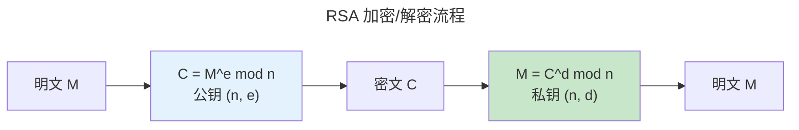

> 公钥与私钥的舞蹈。

对称加密的密钥分发困扰了密码学数千年。1976 年，Diffie 和 Hellman 提出了一个看似不可能的想法：**用一对数学相关的密钥**。公钥可公开，私钥保密。

---

## RSA：大数分解的数学基础

RSA 安全性基于大数分解的困难性。密钥生成过程：

1. 选择两个大素数 $p, q$（各 1024+ 位）
2. 计算 $n = pq$，$\phi(n) = (p-1)(q-1)$
3. 选择 $e$ 满足 $\gcd(e, \phi(n)) = 1$（通常 $e = 65537$）
4. 计算 $d = e^{-1} \bmod \phi(n)$

加密与解密：

$$
C = M^e \bmod n \qquad M = C^d \bmod n
$$

解密正确的数学依据——费马-欧拉定理：

$$
C^d = (M^e)^d = M^{ed} = M^{1 + k\phi(n)} = M \cdot (M^{\phi(n)})^k \equiv M \cdot 1^k = M \pmod{n}
$$

关键：$ed \equiv 1 \pmod{\phi(n)}$ 意味着 $ed = 1 + k\phi(n)$，而 $M^{\phi(n)} \equiv 1 \pmod{n}$（欧拉定理，前提 $\gcd(M, n) = 1$）。

### RSA 的工程局限

- **加密速度**：硬件加速下 RSA-2048 签名约 1000 ops/s，AES-GCM 约 3 GB/s——差距 6 个数量级。因此 RSA 仅用于密钥交换和签名，不用于加密数据本身。
- **密钥尺寸**：RSA-2048 公钥 256 字节，ECC-256 公钥 32 字节——移动端和嵌入式首选 ECC。
- **量子威胁**：Shor 算法在足够大的量子计算机上可在多项式时间内分解 $n$。这就是后量子密码学的驱动力。

---

## ECC：更短密钥，同等安全

椭圆曲线密码学基于 **ECDLP（椭圆曲线离散对数问题）** 的困难性。曲线方程（Weierstrass 形式）：

$$
y^2 = x^3 + ax + b \quad (\text{满足 } 4a^3 + 27b^2 \neq 0 \text{ 以确保非奇异})
$$

点加法的几何规则：过曲线上两点 $P, Q$ 做直线，与曲线交于第三点，该点关于 x 轴的镜像即为 $P+Q$。这个看似简单的操作因椭圆曲线的非线性而极难逆转——这就是 ECDLP 安全性来源。

256 位 ECC 密钥 ≈ 3072 位 RSA 安全性。Curve25519 由 Daniel Bernstein 设计，刻意避免了常规模曲线（如 NIST P-256）的数个潜在陷阱：
- 参数完全确定性（无种子值的"后门"嫌疑）
- 蒙哥马利形式天然抗侧信道——$x$ 坐标 ladder 计算无分支
- 扭曲安全性——无需检查点是否在曲线上

---

## Diffie-Hellman 密钥交换

双方在不共享秘密的情况下协商共享密钥：

Alice 发送 $g^a \bmod p$，Bob 发送 $g^b \bmod p$。双方计算：

$$
K = (g^b)^a \bmod p = g^{ab} \bmod p = (g^a)^b \bmod p
$$

窃听者 Eve 只知道 $g^a$ 和 $g^b$，需要解决 **CDH（计算性 Diffie-Hellman）问题** 才能得到 $g^{ab}$。在足够大的群中（2048 位素数或 256 位 ECC），这被认为不可行。

ECDH 将乘法群替换为椭圆曲线点群：Alice 发送 $aG$，Bob 发送 $bG$，共享密钥是 $abG$——同样的 CDH 难度，但密钥尺寸缩小 8 倍。

---

## 后量子密码学

Shor 算法在量子计算机上可高效解决 RSA 和 ECC 依赖的整数分解和离散对数问题——两者都可通过 Quantum Fourier Transform 转为周期查找问题。NIST 2024 年标准化的算法：

| 算法 | 类型 | 公钥大小 | 基于 |
|------|------|:--:|------|
| **Kyber** | 密钥封装（KEM） | 800 B | Module-LWE 格问题 |
| **Dilithium** | 数字签名 | 1.3 KB | Module-LWE + Module-SIS |

格密码的安全性基于 **Learning With Errors (LWE)**：

$$
\text{给定 } A \in \mathbb{Z}_q^{m \times n}, \quad b = As + e \pmod{q}, \quad \text{找回秘密向量 } s
$$

其中 $e$ 是小噪声向量。没有噪声，这是普通线性方程组，高斯消元秒解。但加上噪声后，LWE 被证明**在最坏情况下与格上的最短向量问题一样难**——数学上最强的安全归约之一。

---

## 跨卷连接

| 概念 | 关联 |
|---------|---------|
| RSA 欧拉定理 $\phi(n)$ | [模运算与欧拉函数——费马-欧拉定理的群论基础](../../00-lingxi/06-cryptographic-mathematics/) |
| ECC 点加法几何规则 | [椭圆曲线群与标量乘法——从实数域到有限域](../../00-lingxi/06-cryptographic-mathematics/) |
| ECDH 共享密钥 | [Diffie-Hellman——离散对数的单向陷门](../../00-lingxi/06-cryptographic-mathematics/) |
| Kyber LWE 噪声 | [MOSFET 热噪声——物理世界的随机性来源](../../01-weichen/01-semiconductor-physics/) |
| 量子 Fourier 变换 | [FFT 快速傅里叶变换——$O(n\log n)$ 的多项式乘法](../../00-lingxi/04-algorithm-theory/) |

:::tip[卷七内部路径]
- [**对称加密**](../01-symmetric-cryptography/)：混合加密——RSA/ECC 加密 AES 会话密钥
- [**哈希与签名**](../03-hash-and-signature/)：ECDSA 签名——ECC 在认证中的应用
:::
