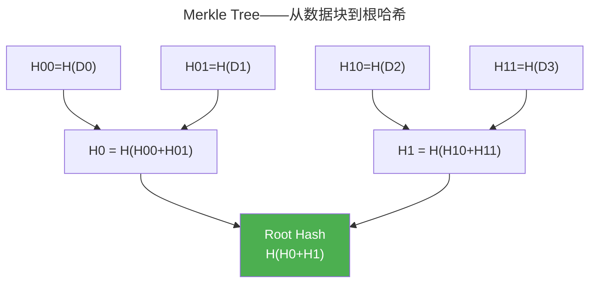

> 不可逆的指纹，不可伪造的印章。

哈希函数将任意长度消息映射为固定摘要。数字签名让公钥持有者验证消息来源。两者结合构成区块链、数字证书和代码签名的基础。

---

## 密码学哈希函数

安全哈希的三个性质：

| 性质 | 含义 |
|------|------|
| **抗原像** | 从 $h = H(m)$ 找回 $m$ 不可行 |
| **抗第二原像** | 给定 $m_1$，找到 $m_2$ 使 $H(m_1) = H(m_2)$ 不可行 |
| **抗碰撞** | 找到任意 $m_1 \neq m_2$ 使 $H(m_1) = H(m_2)$ 不可行 |

SHA-256 基于 **Merkle-Damgård** 结构迭代压缩：将消息填充至 512-bit 倍数，以 256-bit 链值 $H_i$ 逐块压缩，最终输出 256-bit 摘要。

### SHA-256 压缩函数

压缩函数接受 256-bit 链值（8 个 32-bit 字 $a..h$）和 512-bit 消息块，经 64 轮迭代更新链值。每轮的核心操作分为逻辑函数和消息扩展两部分。

**逻辑函数**——Ch（选择）、Maj（多数）、Σ（旋转异或）：

$$
\begin{aligned}
Ch(x, y, z) &= (x \land y) \oplus (\neg x \land z) \\
Maj(x, y, z) &= (x \land y) \oplus (x \land z) \oplus (y \land z) \\
\Sigma_0(x) &= \text{ROTR}^{2}(x) \oplus \text{ROTR}^{13}(x) \oplus \text{ROTR}^{22}(x) \\
\Sigma_1(x) &= \text{ROTR}^{6}(x) \oplus \text{ROTR}^{11}(x) \oplus \text{ROTR}^{25}(x) \\
\sigma_0(x) &= \text{ROTR}^{7}(x) \oplus \text{ROTR}^{18}(x) \oplus \text{SHR}^{3}(x) \\
\sigma_1(x) &= \text{ROTR}^{17}(x) \oplus \text{ROTR}^{19}(x) \oplus \text{SHR}^{10}(x)
\end{aligned}
$$

**消息调度**——将 16 个 32-bit 消息字 $W_0..W_{15}$ 扩展为 64 个 $W_t$：

$$
W_t = \sigma_1(W_{t-2}) + W_{t-7} + \sigma_0(W_{t-15}) + W_{t-16} \quad (t = 16..63)
$$

**64 轮压缩**（每轮使用一个轮常数 $K_t$）：

$$
\begin{aligned}
T_1 &= h + \Sigma_1(e) + Ch(e, f, g) + K_t + W_t \\
T_2 &= \Sigma_0(a) + Maj(a, b, c) \\
h &\leftarrow g,\; g \leftarrow f,\; f \leftarrow e,\; e \leftarrow d + T_1 \\
d &\leftarrow c,\; c \leftarrow b,\; b \leftarrow a,\; a \leftarrow T_1 + T_2
\end{aligned}
$$

轮函数的核心设计模式——**混淆-扩散**——在 [AES 轮函数中](../../07-tianshu/01-symmetric-cryptography/) 有同构体现：Ch/Maj 提供非线性混淆，Σ/σ 的旋转异或提供比特扩散。SHA-256 和 AES 共享 SPN（Substitution-Permutation Network）的根本范式，仅在大粒度（32-bit 字 vs 8-bit 字节）上有所不同。

### 生日悖论与碰撞安全性

哈希输出长度为 $n$ 比特时，碰撞攻击的复杂度服从**生日悖论**——随机采样约 $2^{n/2}$ 个哈希值即有 50% 概率找到碰撞：

$$
P(\text{collision}) \approx 1 - e^{-k^2 / 2^{n+1}} \xrightarrow{k \approx 2^{n/2}} P \approx 1 - e^{-1/2} \approx 39\%
$$

SHA-256（$n=256$）的碰撞安全性为 $2^{128}$ 次操作——经典计算下不可行，但在 Grover 算法下量子攻击降至 $2^{85.3}$。SHA-3 的 $n=256$ 同样维持此安全级别。

> SHA-3 基于**海绵结构**（Sponge Construction）——吸收了 SHA-2 抗长度扩展攻击的教训，安全性不依赖于压缩函数的抗碰撞性。

---

## 数字签名

| 算法 | 基于 | 特点 |
|------|------|------|
| **RSA-PSS** | 因数分解困难性 | 验证最快 |
| **ECDSA** | 椭圆曲线离散对数 | 签名短（Bitcoin 使用） |
| **EdDSA**（Ed25519） | 扭曲爱德华曲线 | 恒定时间、抗侧信道 |

### EdDSA 签名算法（Ed25519）

Ed25519 是基于扭曲爱德华曲线（Curve25519）的 Schnorr 式签名。选择 Ed25519 而非 ECDSA 的理由：**确定性签名**（不需要随机数）、**恒定时间实现**（无分支/无查表侧信道）、签名和公钥均 32 字节。

**密钥生成**——256-bit 私钥 $k$ 经 SHA-512 扩展为两个 256-bit 半段：

$$
H(k) = (h_0, h_1, \ldots, h_{511})
$$

秘密标量 $a$ 从低 256 位派生出（钳位操作保护）：

$$
a = 2^{b-2} + \sum_{i=3}^{b-3} 2^i \cdot h_i, \quad b = 255
$$

公钥为基点 $B$ 的标量乘：

$$
A = a \cdot B
$$

**签名生成**——确定性随机数 $r$ 来自私钥高位 + 消息：

$$
r = H(h_b \parallel \ldots \parallel h_{2b-1} \parallel M) \bmod \ell
$$

其中 $\ell$ 是基点阶（$2^{252} + 27742317777372353535851937790883648493$）。计算承诺 $R$ 和响应 $S$：

$$
R = r \cdot B, \quad S = (r + H(R \parallel A \parallel M) \cdot a) \bmod \ell
$$

输出签名为 64 字节 $(\underline{R}, \underline{S})$。

**签名验证**——检查以下等式（协因子 8 消除小阶子群攻击）：

$$
8 \cdot S \cdot B = 8 \cdot R + 8 \cdot H(R \parallel A \parallel M) \cdot A
$$

验证者从公钥 $A$、消息 $M$ 和签名 $(R, S)$ 出发，只需两次标量乘和一次点加——与 ECDSA 的模逆运算相比，EdDSA 的批验证（batch verification）可额外加速 2×。

:::tip[EdDSA vs ECDSA——密码工程的选择]
ECDSA 需要每签名的安全随机数 $k$（Sony PlayStation 3 因 $k$ 重用被彻底攻破），而 EdDSA 的 $r$ 由私钥哈希确定——这消除了整个随机数重用攻击面。两者的数学根基分别在 [非对称加密章](../02-asymmetric-cryptography/) 的椭圆曲线离散对数问题中有系统分析。
:::

---

## Merkle Tree：对数时间的成员证明

验证数据块 $D_2$ 在树中只需 $\log_2 n$ 个兄弟哈希和一个根哈希——验证者自行计算：

$$
\text{Root}' = H\left(H\left(H(D_2) \parallel H_{11}\right) \parallel H_0\right)
$$

若 $\text{Root}' = \text{Root}$，则 $D_2$ 的成员身份得证。这一 $O(\log n)$ 空间复杂度的证明结构是区块链轻节点（SPV）和 BitTorrent 内容验证的核心数据结构。

### Merkle 证明的安全性

攻击者无法伪造不存在的成员证明——要构造一个叶子 $D_x$ 使得它与给定兄弟哈希重组后产生与公开 Root 相同的哈希值，等价于找到哈希函数的**第二原像**。因此 Merkle 证明的安全性严格归约到哈希函数的抗碰撞性。

Merkle Tree 的递归哈希结构与 [Git 的 Merkle DAG 对象存储](../../08-qianli/03-devops-practices/) 共享同一根本范式——每个 commit 指向一棵树对象，树对象再指向子树和 blob，整个仓库是一棵从 root commit 哈希生根的 Merkle DAG。

---

## 跨卷连接

| 概念 | 关联 |
|---------|---------|
| SHA-256 压缩函数 Ch/Maj/Σ | [AES 轮函数——SPN 混淆-扩散范式](../01-symmetric-cryptography/) |
| 生日悖论碰撞界 | [概率论——生日问题的期望与方差](../../00-lingxi/01-mathematical-foundations/) |
| EdDSA 标量乘 | [椭圆曲线——离散对数与双线性映射](../../00-lingxi/06-cryptographic-mathematics/) |
| EdDSA 恒定时间 | [侧信道——基于执行时间推断密钥的防御方法](../05-system-security/) |
| Merkle Tree 递归哈希 | [Git Merkle DAG——commit→tree→blob 的哈希链](../../08-qianli/03-devops-practices/) |
| Grover 量子攻击 | [后量子密码学——格密码的量子安全性](../02-asymmetric-cryptography/) |

:::tip[卷七内部路径]
- [**非对称加密**](../02-asymmetric-cryptography/)：ECDSA——签名算法的数学基础
- [**零知识证明**](../04-zero-knowledge-proofs/)：Merkle Tree——zk 的承诺方案
:::
