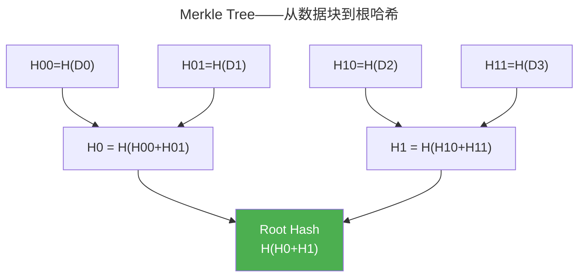

> 不可逆的指纹，不可伪造的印章。

哈希函数将任意长度消息映射为固定摘要。数字签名让公钥持有者验证消息来源。两者结合构成区块链、数字证书和代码签名的基础。

---

## 密码学哈希函数

安全哈希的三个性质：

| 性质 | 含义 |
|------|------|
| **抗原像** | 从 $h = H(m)$ 找回 $m$ 不可行 |
| **抗第二原像** | 给定 $m_1$，找到 $m_2$ 使 $H(m_1) = H(m_2)$ 不可行 |
| **抗碰撞** | 找到任意 $m_1 \neq m_2$ 使 $H(m_1) = H(m_2)$ 不可行 |

SHA-256 基于 Merkle-Damgård 结构迭代压缩。SHA-3 基于海绵结构——吸收了 SHA-2 抗长度扩展攻击的教训。

---

## 数字签名

| 算法 | 基于 | 特点 |
|------|------|------|
| **RSA-PSS** | 因数分解困难性 | 验证最快 |
| **ECDSA** | 椭圆曲线离散对数 | 签名短（Bitcoin 使用） |
| **EdDSA**（Ed25519） | 扭曲爱德华曲线 | 恒定时间、抗侧信道 |

---

## Merkle Tree：对数时间的成员证明

验证某数据块在树中仅需 $O(\log n)$ 个哈希——区块链轻节点和 BitTorrent 内容验证的核心数据结构。

---

## 跨卷连接

| 概念 | 关联 |
|---------|---------|
| SHA 迭代压缩 | [AES 轮函数——迭代混淆-扩散范式](../01-symmetric-cryptography/) |
| Merkle Tree | [Git Merkle DAG 对象存储](../../08-qianli/03-devops-practices/) |
| EdDSA 恒定时间 | [侧信道——基于执行时间推断密钥](../05-system-security/) |

:::tip[卷七内部路径]
- [**非对称加密**](../02-asymmetric-cryptography/)：ECDSA——签名算法的数学基础
- [**零知识证明**](../04-zero-knowledge-proofs/)：Merkle Tree——zk 的承诺方案
:::
