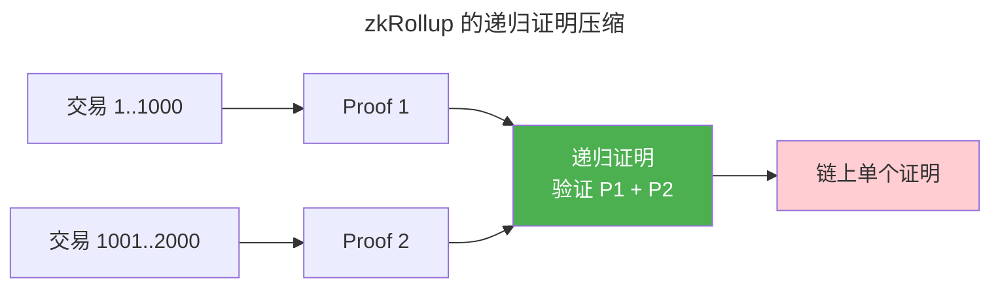

> 证明你知道，但不泄露知道什么。

1985 年 Goldwasser 等人提出 ZKP 概念。三十年后，ZKP 从理论论文走进了区块链扩容（zkRollup）和隐私保护（ZCash）的工程实践。

---

## ZKP 三性质

| 性质 | 含义 |
|------|------|
| **完备性** | 如果陈述为真，诚实证明者总能说服验证者 |
| **可靠性** | 如果陈述为假，作弊证明者无法说服验证者 |
| **零知识** | 验证者除了"陈述为真"之外学不到任何新信息 |

---

## 从电路到多项式：R1CS 与 QAP

zk-SNARK 的核心思想是将**任意计算**编码为**多项式等式**，再用密码学工具验证该等式成立。

### R1CS（Rank-1 Constraint System）

计算被表达为一组形如 $(\vec{a} \cdot \vec{z}) \times (\vec{b} \cdot \vec{z}) = (\vec{c} \cdot \vec{z})$ 的约束，其中 $\vec{z} = (1, x, w)$ 是包含公开输入 $x$ 和秘密见证 $w$ 的向量。$m$ 个约束写成矩阵形式：

$$
A \cdot z \;\odot\; B \cdot z \;=\; C \cdot z
$$

每个约束只涉及一次乘法——任意计算（包括条件分支）都可以通过添加辅助变量平展（flatten）为 R1CS。

### QAP（Quadratic Arithmetic Program）

R1CS 的三个 $(m \times n)$ 矩阵 $A, B, C$ 的每一列被插值为 $m$ 次多项式 $A_i(x), B_i(x), C_i(x)$（在求值域 $\{r_1, \ldots, r_m\}$ 上）。则 R1CS 约束等价于：

$$
\left(\sum_{i=0}^{n-1} z_i \cdot A_i(x)\right) \cdot \left(\sum_{i=0}^{n-1} z_i \cdot B_i(x)\right) - \left(\sum_{i=0}^{n-1} z_i \cdot C_i(x)\right) = H(x) \cdot Z(x)
$$

其中 $Z(x) = \prod_{k=1}^{m} (x - r_k)$ 是**消失多项式**（Vanishing Polynomial）——它在所有求值点 $r_k$ 上精确为零。证明者只需证明自己知道多项式 $H(x)$ 使得上式在随机挑战点成立。

---

## KZG 多项式承诺

**KZG**（Kate-Zaverucha-Goldberg）是 zk-SNARK 中最广泛使用的多项式承诺方案。它使得证明者可以承诺一个多项式 $f(x)$，并证明在任意点 $z$ 上 $f(z) = v$，而无需泄露 $f$ 的其他信息。

**可信设置**——生成随机数 $\tau$（"有毒废料"，必须销毁否则可伪造证明），并在群 $\mathbb{G}_1$ 中发布 $\tau$ 的各次幂：

$$
\{ [\tau^0]_1, [\tau^1]_1, [\tau^2]_1, \ldots, [\tau^d]_1 \}
$$

其中 $[\tau^i]_1 = \tau^i \cdot G_1$（$G_1$ 是 $\mathbb{G}_1$ 的生成元）。

**承诺**——对多项式 $f(x) = \sum_{i=0}^{d} a_i x^i$，承诺为 $f(\tau)$ 在群中的编码：

$$
C = \sum_{i=0}^{d} a_i \cdot [\tau^i]_1 = f(\tau) \cdot G_1
$$

**求值证明**——证明 $f(z) = v$ 等价于证明 $(x - z)$ 整除 $f(x) - v$。证明者计算商多项式 $q(x) = \frac{f(x) - v}{x - z}$，并提交其承诺作为证明：

$$
\pi = q(\tau) \cdot G_1
$$

**验证**——使用双线性配对 $e: \mathbb{G}_1 \times \mathbb{G}_2 \to \mathbb{G}_T$ 检查：

$$
e(C - v \cdot G_1,\; G_2) = e(\pi,\; \tau \cdot G_2 - z \cdot G_2)
$$

简写为 $e(C - [v]_1, [1]_2) = e(\pi, [\tau]_2 - [z]_2)$。配对的双线性性质确保该等式等价于 $(f(\tau) - v) \cdot 1 = q(\tau) \cdot (\tau - z)$，即验证了整除关系——而验证者**从未获知**多项式 $f$ 或秘密 $\tau$。

:::tip[KZG 与 Merkle Tree 的对比]
KZG 的证明大小恒为 1 个群元素（~48 字节），而 [Merkle Tree 的证明](../03-hash-and-signature/) 需要 $O(\log n)$ 个哈希。代价是 KZG 依赖可信设置和配对密码学——[椭圆曲线双线性映射](../../00-lingxi/06-cryptographic-mathematics/) 是其数学根基。
:::

---

## zk-SNARK vs zk-STARK

| 特性 | zk-SNARK | zk-STARK |
|------|---------|---------|
| **证明大小** | ~200 字节 | ~50KB |
| **可信设置** | 需要（Groth16） | 不需要（**透明**） |
| **后量子安全** | 否 | 是 |
| **代表** | ZCash 隐私交易 | StarkNet, Polygon Miden |

---

## Groth16：最小的链上证明

Groth16 是当前证明尺寸最小的 zk-SNARK 协议——证明仅由 3 个群元素组成（$\mathbb{G}_1$ 中 2 个 + $\mathbb{G}_2$ 中 1 个，总计 ~128 字节）。验证只需 3 次配对和 1 次多标量乘。

### 证明结构

证明 $\pi = ([A]_1, [B]_2, [C]_1)$，其中 $[X]_1 = X \cdot G_1$（$\mathbb{G}_1$ 群编码），$[Y]_2 = Y \cdot G_2$（$\mathbb{G}_2$ 群编码）。

### 验证方程

给定证明 $\pi$ 和 $\ell$ 个公开输入 $a_0, \ldots, a_\ell$（$a_0 = 1$），验证者检查单个配对等式：

$$
e([A]_1,\; [B]_2) = e([\alpha]_1,\; [\beta]_2) \;\cdot\; e\left(\sum_{i=0}^{\ell} a_i \cdot \left[\frac{\beta \cdot u_i(x) + \alpha \cdot v_i(x) + w_i(x)}{\gamma}\right]_1,\; [\gamma]_2\right) \;\cdot\; e([C]_1,\; [\delta]_2)
$$

关键观察：等式**右侧第二项**仅依赖公开输入 $a_i$——这是 Groth16 将验证成本从线性于电路规模降至线性于公开输入数量的核心技巧。其余所有见证相关的计算被"压缩"进 $[A]_1$、$[B]_2$、$[C]_1$ 三个承诺中。

### 安全性假设

Groth16 的安全性基于三假设：$q$-type 离散对数假设（Knowledge-of-Exponent）、$d$-PKE 假设（Power Knowledge of Exponent）、以及双线性群中的计算 Diffie-Hellman 变体。可信设置必须为每个电路单独执行——这是 Groth16 的主要工程局限。

---

## 递归证明

递归证明将多个证明聚合为一个——第一个证明验证一批交易，第二个验证第一个证明本身。这种**证明压缩**使 Layer 2 将数千笔交易压缩为单个链上证明。



### 递归的密码学前提

递归证明要求验证电路**内化**配对验证——即证明系统本身的验证逻辑被编码为 R1CS 电路。这在椭圆曲线循环（如 BN254 与 Grumpkin）上实现：一条曲线的验证逻辑在另一条曲线上表达，循环往复。

$$
\text{Verify}_{\text{Curve}_2}\big(\pi_{\text{Curve}_1}\big) \;\longrightarrow\; \pi_{\text{Curve}_2} \;\longrightarrow\; \text{Verify}_{\text{Curve}_1}\big(\pi_{\text{Curve}_2}\big) \;\longrightarrow\; \ldots
$$

这一结构使得验证成本从 $O(n \cdot \text{circuit\_gates})$ 降至 $O(\log n \cdot \text{verification\_cost})$——递归 10 层可将百万笔交易压缩为一次配对验证。StarkNet 和 Polygon zkEVM 的 L1 结算正是基于此原理。
    REC --> CHAIN["链上单个证明"]

    style REC fill:#4caf50,color:#fff
    style CHAIN fill:#ffcdd2
```

---

## 跨卷连接

| 概念 | 关联 |
|---------|---------|
| R1CS 约束系统 | [线性代数——矩阵乘法与秩约束](../../00-lingxi/01-mathematical-foundations/) |
| QAP 消失多项式 | [多项式插值——拉格朗日基与FFT求值](../../00-lingxi/06-cryptographic-mathematics/) |
| KZG 多项式承诺 | [Merkle Tree——两种承诺方案的大小/信任权衡](../03-hash-and-signature/) |
| 双线性配对验证 | [椭圆曲线双线性映射——Weil/Tate/Ate 配对](../../00-lingxi/06-cryptographic-mathematics/) |
| Groth16 证明 | [非对称加密——椭圆曲线离散对数问题](../02-asymmetric-cryptography/) |
| 递归证明循环 | [递归函数——图灵完备的自我引用](../../00-lingxi/03-theory-of-computation/) |

:::tip[卷七内部路径]
- [**哈希与签名**](../03-hash-and-signature/)：Merkle Tree——FRI 的哈希系证明
- [**系统安全**](../05-system-security/)：TEE vs ZKP——硬件 vs 密码学的零知识路线
:::
