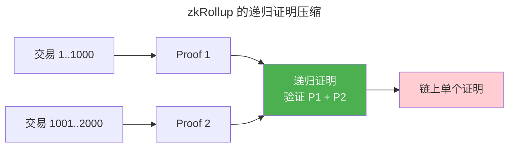

> 证明你知道，但不泄露知道什么。

1985 年 Goldwasser 等人提出 ZKP 概念。三十年后，ZKP 从理论论文走进了区块链扩容（zkRollup）和隐私保护（ZCash）的工程实践。

---

## ZKP 三性质

| 性质 | 含义 |
|------|------|
| **完备性** | 如果陈述为真，诚实证明者总能说服验证者 |
| **可靠性** | 如果陈述为假，作弊证明者无法说服验证者 |
| **零知识** | 验证者除了"陈述为真"之外学不到任何新信息 |

---

## zk-SNARK vs zk-STARK

| 特性 | zk-SNARK | zk-STARK |
|------|---------|---------|
| **证明大小** | ~200 字节 | ~50KB |
| **可信设置** | 需要（Groth16） | 不需要（**透明**） |
| **后量子安全** | 否 | 是 |
| **代表** | ZCash 隐私交易 | StarkNet, Polygon Miden |

---

## 递归证明

递归证明将多个证明聚合为一个——第一个证明验证一批交易，第二个验证第一个证明本身。这种**证明压缩**使 Layer 2 将数千笔交易压缩为单个链上证明。

---

## 跨卷连接

| 概念 | 关联 |
|---------|---------|
| 多项式承诺 | [Merkle Tree——哈希逐层承诺](../03-hash-and-signature/) |
| Groth16 配对 | [椭圆曲线双线性映射](../../00-lingxi/06-cryptographic-mathematics/) |

:::tip[卷七内部路径]
- [**哈希与签名**](../03-hash-and-signature/)：Merkle Tree——FRI 的哈希系证明
- [**系统安全**](../05-system-security/)：TEE vs ZKP——硬件 vs 密码学的零知识路线
:::
