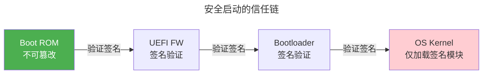

> 从密码学理论到系统攻防。

当 AES 和 RSA 在数学上完美时，攻击者转向攻击密钥存储、侧信道泄露、缓冲区溢出的控制流。系统安全是攻防实战。

---

## Linux 沙箱技术谱系

| 机制 | 粒度 | 典型应用 |
|------|------|---------|
| **seccomp-bpf** | 系统调用级别 | Docker 默认安全配置 |
| **Landlock** | 文件系统级别 | 用户态无特权沙箱 |
| **Namespaces** | 资源隔离 | 容器（Docker/LXC）基础 |
| **Capabilities** | root 权限拆分为 40+ 种 | `CAP_NET_BIND_SERVICE` |

---

## 安全启动与 TEE

**安全启动**从 ROM 开始逐级验证签名：ROM → UEFI → Bootloader → OS Kernel——建立链式信任。**TEE**（ARM TrustZone/Intel SGX）在 CPU 硬件层面创建安全世界——即使 OS 内核被攻破，TEE 内代码仍受保护。

---

## 经典漏洞分类

| 类型 | 原理 | 防御 |
|------|------|------|
| **缓冲区溢出** | 写超过 buffer 的数据覆盖返回地址 | Stack Canary、ASLR、NX bit |
| **竞态条件** | TOCTOU——检查和使用的窗口 | [原子操作与 RCU](../../03-qiankun/04-synchronization/) |
| **侧信道** | 从时间/功耗/电磁辐射推断秘密 | 恒定时间算法 |

---

## 跨卷连接

| 概念 | 关联 |
|---------|---------|
| seccomp-bpf | [eBPF 内核安全执行引擎](../../03-qiankun/08-network-programming/) |
| ARM TrustZone | [Cortex-M 安全启动](../../02-jiezi/01-bare-metal/) |
| Stack Canary | [函数栈帧与返回地址布局](../../01-weichen/05-instruction-set-architecture/) |
| NX bit | [MMU PTE 权限位](../../03-qiankun/02-memory-management/) |

:::tip[卷七内部路径]
- [**对称加密**](../01-symmetric-cryptography/)：AES 侧信道防御
- [**非对称加密**](../02-asymmetric-cryptography/)：TEE 中的私钥保护
:::
