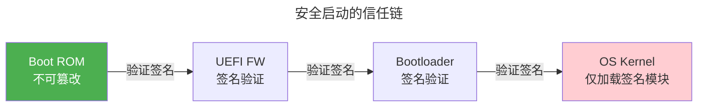
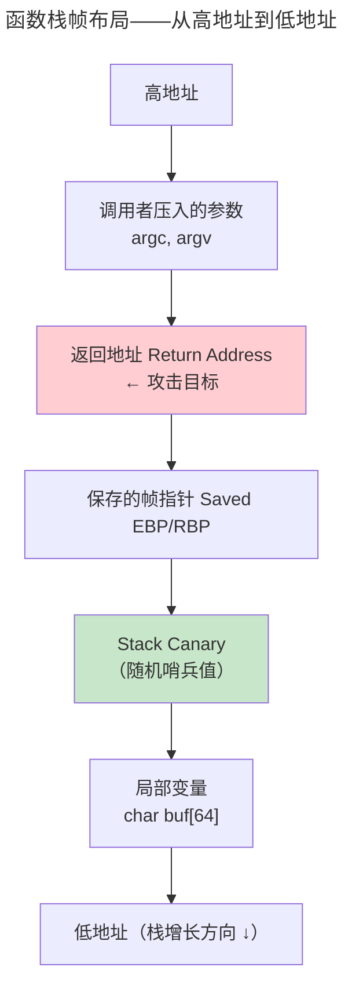

> 从密码学理论到系统攻防。

当 AES 和 RSA 在数学上完美时，攻击者转向攻击密钥存储、侧信道泄露、缓冲区溢出的控制流。系统安全是攻防实战。

---

## Linux 沙箱技术谱系

| 机制 | 粒度 | 典型应用 |
|------|------|---------|
| **seccomp-bpf** | 系统调用级别 | Docker 默认安全配置 |
| **Landlock** | 文件系统级别 | 用户态无特权沙箱 |
| **Namespaces** | 资源隔离 | 容器（Docker/LXC）基础 |
| **Capabilities** | root 权限拆分为 40+ 种 | `CAP_NET_BIND_SERVICE` |

---

## 安全启动与 TEE

**安全启动**从 ROM 开始逐级验证签名：ROM → UEFI → Bootloader → OS Kernel——建立链式信任。**TEE**（ARM TrustZone/Intel SGX）在 CPU 硬件层面创建安全世界——即使 OS 内核被攻破，TEE 内代码仍受保护。

---

## 经典漏洞分类

| 类型 | 原理 | 防御 |
|------|------|------|
| **缓冲区溢出** | 写超过 buffer 的数据覆盖返回地址 | Stack Canary、ASLR、NX bit |
| **竞态条件** | TOCTOU——检查和使用的窗口 | [RCU：零开销读取的革命](../../03-qiankun/04-synchronization/#rcu零开销读取的革命) |
| **侧信道** | 从时间/功耗/电磁辐射推断秘密 | 恒定时间算法 |

### 缓冲区溢出：栈帧的攻防

栈溢出是历史最悠久的软件漏洞——但至今仍在 CWE Top 25 中排名第一。理解溢出必须从函数调用的栈帧布局开始：

**攻击原理**：向 `buf[64]` 写入超过 64 字节的数据 → 覆盖 Canary → 覆盖 SFP → 覆盖返回地址 → 函数返回时跳转到攻击者控制的 shellcode 或 ROP 链。

**三层防御**：

| 机制 | 原理 | 绕过代价 |
|------|------|:--:|
| **Stack Canary** | 函数入口在返回地址下方放置随机哨兵值；返回前检查是否被修改 | 需泄露 Canary 值 |
| **NX bit** (DEP) | 栈/堆内存不可执行——注入 shellcode 无法运行 | 攻击者转向 ROP（复用已有代码片段） |
| **ASLR** | 每次加载时随机化栈、堆、库的基地址——攻击者无法预测 gadget 地址 | 需先通过信息泄露获取基址偏移 |

### ASLR 的熵值计算

ASLR 的安全性取决于随机偏移的搜索空间大小。Linux 32-bit 的典型熵值：

$$
\begin{aligned}
H_{stack} &= \log_2(2^{8}) = 8 \text{ bits} \quad (\text{栈 256 种可能基址}) \\
H_{heap}  &= \log_2(2^{13}) = 13 \text{ bits} \quad (\text{堆极大随机化}) \\
H_{libs}  &= \log_2(2^{28}) = 28 \text{ bits} \quad (\text{共享库加载地址})
\end{aligned}
$$

实际攻击需要同时猜测栈地址（ROP 链）和库地址（libc gadget）——组合熵为 $\min(H_{stack}, H_{libs})$ 而非二者求和，因为泄露其中一项后另一项自动暴露。

**64-bit 的质变**：x86-64 地址空间 48 位虚拟地址，ASLR 可提供 ~30-40 bits 有效熵——暴力搜索在百万次尝试后成功率仍低于 $10^{-6}$。但**侧信道信息泄露**（如 Spectre/Meltdown 绕过地址空间隔离）可将熵归零。

:::tip[防御本质：经济博弈]
安全不是绝对的——每层防御增加攻击者的**经济成本**（时间/尝试次数/工具复杂度）。Stack Canary + NX + ASLR + PIE + RELRO 五层组合使经典栈溢出攻击从"一行脚本"变为"需要信息泄露 + 多次尝试 + 绕过金丝雀"的复合工程——这就足以将攻击者赶向更脆弱的链路，如同 [加密学中的攻击复杂度从指数级降为多项式级](../../00-lingxi/06-cryptographic-mathematics/) 一样，安全水位线总是由系统最弱点决定。
:::

---

## 跨卷连接

| 概念 | 关联 |
|---------|---------|
| seccomp-bpf | [eBPF 内核安全执行引擎](../../03-qiankun/08-network-programming/) |
| ARM TrustZone | [裸机编程的架构全景：不止 Cortex-M](../../02-jiezi/01-bare-metal/#裸机编程的架构全景不止-cortex-m) |
| Stack Canary | [函数栈帧与返回地址布局](../../01-weichen/05-instruction-set-architecture/) |
| NX bit | [PTE 位字段逐位解读](../../03-qiankun/02-memory-management/#pte-位字段逐位解读) |

:::tip[卷七内部路径]
- [**对称加密**](../01-symmetric-cryptography/)：AES 侧信道防御
- [**非对称加密**](../02-asymmetric-cryptography/)：TEE 中的私钥保护
:::
