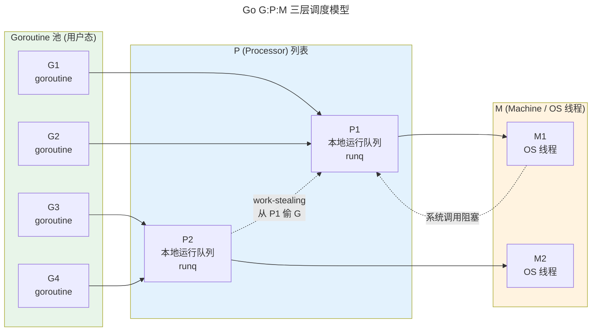

> 面向变化的代码组织之道。

设计模式是对抗"代码一经写就、需求开始变化"悖论的武器——经过数十年验证的可复用经验。

---

## SOLID 原则

| 原则 | 含义 |
|------|------|
| **S** - 单一职责 | 一个类一个变化原因 |
| **O** - 开闭原则 | 对扩展开放，对修改关闭 |
| **L** - 里氏替换 | 子类必须可替换父类 |
| **I** - 接口隔离 | 不强迫实现不需要的接口 |
| **D** - 依赖反转 | 依赖抽象而非具体 |

---

## GoF 模式三族

| 族 | 代表模式 | 核心思想 |
|----|---------|---------|
| **创建型** | 工厂、单例、建造者 | 延迟实例化决策 |
| **结构型** | 适配器、装饰器、代理 | 接口转换 + 动态职责 |
| **行为型** | 观察者、策略、模板方法 | 算法 + 责任分离 |

### Visitor 与 Interpreter：双重分派 vs 语法求值

两者都属于行为型模式，但解决截然不同的问题——混淆它们意味着搞错了扩展方向。

| 维度 | Visitor（访问者） | Interpreter（解释器） |
|------|-------------------|---------------------|
| **问题** | 在不修改元素类的前提下新增操作 | 为特定"语言"定义其求值语义 |
| **结构** | 元素接受 Visitor，调用 `visitor.visit(this)` | 表达式通过递归 `interpret(context)` 求值 |
| **关键技术** | **双重分派**——一次对元素类型的动态分派 + 一次对 Visitor 的动态分派 | **AST 遍历**——语法树节点递归组合为表达式 |
| **扩展方向** | 增加新操作容易（加新 Visitor），增加新元素类困难 | 增加新表达式类型容易，增加新解释逻辑困难 |
| **典型场景** | 编译器 AST 上添加类型检查/代码生成/格式化 pass | SQL 表达式求值、正则引擎、数学公式计算 |

**双重分派**的本质：`element.accept(visitor)` 触发第一次分派（确定 element 的具体类型），然后在方法体内调用 `visitor.visitConcreteElement(this)` 触发第二次分派（确定 visitor 的具体类型）。C++ 和 Java 需要显式实现双重分派，而支持多重分派的语言（如 Common Lisp 的 `defmethod`、Julia 的多重分派）可从语言层面消除 Visitor 模式本身。

:::tip[Visitor 与表达式问题（Expression Problem）]
表达式问题的核心困境：你既想**新增数据类型**（如新增整数类型），又想**新增操作**（如新增美化打印），但传统的 OOP 继承（开放类、封闭操作）与 FP 模式匹配（封闭类型、开放函数）各自只解决一半。Visitor 模式是 OOP 端对表达式问题的妥协方案——牺牲类型扩展的便利性换取操作扩展的便利性。Rust 的 `enum` + `match` 和 Haskell 的 algebraic data types 是 FP 端的另一种妥协。两种妥协的本质分界线在于 [形式逻辑中"开放世界 vs 封闭世界"假设](../../00-lingxi/02-formal-logic/)。
:::

---

## 函数式设计

**纯函数**（相同输入 always 相同输出）和**不可变性**是函数式的核心。Monad 将副作用封装在类型系统中——Rust `Result<T,E>` = $T \lor E$，是 [Curry-Howard 同构：程序即证明](../../00-lingxi/02-formal-logic/#curry-howard-同构程序即证明) 的编程实践。

### Go 并发模型：G:P:M 调度

Go 语言最著名的设计模式不是某一种代码结构，而是它独特的**协程调度模型**——G:P:M 三层架构。理解它是理解 Go 并发编程的前提。

三层角色的职责：

| 层 | 符号 | 含义 | 数量 | 关键属性 |
|----|------|------|------|---------|
| **G** | Goroutine | 用户态轻量协程 | 百万级 | 初始栈 2KB，按需增长/收缩 |
| **P** | Processor | 逻辑处理器（调度上下文） | `GOMAXPROCS`（默认 CPU 核数） | 持有 G 的本地运行队列（256 容量） |
| **M** | Machine | 操作系统线程 | 动态（空闲时回收） | 必须绑定一个 P 才能执行 G |

Go 调度器的核心规则：

1. **M 必须绑定 P 才能执行 G**——P 是 G 和 M 之间的中介
2. **系统调用时 M 会解绑 P**——P 被移交给另一个 M（或新建 M），保证 `GOMAXPROCS` 个 P 始终活跃
3. **Work-Stealing**——当 P 的本地队列为空时，它从全局队列或其它 P 的队列中"偷"一半 G

:::tip[跨卷链接]
G:P:M 的 Work-Stealing 策略与 [CFS 调度器的红黑树（调度算法：CFS 与 EEVDF）（调度算法：CFS 与 EEVDF）](../../03-qiankun/01-process-and-thread/#调度算法cfs-与-eevdf) 有着相通的公平性哲学——CFS 追求 CPU 时间公平（`vruntime` 最小优先），Go 追求 P 的利用率公平（空闲 P 主动偷取任务）。但实现层面截然不同：CFS 在**内核态**操作红黑树（O(log n)），Go 在**用户态**操作环形队列（O(1)）。这也是为什么 Go 能支撑百万级 goroutine——调度开销不经过内核上下文切换。

G:P:M 的 P 数量控制（`GOMAXPROCS`）与 [CPU 亲和性与 NUMA 调度](../../01-weichen/04-memory-hierarchy/) 直接相关——合理设置 P 的数量可以避免跨 NUMA 节点的缓存行乒乓（Cache Line Bouncing）。
:::

---

## 跨卷连接

| 概念 | 关联 |
|------|------|
| 观察者模式 | [I/O 多路复用：select → poll → epoll](../../03-qiankun/08-network-programming/#io-多路复用select--poll--epoll) |
| 策略模式 | [拥塞控制：从 Tahoe 到 BBR](../../03-qiankun/06-transport-tcp-udp-quic/#拥塞控制从-tahoe-到-bbr) |
| SOLID 依赖反转 | [ext4 磁盘布局：inode 与 extent 树](../../03-qiankun/03-filesystem/#ext4-磁盘布局inode-与-extent-树) |
| Go G:P:M Work-Stealing | [CFS 红黑树 `vruntime` 公平调度（调度算法：CFS 与 EEVDF）（调度算法：CFS 与 EEVDF）](../../03-qiankun/01-process-and-thread/#调度算法cfs-与-eevdf) |

:::tip[卷八内部路径]
- [**系统设计**](../02-system-design/)：设计模式在分布式中的规模延伸
- [**工程文化**](../05-engineering-culture/)：代码评审——模式的团队传播
:::
