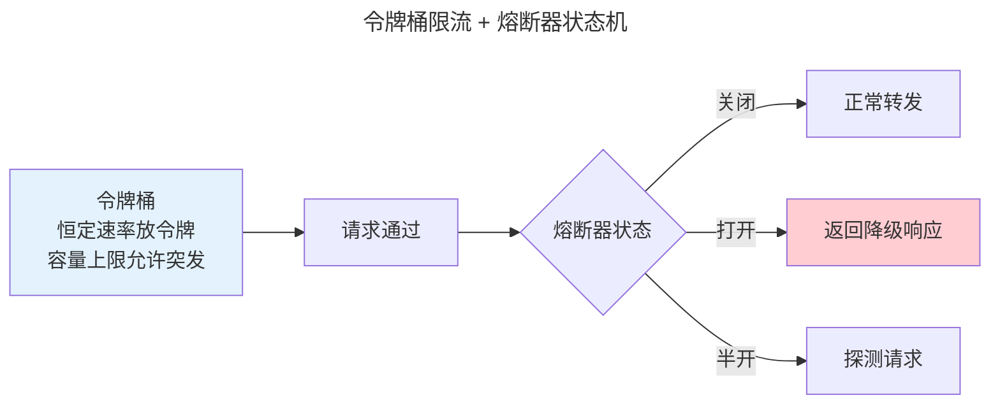

> 从单体到百万 QPS。

系统设计的标准技术栈覆盖四大核心组件。

---

## 负载均衡与缓存

| 负载均衡策略 | 适用 |
|-------------|------|
| **Round Robin** | 无状态同构服务 |
| **Least Connections** | 长连接场景 |
| **Consistent Hash** | 缓存集群（减少缓存失效） |

| 缓存模式 | 读写路径 |
|---------|---------|
| **Cache-Aside** | 应用查缓存→未命中→查DB→填缓存 |
| **Write-Behind** | 写缓存→异步写 DB |

---

## 限流与熔断

**令牌桶**：恒定速率放令牌，容量上限允许短时突发。**熔断器**：错误率超阈值 → 跳闸 → 冷却期后发送探测 → 成功则关闭。

---

## 跨卷连接

| 概念 | 关联 |
|------|------|
| Consistent Hash | [Chord DHT 分布式哈希表](../../04-yuanhai/03-distributed-fundamentals/) |
| 令牌桶 | [TCP 流量整形的漏桶算法](../../03-qiankun/06-transport-tcp-udp-quic/) |

:::tip[卷八内部路径]
- [**可观测性**](../04-observability/)：熔断器状态必须暴露 Metrics
- [**DevOps 实践**](../03-devops-practices/)：K8s——系统设计的编排实现
:::
