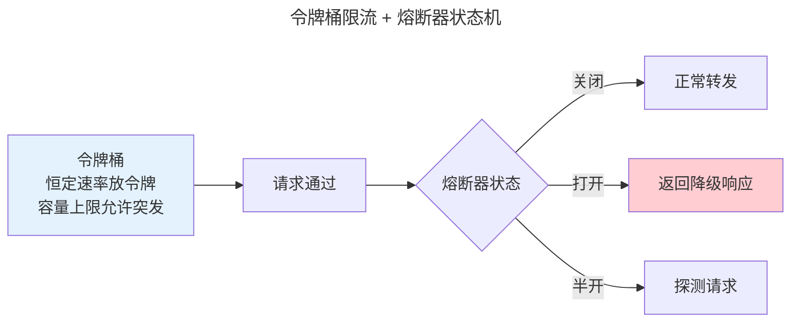
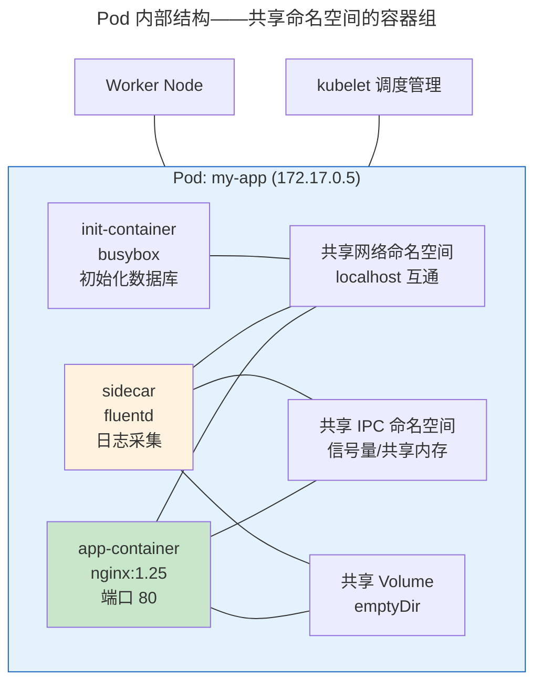

> 从单体到百万 QPS。

系统设计的标准技术栈覆盖四大核心组件。

---

## 负载均衡与缓存

| 负载均衡策略 | 适用 |
|-------------|------|
| **Round Robin** | 无状态同构服务 |
| **Least Connections** | 长连接场景 |
| **Consistent Hash** | 缓存集群（减少缓存失效） |

| 缓存模式 | 读写路径 |
|---------|---------|
| **Cache-Aside** | 应用查缓存→未命中→查DB→填缓存 |
| **Write-Behind** | 写缓存→异步写 DB |

---

## 限流与熔断

**令牌桶**：恒定速率放令牌，容量上限允许短时突发。**熔断器**：错误率超阈值 → 跳闸 → 冷却期后发送探测 → 成功则关闭。

---

## 容器与 Pod：K8s 最小调度单元

在 K8s 的世界里，**Pod 是最小的调度和部署单元**——不是容器，是 Pod。一个 Pod 封装了一组共享内核命名空间的容器，它们在同一个"逻辑主机"上运行：

Pod 的本质是 Linux 内核命名空间和 cgroup 的组合封装。Kubelet 通过 CRI（Container Runtime Interface）调用底层的 `runc` 或 `containerd`，后者使用一系列 `clone()` 标志位创建容器进程。Pod 内所有容器共享两个关键命名空间：

| 共享资源 | 内核机制 | 效果 |
|---------|---------|------|
| **网络** | `CLONE_NEWNET`（Pod 级共享） | 同一 Pod 内容器通过 `localhost` 互通，共享同一个 IP |
| **IPC** | `CLONE_NEWIPC`（Pod 级共享） | 信号量、共享内存跨容器可见 |
| **PID** | `CLONE_NEWPID`（可选共享） | `shareProcessNamespace: true` 时容器间可看到对方进程 |
| **存储** | Volume 挂载 | `emptyDir` / `hostPath` / PVC 跨容器共享文件 |

而以下命名空间是**每个容器独立的**——这确保了容器的安全隔离边界：
- **挂载命名空间** (`CLONE_NEWNS`)：每个容器有独立的根文件系统
- **UTS 命名空间** (`CLONE_NEWUTS`)：每个容器有独立的 hostname

### Pod 的调度视角

当你在 YAML 中声明一个 Pod，K8s 控制面经历以下决策链：

1. **过滤**（Filter）：kube-scheduler 排除不满足资源请求（CPU/内存/GPU）、节点亲和性、污点容忍的 Node
2. **打分**（Score）：对剩余节点按优先级打分——LeastRequestedPriority、BalancedResourceAllocation、NodeAffinityPriority
3. **绑定**（Bind）：调度器将 Pod 的 `nodeName` 字段写入 etcd，kubelet 监听到变更后启动容器

Pod 的 `QoS` 等级（Guaranteed / Burstable / BestEffort）决定了 OOM 时的杀死顺序——这与 Linux 内核的 OOM Killer 是同构问题，只是粒度从进程提升到了 Pod。

:::tip[跨卷链接]
Pod 内的容器共享命名空间，本质上是 [Linux `clone()` 系统调用](../../03-qiankun/01-process-and-thread/#forkexecclone进程诞生的三种路径) 的标志位组合在分布式场景的镜像。`runc` 创建容器时使用的 `CLONE_NEWNS|CLONE_NEWUTS|CLONE_NEWIPC|CLONE_NEWPID|CLONE_NEWNET` 标志位，与 [裸机编程中创建任务](../../02-jiezi/01-bare-metal/) 的上下文隔离一脉相承。而 Pod 的调度打分算法，是 [CFS 红黑树 vruntime](../../03-qiankun/01-process-and-thread/#调度算法cfs-与-eevdf) 在集群维度的多目标扩展。
:::

---

## 跨卷连接

| 概念 | 关联 |
|------|------|
| Consistent Hash | [Chord DHT 分布式哈希表](../../04-yuanhai/03-distributed-fundamentals/) |
| 令牌桶 | [TCP 流量整形的漏桶算法](../../03-qiankun/06-transport-tcp-udp-quic/) |
| Pod 共享命名空间 | [Linux clone() 标志位与进程隔离](../../03-qiankun/01-process-and-thread/#forkexecclone进程诞生的三种路径) |

:::tip[卷八内部路径]
- [**可观测性**](../04-observability/)：熔断器状态必须暴露 Metrics
- [**DevOps 实践**](../03-devops-practices/)：K8s——系统设计的编排实现
:::
