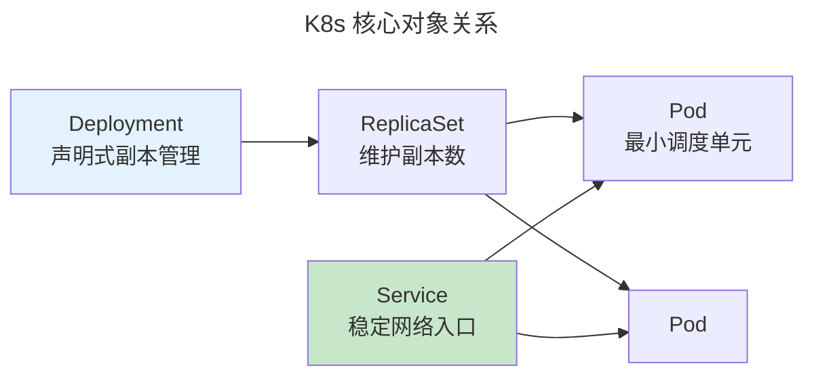

> Build, Test, Ship, Run.

DevOps 打破开发与运维壁垒——构建、测试、部署和监控成为统一流水线。

---

## CI/CD 与 Docker

CI 每次提交触发自动构建和测试。CD 通过自动化测试的代码自动部署。

Docker 核心创新是**镜像分层**——每个 `RUN` 创建只读层，层缓存使重复构建极快。OCI 标准化了容器镜像格式和运行时。

### runc 与 clone 标志位：容器的进程边界

容器的"隔离感"并非魔法——它来自 Linux 内核 `clone()` 系统调用的一组精心组合的标志位。当你执行 `docker run`，Docker 守护进程通过 `containerd` → `containerd-shim` → `runc` 的调用链，最终 `runc` 执行类似以下逻辑：

```c
// runc 创建容器进程的精简逻辑（伪代码）
int container_pid = clone(container_entry, child_stack,
    CLONE_NEWNS   |   // 挂载命名空间：容器有自己的 / 根文件系统
    CLONE_NEWUTS  |   // UTS 命名空间：容器有独立 hostname
    CLONE_NEWIPC  |   // IPC 命名空间：隔离信号量/共享内存/消息队列
    CLONE_NEWPID  |   // PID 命名空间：容器内 PID 从 1 开始
    CLONE_NEWNET  |   // 网络命名空间：容器有独立 veth 网卡
    SIGCHLD);         // 子进程退出时通知父进程
```

各命名空间的隔离效果：

| 标志位 | 命名空间 | 隔离内容 | 缺失时的后果 |
|--------|---------|---------|------------|
| `CLONE_NEWNS` | Mount | 文件系统挂载点 | 容器可看到宿主机所有挂载 |
| `CLONE_NEWUTS` | UTS | hostname / domainname | 容器修改 hostname 影响宿主机 |
| `CLONE_NEWIPC` | IPC | 信号量、消息队列、共享内存 | 容器间 IPC 可互相干扰 |
| `CLONE_NEWPID` | PID | 进程 ID 编号空间 | 容器内可看到宿主机所有进程 |
| `CLONE_NEWNET` | Network | 网络栈（网卡、路由表、iptables） | 容器共享宿主机网络栈 |
| `CLONE_NEWCGROUP` | Cgroup | cgroup 视图 | 容器可看到宿主机 cgroup 层级 |

:::tip[跨卷链接]
`runc` 的标志位组合与 [进程与线程 `fork()`/`clone()` 三路径（fork/exec/clone——进程诞生的三种路径）（fork/exec/clone——进程诞生的三种路径）](../../03-qiankun/01-process-and-thread/#forkexecclone进程诞生的三种路径) 是同一个系统调用的不同用法——`pthread_create()` 用 `CLONE_VM|CLONE_FS|CLONE_FILES|CLONE_SIGHAND` 创建共享地址空间的线程，而 `runc` 用 `CLONE_NEW*` 创建**隔离地址空间和一切资源的容器进程**。两者共享同一个 `clone()` 接口，但标志位的哲学方向完全相反——一个追求**共享的最小集**（线程），一个追求**隔离的最大集**（容器）。
:::

---

## Kubernetes 编排



## GitOps

Git 作为单一事实来源——ArgoCD/Flux 持续同步 Git → K8s。任何人直接修改集群会被自动回滚。

### GitOps 差异检测与自愈循环

ArgoCD 每 3 分钟（可配置）执行一次**差异检测**（Reconciliation Loop）：

1. **获取期望状态**（Desired State）：从 Git 仓库 `HEAD` 解析 YAML manifest（`kustomize build` 或 `helm template`）
2. **获取实际状态**（Actual State）：通过 K8s API 获取集群中对应资源对象的当前 spec
3. **计算差异**：`diff(Desired, Actual)`——对比两个 JSON/yaml 树的字段级差异
4. **自愈**：若有差异（drifted），将期望状态 `kubectl apply` 到集群，使其收敛

$$
\text{State}_{t+1} = \text{State}_{t} \xrightarrow{\text{reconcile}} \text{Git HEAD}
$$

这一循环与 [共识协议的自愈复制状态机](../04-consensus-protocols/) 共享同一个控制论范式：**声明式期望状态驱动的负反馈闭环**。区别仅在于时间尺度——Raft 在毫秒级同步日志，GitOps 在分钟级同步配置。

Prune（级联删除）：Git 中删除的 YAML 会被 ArgoCD 检测为"desired 中缺失 → actual 中多余"，触发自动 `kubectl delete`——实现完整的**声明式生命周期管理**。

:::tip[GitOps vs ChatOps vs ClickOps]
- **GitOps**：Git 是唯一的事实来源，审计日志 = git log，回滚 = git revert
- **ChatOps**：Slack/Teams 聊天命令触发操作——操作记录在聊天历史中
- **ClickOps**：通过 Cloud Console 点击操作——最难审计、最易漂移

GitOps 的哲学等价于函数式编程的**不可变性原则**——状态从不原地修改，而是通过声明新期望状态来"替换"。这不是巧合：声明式基础设施管理的本质是 [函数式设计中不可变数据结构的分布式推广](../../00-lingxi/02-formal-logic/#curry-howard-同构程序即证明)。
:::

---

## 跨卷连接

| 概念 | 关联 |
|------|------|
| Docker 镜像分层 | [OverlayFS——写时复制层叠加](../../03-qiankun/03-filesystem/) |
| K8s Service 负载均衡 | [IPVS——内核四层负载均衡](../../03-qiankun/05-network-protocol-stack/) |
| GitOps | [SQL 声明式——说"要什么"而非"怎么做"](../../04-yuanhai/01-relational-database/) |
| runc clone 标志位 | [进程与线程 `clone()` 的系统调用语义（fork/exec/clone——进程诞生的三种路径）（fork/exec/clone——进程诞生的三种路径）](../../03-qiankun/01-process-and-thread/#forkexecclone进程诞生的三种路径) |

:::tip[卷八内部路径]
- [**系统设计**](../02-system-design/)：熔断器——K8s Readiness Probe
- [**可观测性**](../04-observability/)：Prometheus——K8s 原生指标
:::
