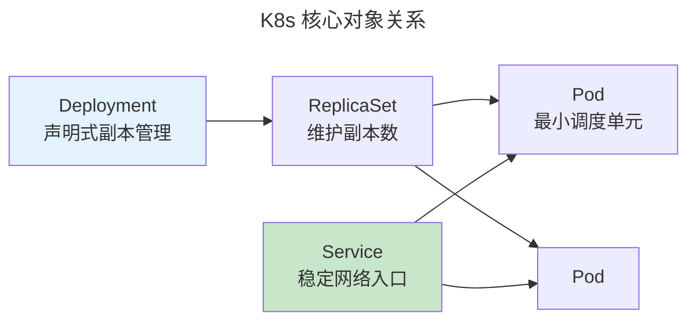

> Build, Test, Ship, Run.

DevOps 打破开发与运维壁垒——构建、测试、部署和监控成为统一流水线。

---

## CI/CD 与 Docker

CI 每次提交触发自动构建和测试。CD 通过自动化测试的代码自动部署。

Docker 核心创新是**镜像分层**——每个 `RUN` 创建只读层，层缓存使重复构建极快。OCI 标准化了容器镜像格式和运行时。

---

## Kubernetes 编排

## GitOps

Git 作为单一事实来源——ArgoCD/Flux 持续同步 Git → K8s。任何人直接修改集群会被自动回滚。

---

## 跨卷连接

| 概念 | 关联 |
|------|------|
| Docker 镜像分层 | [OverlayFS——写时复制层叠加](../../03-qiankun/03-filesystem/) |
| K8s Service 负载均衡 | [IPVS——内核四层负载均衡](../../03-qiankun/05-network-protocol-stack/) |
| GitOps | [SQL 声明式——说"要什么"而非"怎么做"](../../04-yuanhai/01-relational-database/) |

:::tip[卷八内部路径]
- [**系统设计**](../02-system-design/)：熔断器——K8s Readiness Probe
- [**可观测性**](../04-observability/)：Prometheus——K8s 原生指标
:::
