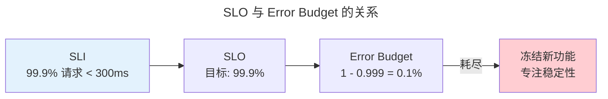

> 你不能优化你看不见的东西。

可观测性通过三大信号回答"系统出了什么问题"。

---

## 三大支柱

| 信号 | 用途 | 示例 |
|------|------|------|
| **Logs** | 不可变事件记录 | `ERROR: connection refused` |
| **Metrics** | 聚合数值 | `http_latency_p99{quantile=0.99}` |
| **Traces** | 请求传播路径 | 前端→API→UserService→DB |

---

## Prometheus 与 SLO

| 指标类型 | 行为 | 适用 |
|---------|------|------|
| **Counter** | 只增不减 | 请求次数 |
| **Gauge** | 可增可减 | CPU 使用率 |
| **Histogram** | 分桶计数 | P50/P95/P99 延迟 |

---

## 跨卷连接

| 概念 | 关联 |
|------|------|
| Histogram P99 | [快速选择——分位数近似](../../00-lingxi/04-algorithm-theory/) |
| 链路追踪 | [TCP/IP 四层模型](../../03-qiankun/05-network-protocol-stack/#tcpip-四层模型) |

:::tip[卷八内部路径]
- [**系统设计**](../02-system-design/)：熔断器——Error Budget 耗尽后的自动保护
- [**工程文化**](../05-engineering-culture/)：无责复盘——从事故中学习
:::
