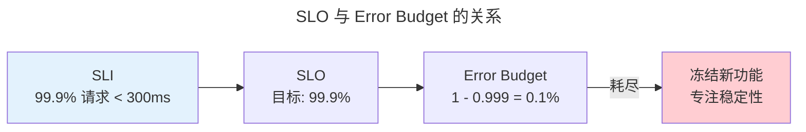

> 你不能优化你看不见的东西。

可观测性通过三大信号回答"系统出了什么问题"。

---

## 三大支柱

| 信号 | 用途 | 示例 |
|------|------|------|
| **Logs** | 不可变事件记录 | `ERROR: connection refused` |
| **Metrics** | 聚合数值 | `http_latency_p99{quantile=0.99}` |
| **Traces** | 请求传播路径 | 前端→API→UserService→DB |

---

## Prometheus 与 SLO

| 指标类型 | 行为 | 适用 |
|---------|------|------|
| **Counter** | 只增不减 | 请求次数 |
| **Gauge** | 可增可减 | CPU 使用率 |
| **Histogram** | 分桶计数 | P50/P95/P99 延迟 |

### PromQL 常见查询模式

PromQL 的函数组合方式决定了你能从时序数据中提取多少信息：

| 模式 | PromQL | 用途 |
|------|--------|------|
| **速率** | `rate(http_requests_total[5m])` | 将 Counter 转换为每秒速率 |
| **分位数** | `histogram_quantile(0.99, rate(http_duration_bucket[5m]))` | 从 Histogram 估算 P99 延迟 |
| **饱和度** | `cpu_utilization / cpu_cores` | 资源使用率 |
| **错误率** | `rate(http_errors[5m]) / rate(http_total[5m])` | SLI 计算 |
| **预测** | `predict_linear(disk_free[1h], 4*3600)` | 线性外推磁盘耗尽时间 |

### Histogram 分位数估算的数学

Histogram 将观测值落入预定义桶（如 0.1s, 0.5s, 1s, 5s）中计数。$\phi$-分位数通过线性插值估算：

$$
q_\phi = b_k + \frac{\phi \cdot N - c_{k-1}}{c_k - c_{k-1}} \cdot w_k
$$

其中 $b_k$ 是第 $k$ 个桶的上界，$c_k$ 是累计计数，$w_k = b_k - b_{k-1}$ 是桶宽，$N$ 是总观测数。

关键局限：该估算假设桶内**均匀分布**——当延迟呈长尾分布时，P99 的插值误差可达 50%+。应对方案是增加尾部桶密度（如 0.1s, 0.2s, 0.5s, 1s, 2s, 5s, 10s, +Inf）。

### SLO 燃尽速率与 Error Budget

Error Budget = $1 - \text{SLO}$。例如 SLO 为 99.9% (30 天窗口)，允许约 43 分钟的不可用时间。**燃尽速率**（Burn Rate）衡量 Error Budget 的消耗速度：

$$
\text{Burn Rate} = \frac{\text{实际错误率}}{1 - \text{SLO}} = \frac{\text{实际错误率}}{\text{Error Budget Rate}}
$$

燃尽速率 > 1 表示预算正在过快消耗。Google SRE 的多窗口多燃尽速率告警策略是这一概念的直接工程化：短窗口（1h）检测突发，长窗口（6h/3d）防止慢性恶化——在可观测性的信号处理层面与 [PID 控制器的时间窗口积分项](../../02-jiezi/02-interrupts/) 共享相同的"微分检测尖峰 + 积分消除偏移"设计哲学。

---

## 跨卷连接

| 概念 | 关联 |
|------|------|
| Histogram P99 | [快速选择——分位数近似](../../00-lingxi/04-algorithm-theory/) |
| 链路追踪 | [TCP/IP 四层模型](../../03-qiankun/05-network-protocol-stack/#tcpip-四层模型) |

:::tip[卷八内部路径]
- [**系统设计**](../02-system-design/)：熔断器——Error Budget 耗尽后的自动保护
- [**工程文化**](../05-engineering-culture/)：无责复盘——从事故中学习
:::
