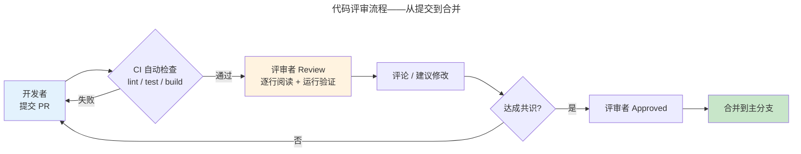
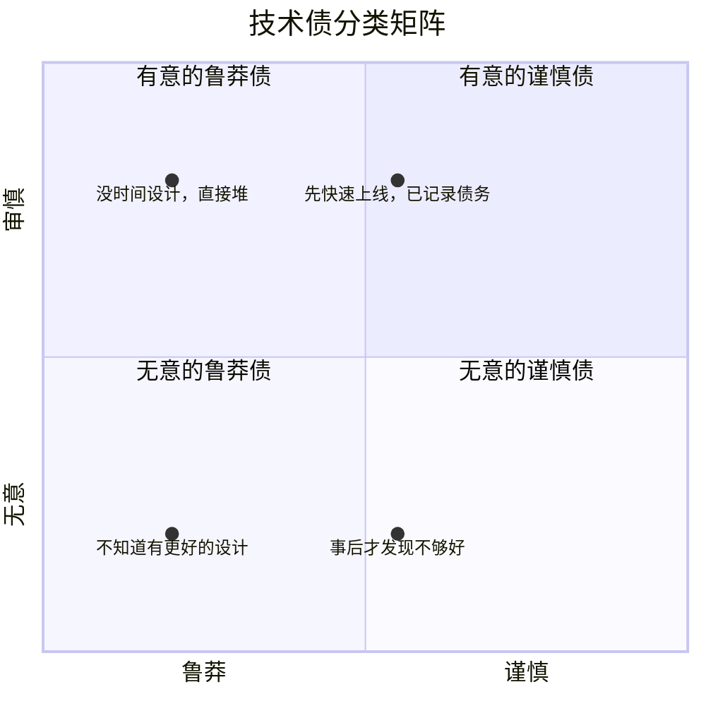
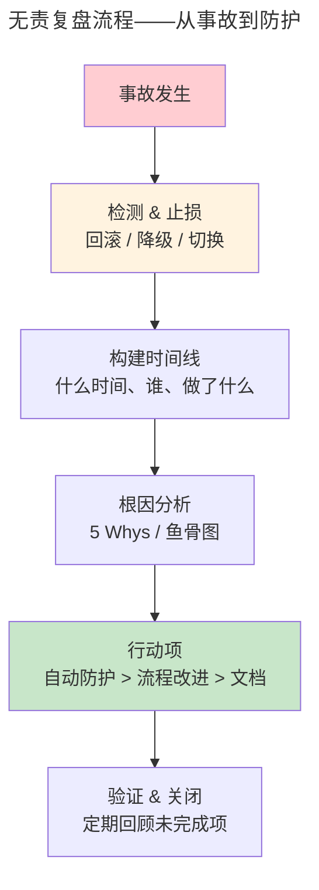

> 技术之外，决定成败的因素。

Google Project Aristotle 研究了 180 个团队，发现最高效团队的第一预测指标不是技术能力，而是**心理安全**。工程文化不是软技能——它是决定技术决策能否落地的"硬约束"。

---

## 代码评审：知识传播的仪式



评审的真正目的不是找 Bug（那是测试的职责），而是：

1. **知识传播**：让团队共享对代码库的理解——每个模块至少两个人懂
2. **一致性维护**：确保遵循团队约定模式——代码风格属于 linter，架构模式属于评审
3. **可维护性把关**：六个月后的自己能否读懂？

Google 研究表明：**评审速度比评审完美程度更重要**——延迟 1 小时显著降低开发者的心流状态。最佳实践：评审者应在 24 小时内给出第一轮反馈，即使只是"我明天仔细看"。

---

## 技术债管理：让债务可见



| 象限 | 含义 | 策略 |
|------|------|------|
| **审慎 + 有意** | "先快速上线，已记录债务" | ✅ 可接受——有偿还计划 |
| **鲁莽 + 有意** | "没时间设计，直接堆" | ❌ 危险——明知故犯无计划 |
| **无意 + 鲁莽** | "不知道有更好的设计" | ⚠️ 知识问题——培训 + 评审 |
| **无意 + 谨慎** | "事后才发现不够好" | 🟡 学习成本——复盘改进 |

关键不是消除所有技术债（不可能），而是**让技术债可见、可追踪、有计划偿还**。实践工具：在 Backlog 中为每笔技术债创建 Ticket，标注利息（每小时浪费的额外时间）和本金（修复所需时间）——当利息超过本金时，优先偿还。

技术债的跨层迁移与 SOLID 依赖反转原则直接相关——如果高层模块依赖低层细节，低层的一笔小债会向上污染所有依赖方，修复成本指数级增长。**依赖反转将技术债隔离在层内**。

---

## Blameless Postmortem：从事故中学习



无责复盘的第一原则：**假设每个人在当时条件下做出了最合理的判断**。不是找"谁干的"，而是找"什么条件导致了这次事故"。

**根因分析的 5 Whys 法**：
```
事故：数据库连接池耗尽
Why 1：慢查询占满连接 → Why 2：缺少索引 → Why 3：新功能没走索引评审
→ Why 4：索引评审不在 checklist 中 → Why 5：checklist 从未更新
根因：数据库变更流程缺少自动化索引检查
```

改进方向从高到低：
1. **自动化防护栏**——添加索引前强制 EXPLAIN 检查（最佳：消除人的因素）
2. **流程改进**——数据库变更评审增加索引项
3. **文档补充**——编写索引设计指南（最弱：依赖人记忆）

这与 [RCU 的哲学](../../03-qiankun/04-synchronization/#rcu零开销读取的革命) 相同——用**机制**（自动化）而非**策略**（人工检查）来保证正确性。

---

## 跨卷连接

| 概念 | 关联 |
|------|------|
| 代码评审知识传播 | [Git PR 驱动的开源协作模式](../03-devops-practices/) |
| 技术债四象限 | [SOLID 依赖反转——解耦层次阻止技术债迁移](../01-design-patterns-and-principles/) |
| 无责复盘 5 Whys | [停机问题的不可判定性——没有算法能预防所有 Bug](../../00-lingxi/03-theory-of-computation/#停机问题不可判定的第一道墙) |
| 自动化防护 vs 流程改进 | [RCU 机制——用锁-free 数据结构消除使用错误](../../03-qiankun/04-synchronization/#rcu零开销读取的革命) |
| 代码评审速度与心流 | [CFS `vruntime` 公平调度——不让任何进程"饥饿"](../../03-qiankun/01-process-and-thread/#调度算法cfs-与-eevdf) |

:::tip[卷八内部路径]
- [**设计模式与原则**](../01-design-patterns-and-principles/)：SOLID——减少技术债的代码级工具
- [**可观测性**](../04-observability/)：SLO——On-call 的量化优先级
:::

---

> 硅步千里，至此八卷俱成。从一粒硅沙的 MOSFET 能带弯曲，到万亿参数 Transformer 的分布式训练；从 6502 的 3510 个晶体管，到 H100 的 800 亿个——计算机科学的每一次跃迁，都站在前人的肩膀上。这八卷知识不是终点，而是你探索这个数字宇宙的起点。
>
> **不积跬步，无以至千里。**
